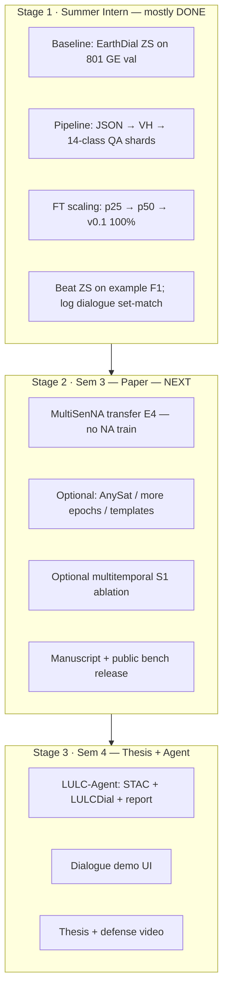
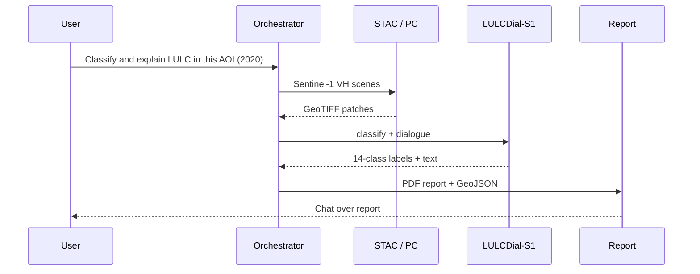

# AI4LCC-S1 VLM — MTech 3-Stage Roadmap

> **Workspace:** `e:\MTP\earth2\`  
> **Base model:** [EarthDial](https://arxiv.org/abs/2412.15190) (CVPR 2025) — `EarthDial_4B_MS`  
> **Primary dataset:** [AI4LCC MultiSenGE](BenchmarkGuide/AI4LCC/multiSenge_AI4LCC.pdf) (8,157 patches, Sentinel-1 VH, **14 OCSGE classes — unchanged**)  
> **Extension code:** `LULCDial-s1/baresoil/`  
> **Ops / history:** [`RUNBOOK.md`](RUNBOOK.md) · [`log.md`](log.md) · [`README.md`](README.md)  
> **Companion docs:** [`BenchmarkGuide/AI4LCC/BareSoil_AI4LCC_Workflow_Guide.md`](BenchmarkGuide/AI4LCC/BareSoil_AI4LCC_Workflow_Guide.md) · [`BenchmarkGuide/AI4LCC/MultiSenGE_AI4LCC_Complete_Analysis.md`](BenchmarkGuide/AI4LCC/MultiSenGE_AI4LCC_Complete_Analysis.md) · [`EarthDial_Complete_Analysis.md`](EarthDial_Complete_Analysis.md) · [`Stage1_Summer_Intern_Guide.md`](Stage1_Summer_Intern_Guide.md)

**Status (2026-07-13):** Stage 1 GE scaling **DONE** (ZS F1 ≈ **0.019** → 25% **0.782** → 50% **0.783** → 100% **0.799**). **E4 MultiSenNA transfer DONE** — GE→NA example F1 ≈ **0.670** (12 115 patches, no NA train). Dialogue set-match stays hard (GE ~0.12/0.37; NA ~0.02/0.08). **Next:** optional NA ZS baseline, then Stage 2 ablations / temporal / paper tables.

---

## 1. Research question (one sentence)

**Can a CVPR 2025 RS-VLM (EarthDial), fine-tuned on expert OCSGE land-cover dialogue from Sentinel-1, outperform zero-shot VLMs and transfer to unseen French regions — where BigEarthNet optical pretraining and legacy CNN baselines (U-Net/VGG) do not apply?**

---

## 2. What changed after supervisor meeting

| Old plan | **Revised plan (approved direction)** |
|---|---|
| Remap 14 AI4LCC → 7 unified bare-soil classes | **Keep official 14 OCSGE class names** in all QA answers |
| Compete with MultiSenGE U-Net baselines | **Do not replay** U-Net-IRRG / U-Net-Index / VGG-16 |
| “Bare soil” as custom taxonomy | **Bare soil / LULC** = application **theme**; labels stay LULC |
| Fine-tune only | Add **classification + multi-turn dialogue** |
| Weak novelty vs BigEarthNet | Clarify: **AI4LCC ≠ BigEarthNet**; EarthDial S1 = ships/quakes, **not SAR LULC** |

---

## 3. Novelty you can publish

### 3.1 What already exists (not your claim)

| Work | What it did |
|---|---|
| MultiSenGE (ISPRS 2022) | CNN segmentation on **urban** classes; U-Net + VGG-16 |
| BigEarthNet-MM | CORINE multi-label; 590k patches; **no VLM** |
| EarthDial (CVPR 2025) | BigEarthNet **RGB/S2** classification; S1 for **ships & earthquake change** |
| SARLANG / SARChat | SAR dialogue — **not** OCSGE / AI4LCC LULC |

### 3.2 Your contribution (defensible claims)

1. **First VLM instruction benchmark** pairing **AI4LCC Sentinel-1 VH** with **14-class OCSGE** dialogue (classify + chat).
2. **Empirical gap:** EarthDial_4B_MS is **near-floor** on S1 LULC before AI4LCC fine-tune (GE val example F1 ≈ **0.02**); optical BigEarthNet pretraining **does not substitute** SAR LULC dialogue.
3. **Data scaling:** most of the GE gain appears by **~25%** of train data under a fixed 1-epoch recipe; 50%/100% add little F1 (flat scaling story).
4. **Regional transfer:** train MultiSenGE (Grand-Est) → evaluate **MultiSenNA** (Nouvelle-Aquitaine) without retraining — **done** (example F1 ≈ **0.670**).
5. **(Stage 2+)** Multitemporal S1 dialogue using AI4LCC’s 2020 time series — capability BigEarthNet lacks.

### 3.3 Paper positioning (working titles)

- *AI4LCC-S1-Dialogue: A Vision-Language Benchmark for Sentinel-1 Land-Cover Classification and Interactive Dialogue*
- *LULCDial-S1: Adapting EarthDial for Expert Regional LULC Understanding from SAR*

**Do not claim:** “first SAR VLM” or “new dataset” (AI4LCC exists).  
**Do claim:** “first **VLM instruction + evaluation protocol** on AI4LCC S1 with OCSGE taxonomy.”

---

## 4. Product names (use consistently)

| Name | What it is | Path |
|---|---|---|
| **LULCDial-S1** | Fine-tuned VLM family (thesis model) | `checkpoints/LULCDial_S1_p25/`, `_p50/`, `_v0.1/` (PARAM) |
| **AI4LCC-S1-Instruct** | Training instruction shards | `LULCDial-s1/data/baresoil_s1/shards/` |
| **AI4LCC-S1-Dialogue-Bench** | Held-out eval (classify + 2-turn dialogue) | `bench/v0.1/ai4lcc_val.jsonl` (801) |
| **LULC-Agent** (Sem 4) | Tool-using demo around LULCDial-S1 | `LULCDial-s1/baresoil/agent/` |
| `baresoil/` | Python package name (keep — code already scaffolded) | `LULCDial-s1/baresoil/` |

---

## 5. Workspace layout

```
e:\MTP\earth2\
├── AI4LCC_S1_VLM_MTech_3Stage_Roadmap.md    ← this file
├── RUNBOOK.md / log.md / README.md           ← commands, history, status
├── Stage1_Summer_Intern_Guide.md
├── EarthDial_Complete_Analysis.md
├── BenchmarkGuide\AI4LCC\                    ← paper PDF + analysis + workflow
└── LULCDial-s1\
    ├── baresoil\                             ← build_instruct, bench, predict, eval
    ├── data\baresoil_s1\
    │   ├── ai4lcc\multisenge\labels\         ← ✅ 8,157 JSON
    │   ├── ai4lcc\multisenge\s1_val_bench\   ← ✅ packed 801 val TIFFs (PARAM)
    │   ├── shards\                           ← ✅ train / val / p25 / p50 (PARAM)
    │   ├── bench\v0.1\                       ← ✅ GE val + preds + MultiSenNA bench
    │   └── metrics\v0.1\                     ← ✅ ZS + p25 + p50 + v0.1
    ├── src\shell\data\Stage4_BareSoil_S1*.json
    ├── src\shell\train_*.sbatch / pred_*.sbatch
    └── checkpoints\                          ← LULCDial_S1_* on PARAM (~8 GB each)
```

---

## 6. Three-stage roadmap (overview)



Each stage **extends** the same checkpoint and benchmark — no sensor or taxonomy switch.

---

## Stage 1 — Summer Intern

> **Detailed guide:** [`Stage1_Summer_Intern_Guide.md`](Stage1_Summer_Intern_Guide.md) — 1A pipeline → 1B ZS → 1C FT scaling → 1D eval  
> **Live commands:** [`RUNBOOK.md`](RUNBOOK.md)

**Goal:** Working **LULCDial-S1 v0.1** + measurable beat over **EarthDial zero-shot** on AI4LCC GE val — **achieved (Jul 2026).**

### 1.1 Deliverables

| # | Deliverable | Status |
|---|---|---|
| D1 | Labels parsed; **14 OCSGE names** in templates (no 7-class remap) | ✅ Done |
| D2 | S1 available for train/val (PARAM shards + `s1_val_bench`) | ✅ Done |
| D3 | ~16k QA rows (train/val HF shards) | ✅ Done |
| D4 | AI4LCC-S1-Dialogue-Bench v0.1 (**801** val patches) | ✅ `bench/v0.1/ai4lcc_val.jsonl` |
| D5 | EarthDial_4B_MS **zero-shot** baseline | ✅ F1 ≈ **0.019** (`earthdial_zs_baseline.json`) |
| D6 | **LULCDial-S1** FT scaling | ✅ p25 / p50 / **v0.1** (100%) on PARAM |
| D7 | Beat ZS on primary metric + logged dialogue | ✅ example F1 **0.799** @ 100%; set-match ~0.12 / ~0.37 |
| D8 | Intern report + qualitative examples | ⏳ Write-up (optional wrap-up) |

### 1.2 What we actually ran (GE scaling)

| Run | Train data | Checkpoint | GE val example F1 | turn1 / turn2 set-match |
|---|---|---|---:|---|
| ZS | — | `EarthDial_4B_MS` | **0.019** | 0.00 / 0.00 |
| 1C-a | 25% | `LULCDial_S1_p25` | **0.782** | 0.10 / 0.38 |
| 1C-b | 50% | `LULCDial_S1_p50` | **0.783** | 0.12 / 0.38 |
| 1C-c | 100% | `LULCDial_S1_v0.1` | **0.799** | 0.12 / 0.37 |

**Recipe (locked):** 1 epoch, `force_image_size 448`, batch 1, accum 128, `freeze_backbone`, bf16, no DeepSpeed; launch via `sbatch` on PARAM.

**Finding:** Huge ZS→FT jump; **25%→50%≈flat**; **100% only small extra F1**. Exact dialogue set-match does **not** scale with more GE data under the current 1-epoch recipe.

### 1.3 Two instruction tasks (per patch)

| Task | Token pattern | Example answer (14-class) |
|---|---|---|
| **Classification** | `[baresoil] [s1_vh_10] [classify] <image>` | `Arable Lands, Grasslands, Forests` (multi-label) |
| **Dialogue** | 2-turn: all classes → natural/ag subset | Turn 2: `Arable Lands, Grasslands, Forests` |

### 1.4 Success metrics (Stage 1 exit) — updated

| Metric | Original target | Achieved (Jul 2026) |
|---|---|---|
| Multi-label **example F1** (801 val) | Beat ZS by a large margin | ✅ **0.019 → 0.799** |
| Dialogue turn-1 / turn-2 **exact set-match** | Aspirational ≥70% | ❌ ~**0.12 / 0.37** — keep as secondary; do not block Stage 1 |
| Data-scaling curve 25/50/100% | Prove learning with more data | ✅ Curve complete; weak after 25% |
| Qualitative | 10 patches | ⏳ Optional for report |

**Primary metric for thesis tables:** **example F1**. Report set-match beside it (strict all-or-nothing).

### 1.5 Intern report title

*LULCDial-S1 v0.1: Sentinel-1 Land-Cover Dialogue on AI4LCC Using EarthDial*

---

## Stage 2 — Sem 3 + Paper

**Goal:** Publish **AI4LCC-S1-Dialogue-Bench** + **LULCDial-S1** with **MultiSenNA transfer** and optional ablations.

**Immediate (Jul 2026):** **E4 DONE** — NA transfer F1 ≈ **0.670**. Optional: EarthDial ZS on NA for baseline table; then ablations / paper draft.

### 2.1 Benchmark v1.0 — evaluation tracks

| Track | Task | Metric | Status |
|---|---|---|---|
| **E1 Multi-label classify** | Which of 14 OCSGE classes are present? | **example F1** (primary) | ✅ GE val done |
| **E2 Dominant class** | Single dominant land-cover type | Accuracy | Optional later |
| **E3 Dialogue** | 2-turn: all classes → natural/ag | Exact **set-match** (secondary) | ✅ Logged on GE; still hard |
| **E4 Transfer** | Train MultiSenGE → test **MultiSenNA** | Same metrics, **no NA FT** | ✅ **DONE** (F1 ≈ 0.670) |

Optional **E6 Temporal** (if time): 2-date S1 → “Did surface backscatter change?” using `[s1_vh_temp_10]`.

### 2.2 Required experiments

| # | Comparison | Purpose | Status |
|---|---|---|---|
| 1 | EarthDial_4B_MS (ZS) vs LULCDial-S1 | Main GE result | ✅ Done (scaling table) |
| 2 | Data scale 25% / 50% / 100% | Show learning vs saturation | ✅ Done |
| 3 | LULCDial-S1 vs **AnySat** (CVPR 2025) | Modern non-VLM baseline | Pending |
| 4 | GE → **MultiSenNA** transfer | Regional generalization | ✅ **DONE** (F1 ≈ 0.670) |
| 5 | Optional: 2 epochs / unfreeze / templates | Dialogue set-match ablation | After E4 |
| 6 | Failure cases | Water / mineral / urban vs arable | Pending write-up |

### 2.3 Data scale

| Component | Size | Notes |
|---|---|---|
| Train instruct | ~14.7k QA rows (full MultiSenGE train) | + val in meta during FT |
| Val / GE bench | **801** patches | Primary Stage 1 metric |
| MultiSenNA ZS/transfer test | ~12k patches | **Never train on this** — bench on PARAM |
| Optional DW+ | Global bare-ground ZS (later) | Sem 3+ |

### 2.4 Publication targets

| Venue | Fit |
|---|---|
| **IGARSS 2026** | Benchmark + SAR VLM |
| **IEEE GRSL** | Short letter (bench + main table) |
| **Remote Sensing (MDPI)** | Full bench description + agent preview |
| **JSTARS** | If temporal + MultiSenNA results are strong |

### 2.5 Paper structure (4 pages short / 8 pages full)

1. **Introduction** — gap: EarthDial S1 ≠ LULC; AI4LCC only had CNN baselines  
2. **AI4LCC-S1-Dialogue-Bench** — tasks, splits, 14-class policy  
3. **LULCDial-S1** — EarthDial fine-tune recipe + data scaling  
4. **Experiments** — ZS vs FT, scaling curve, MultiSenNA, ablations  
5. **Conclusion** — agent preview (Stage 3)

---

## Stage 3 — Sem 4 + Thesis

**Goal:** **LULC-Agent** demo + thesis — not a new backbone.

### 3.1 Agent architecture



### 3.2 Sem 4 modules

| Module | Path |
|---|---|
| Agent entry | `baresoil/agent/lulc_agent.py` |
| STAC S1 search | `baresoil/agent/tools/stac_search.py` |
| VLM inference | `baresoil/agent/tools/vlm_inference.py` |
| Report + GeoJSON | `baresoil/agent/tools/report.py` |
| Dialogue UI | extend `LULCDial-s1/demo/` or Streamlit |

### 3.3 Thesis chapters

| Ch | Title | Content |
|---|---|---|
| 1 | Introduction | Motivation, gaps, contributions |
| 2 | Background | EarthDial, AI4LCC, related CVPR 2025 work |
| 3 | AI4LCC-S1-Dialogue-Bench + LULCDial-S1 | Methods, training, eval |
| 4 | LULC-Agent + conclusions | System, limitations, future work |

### 3.4 Exit criteria

| Deliverable | Target |
|---|---|
| LULC-Agent end-to-end | AOI → S1 → classify + dialogue → report < 10 min |
| Thesis submitted | Before defense deadline |
| Demo video | 3 min: classify + dialogue demo |
| Code + bench manifest public | Zenodo or GitHub release with thesis |

---

## 7. Twelve-month calendar

| Period | Focus | Exit criterion |
|---|---|---|
| **May–Jul** (Intern) | Pipeline + ZS + FT scaling p25/p50/v0.1 | ✅ GE curve done; F1 0.019→0.799 |
| **Jul–Oct** (Sem 3 start) | **MultiSenNA transfer** + paper tables | Draft + NA metrics |
| **Nov–Jan** | Write + submit | Manuscript submitted |
| **Feb–Apr** (Sem 4) | LULC-Agent + thesis Ch 1–3 | Working demo |
| **May–Jul** (Sem 4) | Defense prep | Thesis submitted |

---

## 8. What NOT to do

| Avoid | Why |
|---|---|
| Remap 14 AI4LCC → custom bare-soil taxonomy | Supervisor: keep official OCSGE names |
| Re-implement U-Net / VGG on AI4LCC | Already published 2022; not your contribution |
| Train primarily on BigEarthNet | EarthDial already did; weak novelty |
| Use HuggingFace `wtr001/S1_AI4LCC` mosaics | Wrong format (not 256² patches) |
| Claim “new dataset” | AI4LCC exists — you add **VLM instructions + bench** |
| OpenEarthMap-SAR as primary train | Umbra SAR, not Sentinel-1 |
| Four separate agents in Sem 4 | One orchestrator + tools |
| Train on **MultiSenNA** for the transfer claim | Invalidates E4 |
| Treat dialogue set-match ≥70% as Stage 1 blocker | Exact match is hard; F1 is primary |

---

## 9. Immediate next steps (now)

| Priority | Action | Owner |
|---|---|---|
| 🔴 P0 | Optional: EarthDial ZS on MultiSenNA for transfer baseline table; sync NA preds/metrics to git | Experiments + paper |
| 🟡 P1 | Pack/confirm NA S1 paths on PARAM if predict needs images beyond bench metadata | Data |
| 🟢 P2 | Intern/scaling write-up: one table ZS→p25→p50→v0.1; note flat dialogue set-match | You |
| ⚪ P3 | Optional later: 2-epoch or template ablation for dialogue | Experiments |

---

## 10. Elevator pitch

> We introduce **AI4LCC-S1-Dialogue-Bench** — an instruction-tuning and evaluation suite for **Sentinel-1 land-cover classification and dialogue** on expert **14-class OCSGE** labels — and **LULCDial-S1**, an EarthDial fine-tune that closes the zero-shot gap on MultiSenGE (example F1 ≈ 0.02 → ≈ 0.80) and targets zero-shot / transfer evaluation on **MultiSenNA**.

---

## 11. Related documents

| Document | Purpose |
|---|---|
| [`RUNBOOK.md`](RUNBOOK.md) | Copy-paste PARAM / pipeline commands |
| [`log.md`](log.md) | What was run + metrics history |
| [`Stage1_Summer_Intern_Guide.md`](Stage1_Summer_Intern_Guide.md) | Stage 1 substages + glossary |
| [`BenchmarkGuide/AI4LCC/MultiSenGE_AI4LCC_Complete_Analysis.md`](BenchmarkGuide/AI4LCC/MultiSenGE_AI4LCC_Complete_Analysis.md) | Dataset deep dive |
| [`BenchmarkGuide/AI4LCC/BareSoil_AI4LCC_Workflow_Guide.md`](BenchmarkGuide/AI4LCC/BareSoil_AI4LCC_Workflow_Guide.md) | Step-by-step pipeline for PI |
| [`BenchmarkGuide/AI4LCC/multiSenge_AI4LCC.pdf`](BenchmarkGuide/AI4LCC/multiSenge_AI4LCC.pdf) | Original MultiSenGE paper |
| [`EarthDial_Complete_Analysis.md`](EarthDial_Complete_Analysis.md) | EarthDial architecture reference |
| `metrics/v0.1/*.json` | Frozen Stage 1 numbers |

---

*Previous filename `BareSoil_S1_MTech_3Stage_Roadmap.md` superseded (March 2026 — post supervisor meeting). Updated July 2026 after Stage 1 GE scaling completion.*
