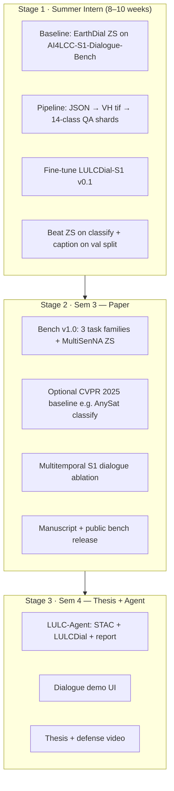
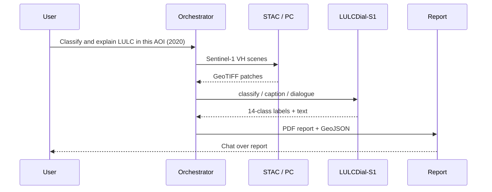

# AI4LCC-S1 VLM — MTech 3-Stage Roadmap

> **Workspace:** `e:\MTP\earth2\`  
> **Base model:** [EarthDial](https://arxiv.org/abs/2412.15190) (CVPR 2025) — `EarthDial_4B_MS`  
> **Primary dataset:** [AI4LCC MultiSenGE](BenchmarkGuide/AI4LCC/multiSenge_AI4LCC.pdf) (8,157 patches, Sentinel-1 VH, **14 OCSGE classes — unchanged**)  
> **Extension code:** `EarthDial-main/baresoil/`  
> **Companion docs:** [`BenchmarkGuide/AI4LCC/BareSoil_AI4LCC_Workflow_Guide.md`](BenchmarkGuide/AI4LCC/BareSoil_AI4LCC_Workflow_Guide.md) · [`BenchmarkGuide/AI4LCC/MultiSenGE_AI4LCC_Complete_Analysis.md`](BenchmarkGuide/AI4LCC/MultiSenGE_AI4LCC_Complete_Analysis.md) · [`EarthDial_Complete_Analysis.md`](EarthDial_Complete_Analysis.md)

---

## 1. Research question (one sentence)

**Can a CVPR 2025 RS-VLM (EarthDial), fine-tuned on expert OCSGE land-cover dialogue from Sentinel-1, outperform zero-shot VLMs and transfer to unseen French regions — where BigEarthNet optical pretraining and legacy CNN baselines (U-Net/VGG) do not apply?**

---

## 2. What changed after supervisor meeting

| Old plan | **Revised plan (approved direction)** |
|---|---|
| Remap 14 AI4LCC → 7 unified bare-soil classes | **Keep official 14 OCSGE class names** in all QA answers |
| Compete with MultiSenGE U-Net baselines | **Do not replay** U-Net-IRRG / U-Net-Index / VGG-16 |
| “Bare soil” as custom taxonomy | **Bare soil / LULC** = application **theme**; labels stay LULC |
| Fine-tune only | Add **classification + captioning + multi-turn dialogue** |
| Weak novelty vs BigEarthNet | Clarify: **AI4LCC ≠ BigEarthNet**; EarthDial S1 = ships/quakes, **not SAR LULC** |

---

## 3. Novelty you can publish

### 3.1 What already exists (not your claim)

| Work | What it did |
|---|---|
| MultiSenGE (ISPRS 2022) | CNN segmentation on **urban** classes; U-Net + VGG-16 |
| BigEarthNet-MM | CORINE multi-label; 590k patches; **no VLM** |
| EarthDial (CVPR 2025) | BigEarthNet **RGB/S2** classification; S1 for **ships & earthquake change** |
| SARLANG / SARChat | SAR dialogue — **not** OCSGE / AI4LCC LULC |

### 3.2 Your contribution (defensible claims)

1. **First VLM instruction benchmark** pairing **AI4LCC Sentinel-1 VH** with **14-class OCSGE** dialogue (classify · caption · chat).
2. **Empirical gap:** EarthDial_4B_MS **fails or is weak** on S1 LULC before AI4LCC fine-tune; optical BigEarthNet pretraining **does not substitute** SAR LULC dialogue.
3. **Zero-shot regional transfer:** train MultiSenGE (Grand-Est) → evaluate **MultiSenNA** (Nouvelle-Aquitaine) without retraining.
4. **(Stage 2+)** Multitemporal S1 dialogue using AI4LCC’s 2020 time series — capability BigEarthNet lacks.

### 3.3 Paper positioning (working titles)

- *AI4LCC-S1-Dialogue: A Vision-Language Benchmark for Sentinel-1 Land-Cover Classification, Captioning, and Interactive Dialogue*
- *LULCDial-S1: Adapting EarthDial for Expert Regional LULC Understanding from SAR*

**Do not claim:** “first SAR VLM” or “new dataset” (AI4LCC exists).  
**Do claim:** “first **VLM instruction + evaluation protocol** on AI4LCC S1 with OCSGE taxonomy.”

---

## 4. Product names (use consistently)

| Name | What it is | Path |
|---|---|---|
| **LULCDial-S1** | Fine-tuned VLM checkpoint (thesis model) | `EarthDial-main/checkpoints/LULCDial_S1/` |
| **AI4LCC-S1-Instruct** | Training instruction shards | `EarthDial-main/data/baresoil_s1/shards/` |
| **AI4LCC-S1-Dialogue-Bench** | Held-out eval (classify + caption + dialogue) | `EarthDial-main/data/baresoil_s1/bench/` |
| **LULC-Agent** (Sem 4) | Tool-using demo around LULCDial-S1 | `EarthDial-main/baresoil/agent/` |
| `baresoil/` | Python package name (keep — code already scaffolded) | `EarthDial-main/baresoil/` |

---

## 5. Workspace layout

```
e:\MTP\earth2\
├── AI4LCC_S1_VLM_MTech_3Stage_Roadmap.md    ← this file
├── EarthDial_Complete_Analysis.md
└── BenchmarkGuide\
    └── AI4LCC\                               ← paper PDF + analysis + workflow only
└── EarthDial-main\
    ├── baresoil\                               ← ai4lcc.py, build_instruct_s1.py, …
    ├── data\baresoil_s1\ai4lcc\multisenge\
    │   ├── labels\                             ← ✅ 8,157 JSON (done)
    │   └── s1\                                 ← ⏳ download s1.tgz (~110 GB)
    ├── src\shell\data\Stage4_BareSoil_S1.json
    └── checkpoints\LULCDial_S1\
```

---

## 6. Three-stage roadmap (overview)



Each stage **extends** the same checkpoint and benchmark — no sensor or taxonomy switch.

---

## Stage 1 — Summer Intern

**Goal:** Working **LULCDial-S1 v0.1** + measurable beat over **EarthDial zero-shot** on AI4LCC val.

### 1.1 Deliverables

| # | Deliverable | Done when |
|---|---|---|
| D1 | Labels parsed; **14 OCSGE names** in templates (no 7-class remap) | Shards use `Dense Built-Up`, `Arable Lands`, … |
| D2 | `s1.tgz` extracted; median-date VH per patch | `build_instruct_s1.py` completes |
| D3 | ~24k QA rows (8,157 patches × 3 tasks) | HF shards on disk |
| D4 | AI4LCC-S1-Dialogue-Bench v0.1 (~800 val patches) | `build_bench.py` + JSONL |
| D5 | EarthDial_4B_MS **zero-shot** baseline logged | `metrics/earthdial_zs_baseline.json` |
| D6 | **LULCDial-S1 v0.1** checkpoint | Stage 4 fine-tune complete |
| D7 | Intern report + 10 qualitative dialogue examples | PDF + notebook |

### 1.2 Week-by-week

| Week | Task | Output |
|---|---|---|
| 1 | Env setup; `pip install -e .`; download `EarthDial_4B_MS` | `checkpoints/EarthDial_4B_MS/` |
| 1–2 | **Update** `instruct_templates.py` → 14-class names; add caption + dialogue templates | Code PR in `baresoil/` |
| 2 | Confirm labels on disk; **download + extract `s1.tgz`** | `data/.../multisenge/s1/` |
| 3 | Run `build_instruct_s1.py` (train + val shards) | `shards/ai4lcc_ge_train_*` |
| 3 | Run `build_bench.py` | `bench/v0.1/ai4lcc_val.jsonl` |
| 4 | **Baseline eval** — EarthDial ZS on bench (no fine-tune) | Baseline metrics file |
| 4–6 | Stage 4 fine-tune (`Stage4_BareSoil_S1.json`, `[lulc_s1]` or `[baresoil]` token) | `LULCDial_S1_v0.1/` |
| 6–7 | Eval fine-tuned model on same bench | `metrics/lulcdial_v0.1.json` |
| 7–8 | Error analysis: water vs mineral, urban vs arable, speckle | 2-page failure appendix |
| 8–10 | Intern report + supervisor demo | Report PDF |

### 1.3 Three instruction tasks (per patch)

| Task | Token pattern | Example answer (14-class) |
|---|---|---|
| **Classification** | `[lulc_s1] [s1_vh_10] [classify] <image>` | `Arable Lands, Grasslands, Forests` (multi-label) |
| **Captioning** | `[lulc_s1] [s1_vh_10] [caption] <image>` | Prose using OCSGE names |
| **Dialogue** | 2-turn: classify then follow-up | “What natural classes are present?” → `Grasslands, Forests` |

### 1.4 Success metrics (Stage 1 exit)

| Metric | Target |
|---|---|
| Multi-label **14-class** F1 (val) | LULCDial-S1 ≥ EarthDial ZS **+10 F1** (macro) |
| Caption ROUGE-L / CIDEr | Beat EarthDial ZS |
| Dialogue turn-1 accuracy | ≥ 70% on val |
| Qualitative | 10 patches with sensible SAR-aware explanations |

### 1.5 Intern report title

*LULCDial-S1 v0.1: Sentinel-1 Land-Cover Dialogue on AI4LCC Using EarthDial*

---

## Stage 2 — Sem 3 + Paper

**Goal:** Publish **AI4LCC-S1-Dialogue-Bench** + **LULCDial-S1** with zero-shot transfer and ablations.

### 2.1 Benchmark v1.0 — five evaluation tracks

| Track | Task | Metric |
|---|---|---|
| **E1 Multi-label classify** | Which of 14 OCSGE classes are present? | Example-F1, macro-F1 |
| **E2 Dominant class** | Single dominant land-cover type | Accuracy |
| **E3 Captioning** | Describe land use in SAR image | CIDEr, ROUGE-L, LLM-judge |
| **E4 Dialogue** | 3-turn: presence → detail → reasoning | Turn accuracy, human eval (subset) |
| **E5 Zero-shot transfer** | Train MultiSenGE → test **MultiSenNA** | Same metrics, no FT |

Optional **E6 Temporal** (if time): 2-date S1 → “Did surface backscatter change?” using `[s1_vh_temp_10]`.

### 2.2 Required experiments

| # | Comparison | Purpose |
|---|---|---|
| 1 | EarthDial_4B_MS (ZS) vs LULCDial-S1 | Main result |
| 2 | LULCDial-S1 vs **AnySat** (CVPR 2025) patch classify | Modern non-VLM baseline |
| 3 | S1-only vs S2-only (same AI4LCC patches) | Modality ablation |
| 4 | Single-date vs multi-date S1 | Temporal ablation |
| 5 | Failure cases | Water / Wetlands vs Open Spaces Mineral; urban paved vs bare |

### 2.3 Data scale

| Component | Size | Notes |
|---|---|---|
| Train instruct | ~24k QA (full MultiSenGE) | 3 QA × 8,157 patches |
| Val | ~2.4k QA | 90/10 hash split |
| MultiSenNA ZS test | up to 12,258 patches | **Never train on this** |
| Optional DW+ | Global 9-class ZS (later) | Generalization story |

### 2.4 Publication targets

| Venue | Fit |
|---|---|
| **IGARSS 2026** | Benchmark + SAR VLM |
| **IEEE GRSL** | Short letter (bench + main table) |
| **Remote Sensing (MDPI)** | Full bench description + agent preview |
| **JSTARS** | If temporal + MultiSenNA results are strong |

### 2.5 Paper structure (4 pages short / 8 pages full)

1. **Introduction** — gap: EarthDial S1 ≠ LULC; AI4LCC only had CNN baselines  
2. **AI4LCC-S1-Dialogue-Bench** — tasks, splits, 14-class policy  
3. **LULCDial-S1** — EarthDial fine-tune recipe  
4. **Experiments** — ZS vs FT, MultiSenNA, ablations  
5. **Conclusion** — agent preview (Stage 3)

---

## Stage 3 — Sem 4 + Thesis

**Goal:** **LULC-Agent** demo + thesis — not a new backbone.

### 3.1 Agent architecture



### 3.2 Sem 4 modules

| Module | Path |
|---|---|
| Agent entry | `baresoil/agent/lulc_agent.py` |
| STAC S1 search | `baresoil/agent/tools/stac_search.py` |
| VLM inference | `baresoil/agent/tools/vlm_inference.py` |
| Report + GeoJSON | `baresoil/agent/tools/report.py` |
| Dialogue UI | extend `EarthDial-main/demo/` or Streamlit |

### 3.3 Thesis chapters

| Ch | Title | Content |
|---|---|---|
| 1 | Introduction | Motivation, gaps, contributions |
| 2 | Background | EarthDial, AI4LCC, related CVPR 2025 work |
| 3 | AI4LCC-S1-Dialogue-Bench + LULCDial-S1 | Methods, training, eval |
| 4 | LULC-Agent + conclusions | System, limitations, future work |

### 3.4 Exit criteria

| Deliverable | Target |
|---|---|
| LULC-Agent end-to-end | AOI → S1 → classify/caption → report < 10 min |
| Thesis submitted | Before defense deadline |
| Demo video | 3 min: classify + caption + dialogue box |
| Code + bench manifest public | Zenodo or GitHub release with thesis |

---

## 7. Twelve-month calendar

| Period | Focus | Exit criterion |
|---|---|---|
| **May–Jul** (Intern) | Pipeline + LULCDial-S1 v0.1 + ZS baseline | Intern report; +10 F1 vs ZS |
| **Aug–Oct** (Sem 3) | Bench v1.0 + MultiSenNA + paper tables | Draft complete |
| **Nov–Jan** | Write + submit | Manuscript submitted |
| **Feb–Apr** (Sem 4) | LULC-Agent + thesis Ch 1–3 | Working demo |
| **May–Jul** (Sem 4) | Defense prep | Thesis submitted |

---

## 8. What NOT to do

| Avoid | Why |
|---|---|
| Remap 14 AI4LCC → custom bare-soil taxonomy | Supervisor: keep official OCSGE names |
| Re-implement U-Net / VGG on AI4LCC | Already published 2022; not your contribution |
| Train primarily on BigEarthNet | EarthDial already did; weak novelty |
| Use HuggingFace `wtr001/S1_AI4LCC` mosaics | Wrong format (not 256² patches) |
| Claim “new dataset” | AI4LCC exists — you add **VLM instructions + bench** |
| OpenEarthMap-SAR as primary train | Umbra SAR, not Sentinel-1 |
| Four separate agents in Sem 4 | One orchestrator + tools |

---

## 9. Immediate next steps (this week)

| Priority | Action | Owner |
|---|---|---|
| 🔴 P0 | Download + extract **`s1.tgz`** | You |
| 🔴 P0 | Update `instruct_templates.py` → **14 OCSGE class names**; add caption + dialogue | Code |
| 🟡 P1 | Run `build_instruct_s1.py` after S1 on disk | Code |
| 🟡 P1 | Run `build_bench.py` → AI4LCC-S1-Dialogue-Bench v0.1 | Code |
| 🟡 P1 | EarthDial **zero-shot** eval on bench **before** fine-tune | Experiments |
| 🟢 P2 | Email supervisor 1-page contribution statement (§3.2) | You |

---

## 10. Elevator pitch

> We introduce **AI4LCC-S1-Dialogue-Bench** — the first instruction-tuning and evaluation suite for **Sentinel-1 land-cover classification, captioning, and dialogue** on expert **14-class OCSGE** labels — and **LULCDial-S1**, an EarthDial fine-tune that closes the gap left by BigEarthNet optical pretraining and legacy MultiSenGE CNN baselines, with zero-shot transfer to **MultiSenNA**.

---

## 11. Related documents

| Document | Purpose |
|---|---|
| [`BenchmarkGuide/AI4LCC/MultiSenGE_AI4LCC_Complete_Analysis.md`](BenchmarkGuide/AI4LCC/MultiSenGE_AI4LCC_Complete_Analysis.md) | Dataset deep dive |
| [`BenchmarkGuide/AI4LCC/BareSoil_AI4LCC_Workflow_Guide.md`](BenchmarkGuide/AI4LCC/BareSoil_AI4LCC_Workflow_Guide.md) | Step-by-step pipeline for PI |
| [`BenchmarkGuide/AI4LCC/multiSenge_AI4LCC.pdf`](BenchmarkGuide/AI4LCC/multiSenge_AI4LCC.pdf) | Original MultiSenGE paper |
| [`EarthDial_Complete_Analysis.md`](EarthDial_Complete_Analysis.md) | EarthDial architecture reference |

---

*Previous filename `BareSoil_S1_MTech_3Stage_Roadmap.md` superseded by this document (March 2026 — post supervisor meeting).*
