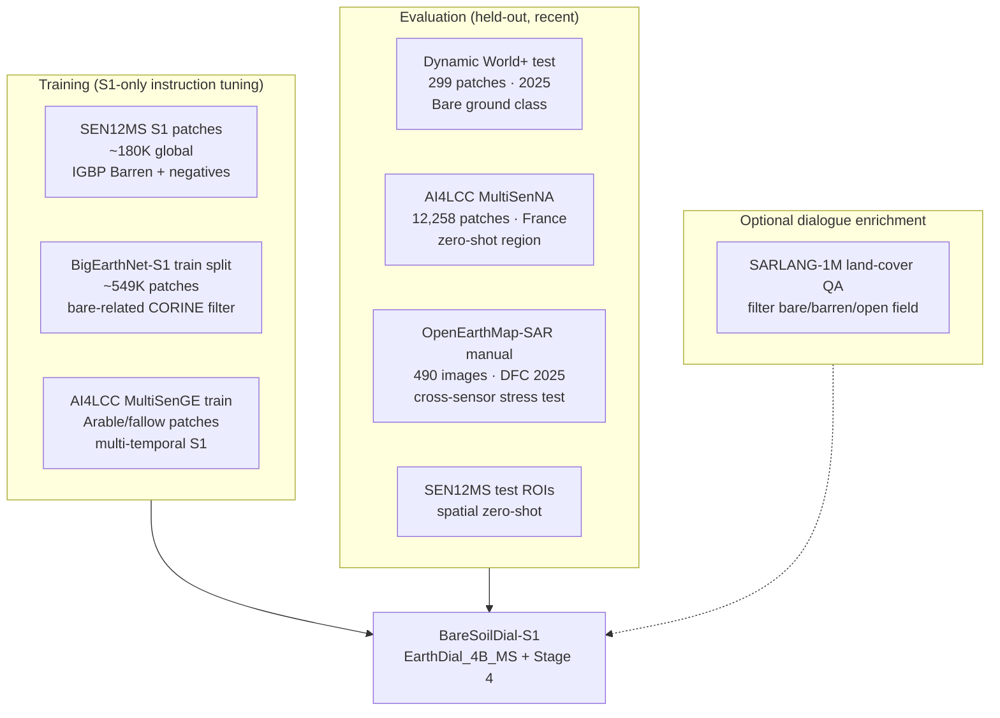

# BareSoil-S1 VLM: Dataset Strategy & Conversion Guide

> **Workspace:** `e:\MTP\earth2\` only — all code and docs live here.  
> **Goal:** Build a **Sentinel-1 SAR-only** VLM for **general LULC bare-soil classification + dialogue**, extending EarthDial as the base.  
> **Base model repo:** `EarthDial-main/` (upstream EarthDial — CVPR 2025)  
> **Your extension (to build):** `EarthDial-main/baresoil/` — does **not exist yet**; create from scratch in this workspace.

---

## 0. Earth2 Workspace Layout (current & planned)

```
e:\MTP\earth2\
├── BareSoil_S1_VLM_Dataset_Guide.md      ← this file
├── BareSoil_S1_MTech_3Stage_Roadmap.md   ← 3-stage thesis plan
├── EarthDial_Complete_Analysis.md        ← EarthDial codebase reference
│
└── EarthDial-main\                       ← cloned EarthDial (unchanged upstream)
    ├── README.md
    ├── demo\
    ├── src\
    │   ├── earthdial\                     ← model, train, eval (EarthDial core)
    │   │   └── train\constants.py        ← S1 tokens already exist here
    │   └── shell\data\
    │       ├── Stage1_Pretraining.json
    │       ├── Stage2_RGB_Temporal_Finetunning.json
    │       ├── Stage3_MS_SAR_finetunning.json
    │       └── Stage4_BareSoil_S1.json   ← YOU CREATE (Stage 4 fine-tune config)
    │
    ├── baresoil\                           ← YOU CREATE (BareSoilDial-S1 extension)
    │   ├── taxonomy.py                     ← unified 7-class label mappings
    │   ├── instruct_templates.py           ← S1 QA templates
    │   ├── build_instruct_s1.py            ← instruction dataset builder
    │   ├── build_bench.py                  ← BareSoil-Bench-S1 builder
    │   ├── eval_bench.py
    │   ├── docs\TAXONOMY.md
    │   └── data\
    │       ├── instruct\                   ← generated JSONL / HF shards
    │       └── bench\                      ← held-out test sets
    │
    └── data\                               ← YOU CREATE (downloaded EO data)
        └── baresoil_s1\
            ├── sen12ms\
            ├── ai4lcc\
            ├── dynamic_world_plus\
            └── shards\                     ← HF save_to_disk training shards
```

**Important:** There is **no** `baresoil/` folder in `EarthDial-main` today. Taxonomy, templates, and bench builders are **first deliverables** of your project inside `earth2`.

---

## 1. Critical Finding: No Ready-Made S1 Bare-Soil VLM Dataset Exists

| What exists | Gap |
|---|---|
| EarthDial Stage-3 SAR (ships, QuakeSet, Satlas S1 captions) | **No LULC / bare-soil focus** |
| EarthDial RGB/MS tasks (BigEarthNet, LCZ, AID, etc.) | **Not Sentinel-1 bare-soil dialogue** |
| SARLANG-1M (2025) | ~1M SAR VLM pairs — **mixed SAR sensors, not S1-only** |
| OpenEarthMap-SAR (DFC 2025) | Has **bareland** — but **Umbra SAR**, not Sentinel-1 |

**Conclusion:** You must **convert** segmentation / scene-classification datasets into EarthDial-style instruction shards inside `earth2`. This matches how EarthDial built 11M pairs from labels + templates.

---

## 2. What EarthDial Already Used (AVOID for Eval / Claim Novelty)

| Source | S1? | Task | In EarthDial? |
|---|---|---|---|
| **Satlas_S1** | ✅ GRD VH | Caption / localization QA | ✅ Stage 3 (~1.68M QA) |
| **ship_dataset_v0 / SRSDD** | ✅ | Ship detection / grounding | ✅ Stage 3 |
| **QuakeSet** | ✅ bi-temporal | Earthquake yes/no | ✅ Stage 3 |
| **BigEarthNet** (RGB + S2 MS) | S1 paired | Multi-label CORINE | ✅ Stage 2/3 |
| **AI4LCC** | ✅ multi-temp S1 | LULC segmentation | ❌ **Not used** |
| **Dynamic World+** | ✅ S1+DW labels | Global LULC seg | ❌ **Not used** |
| **SEN12MS** | ✅ VV+VH | IGBP scene + seg labels | ❌ **Not used** |
| **OpenEarthMap-SAR** | ❌ (Umbra) | 8-class LULC + bareland | ❌ **Not used** |

Use **AI4LCC**, **Dynamic World+**, and **SEN12MS held-out ROIs** as **primary eval benchmarks**.

Config reference (EarthDial SAR training):  
`EarthDial-main/src/shell/data/Stage3_MS_SAR_finetunning.json`

S1 constants already in:  
`EarthDial-main/src/earthdial/train/constants.py`

---

## 3. Recommended Dataset Stack



### Tier A — Primary (Sentinel-1, large, convertible)

#### 3.1 SEN12MS ⭐ Best for large-scale S1 LULC training

| Field | Detail |
|---|---|
| **Link** | [GitHub schmitt-muc/SEN12MS](https://github.com/schmitt-muc/SEN12MS) |
| **Size** | **180,662** patch triplets (S1 + S2 + LC labels) |
| **S1 bands** | VV + VH, σ° dB, 10 m, 256×256 px |
| **Bare-soil class** | IGBP **Barren** → simplified class 9: *exposed soil, sand, rocks* |
| **Local path** | `EarthDial-main/data/baresoil_s1/sen12ms/` |

#### 3.2 BigEarthNet-S1 ⭐ Largest S1 patch archive

| Field | Detail |
|---|---|
| **Link** | [bigearth.net](https://bigearth.net/) — **549,488** S1+S2 pairs |
| **Bare-related CORINE** | Beaches/dunes/sands, sparsely vegetated, **arable land** (fallow) |
| **Caution** | EarthDial trained on BigEarthNet RGB/MS — use **S1-only + bare filter + held-out test** |
| **Local path** | `EarthDial-main/data/baresoil_s1/bigearthnet_s1/` |

#### 3.3 AI4LCC ⭐ Best recent S1 LULC benchmark

| Field | Detail |
|---|---|
| **Link** | [doi.theia.data-terra.org/ai4lcc](https://doi.theia.data-terra.org/ai4lcc/?lang=en) |
| **Size** | MultiSenGE **8,157** + MultiSenNA **12,258** patches |
| **HF mirror** | [wtr001/S1_AI4LCC](https://huggingface.co/datasets/wtr001/S1_AI4LCC) |
| **Strategy** | Train **MultiSenGE** → eval zero-shot **MultiSenNA** |
| **Local path** | `EarthDial-main/data/baresoil_s1/ai4lcc/` |

### Tier B — Primary Eval (recent, not in EarthDial)

#### 3.4 Dynamic World+ ⭐ 2025 global S1+LULC benchmark

| Field | Detail |
|---|---|
| **Paper** | JSTARS 2025 · [LULCFormer](https://github.com/uoe-haoyu/LULCFormer) |
| **Size** | **299 test** patches; label **`Bare ground`** |
| **Local path** | `EarthDial-main/data/baresoil_s1/dynamic_world_plus/` |

#### 3.5 OpenEarthMap-SAR — Cross-sensor eval only (not S1)

| Field | Detail |
|---|---|
| **Link** | [Zenodo DFC 2025](https://zenodo.org/records/14950559) |
| **SAR** | Umbra — **not Sentinel-1** |
| **Use** | Sem 3 appendix only; **do not use as primary S1 train set** |

### Tier C — Optional

#### 3.6 SARLANG-1M

[arXiv:2504.03254](https://arxiv.org/abs/2504.03254) — borrow dialogue templates only.

---

## 4. Recommended Train / Eval Split

| Split | Dataset | Patches (approx) | Role |
|---|---|---:|---|
| **Train** | SEN12MS S1 (Barren + balanced negatives) | 50K–120K | Core diversity |
| **Train** | BigEarthNet-S1 (bare CORINE filter) | 80K–200K | Scale |
| **Train** | AI4LCC MultiSenGE | ~40K QA | Multi-temporal S1 |
| **Val** | SEN12MS held-out ROIs | ~5K | Early stopping |
| **Test-1** | Dynamic World+ | **299** | Primary zero-shot |
| **Test-2** | AI4LCC MultiSenNA | **12,258** | Regional zero-shot |
| **Test-3** | BigEarthNet-S1 test (bare filter) | ~5K | Same sensor, new split |
| **Test-4** | OpenEarthMap-SAR manual | 490 | Cross-sensor |

**Target:** 150K–300K S1 instruction pairs for Stage 4 fine-tune.

---

## 5. Unified Bare-Soil Taxonomy

**Planned file:** `EarthDial-main/baresoil/taxonomy.py`  
**Documentation:** `EarthDial-main/baresoil/docs/TAXONOMY.md`

Map all source labels → **7 unified classes**:

| Unified class | Bare-positive? | Display name | S1-relevant sources |
|---|---|---|---|
| `bare_soil` | ✅ | bare soil | DW Bare ground, IGBP Barren, OEM bareland |
| `sparse_vegetation` | ✅ | sparse vegetation | CORINE sparsely vegetated, DW Shrub/scrub |
| `desert_sand` | ✅ | desert sand | CORINE beaches/dunes/sands |
| `bare_rock_paved` | ✅ | bare rock or paved | OEM developed/road |
| `agricultural_fallow` | ✅ | agricultural fallow | CORINE arable, AI4LCC Arable Lands |
| `burnt_barren` | ✅ | burnt barren | post-fire scars (optional temporal) |
| `non_bare` | ❌ | non bare | forest, urban, water, dense vegetation |

### Source label mappings (implement in `taxonomy.py`)

**IGBP simplified (SEN12MS):**

| IGBP class | Unified |
|---|---|
| Barren (9) | `bare_soil` |
| Croplands (6) | `agricultural_fallow` |
| Grasslands (4) | `sparse_vegetation` |
| All others | `non_bare` |

**Dynamic World:**

| DW label | Unified |
|---|---|
| Bare ground | `bare_soil` |
| Crops | `agricultural_fallow` |
| Shrub & scrub | `sparse_vegetation` |
| Built / bare rock | `bare_rock_paved` |

**AI4LCC (14-class):**

| AI4LCC class | Unified |
|---|---|
| Open Spaces, Mineral (12) | `bare_soil` |
| Arable Lands (6) | `agricultural_fallow` |
| Grasslands (9) | `sparse_vegetation` |
| Urban / built classes | `non_bare` or `bare_rock_paved` |

**CORINE (BigEarthNet 19-class) — bare-related only:**

| CORINE label | Unified |
|---|---|
| Beaches, dunes, sands | `desert_sand` |
| Natural grassland & sparsely vegetated | `sparse_vegetation` |
| Arable land | `agricultural_fallow` |

### SAR hard negatives (add to bench)

- smooth dark backscatter ↔ water  
- urban flat roofs ↔ bare soil  
- wet soil ↔ bare soil  
- speckle noise ↔ false bare patches  

---

## 6. EarthDial-Compatible Data Format

### 6.1 Training shard schema

Each HuggingFace `Dataset` sample (`load_from_disk`):

```python
{
  "jpg": "<SAR grayscale PNG path or PIL image>",
  "conversations": json.dumps([
    {"from": "human", "value": "<prompt with tokens>"},
    {"from": "gpt",  "value": "<answer>"}
  ])
}
```

### 6.2 Stage config — create this file

**Path:** `EarthDial-main/src/shell/data/Stage4_BareSoil_S1.json`

```json
{
  "BareSoil_SEN12MS_train": {
    "annotation": "EarthDial-main/data/baresoil_s1/shards/sen12ms_train",
    "image_key": "jpg",
    "conversation": "conversations",
    "bands": 1,
    "normalization": "s1",
    "dynamic_image": false,
    "repeat_time": 1
  },
  "BareSoil_AI4LCC_GE_train": {
    "annotation": "EarthDial-main/data/baresoil_s1/shards/ai4lcc_ge_train",
    "image_key": "jpg",
    "conversation": "conversations",
    "bands": 1,
    "normalization": "s1",
    "dynamic_image": false
  }
}
```

Use **absolute paths** on your machine when training (EarthDial configs in repo use `/cos/...` placeholders).

### 6.3 Tokens — extend EarthDial `constants.py`

**Already present** in `EarthDial-main/src/earthdial/train/constants.py`:

```python
S1_VH_10_TOKEN = "[s1_vh_10]"    # use for SEN12MS, AI4LCC, DW+ (10 m GRD)
S1_VH_TEMP_10  = "[s1_vh_temp_10]"
CLASSIFY = "[classify]"
CHANGEDET = "[changedet]"
CAPTION = "[caption]"
```

**You add** (in `constants.py` + register in `finetune.py`):

```python
BARESOIL = "[baresoil]"
```

**Example instruction:**

```
[baresoil] [s1_vh_10] [classify] <image>
Classify dominant surface from Sentinel-1 SAR backscatter.
Options: bare soil, sparse vegetation, desert sand, bare rock or paved,
agricultural fallow, burnt barren, non bare.
```

### 6.4 S1 preprocessing

From `constants.py` + `dataloader.py`:

| Setting | Value |
|---|---|
| `normalization` | `"s1"` |
| S1 mean / std | **-20.26** / **5.91** (dB) |
| `bands` | **1** (VH channel, or mean VV+VH) |
| Modality token | `[s1_vh_10]` |

---

## 7. Conversion Pipeline (Step-by-Step)


### Step 1 — Download into earth2

```text
EarthDial-main/data/baresoil_s1/sen12ms/
EarthDial-main/data/baresoil_s1/ai4lcc/
EarthDial-main/data/baresoil_s1/dynamic_world_plus/
EarthDial-main/data/baresoil_s1/bigearthnet_s1/
```

### Step 2 — SAR patch → PNG

```python
import numpy as np
from PIL import Image

def s1_patch_to_png(vh_db: np.ndarray, out_path: str):
    vh = np.clip(vh_db, -35, 5)
    vh_norm = ((vh + 35) / 40 * 255).astype(np.uint8)
    Image.fromarray(vh_norm, mode="L").convert("RGB").save(out_path)
```

### Step 3 — Label mapping

Implement in `EarthDial-main/baresoil/taxonomy.py`:

```python
def map_label(raw_label: str, scheme: str) -> str:
    """scheme: igbp | dynamic_world | ai4lcc | corine"""
    ...

def unified_display_name(unified: str) -> str:
    ...

def is_bare_positive(unified: str) -> bool:
    return unified != "non_bare"
```

### Step 4 — QA templates

Create `EarthDial-main/baresoil/instruct_templates.py`:

```python
CLASSIFY_S1 = [
    "[baresoil] [s1_vh_10] [classify] <image>\n"
    "From Sentinel-1 SAR, classify surface: {options}.",
]

VQA_S1 = [
    "[baresoil] [s1_vh_10] <image>\n"
    "Is bare or barren land present in this SAR image? Answer yes or no.",
]

TEMPORAL_S1 = [
    "[baresoil] [changedet] [s1_vh_temp_10] <image>\n"
    "Did bare exposed area increase between the two SAR acquisitions?",
]
```

### Step 5 — Build shards

```python
# EarthDial-main/baresoil/build_instruct_s1.py
ds.save_to_disk("EarthDial-main/data/baresoil_s1/shards/sen12ms_train")
```

### Step 6 — Fine-tune (Stage 4)

```bash
cd EarthDial-main
torchrun ... src/earthdial/train/finetune.py \
  --model_name_or_path checkpoints/EarthDial_4B_MS \
  --meta_path src/shell/data/Stage4_BareSoil_S1.json \
  --freeze_backbone True \
  --conv_style phi3-chat
```

---

## 8. Evaluation Protocol

| Metric | Task | Benchmark |
|---|---|---|
| Binary F1 | bare vs non-bare | All test sets |
| Macro-F1 | 7-class unified | Dynamic World+ |
| Ordinal accuracy | bare fraction bucket | Bench T2 |
| ROUGE-L | caption / explanation | Bench T4–T5 |
| Zero-shot Δ | vs EarthDial_4B_MS | Same prompts, greedy decode |

**Create eval module:** `EarthDial-main/src/earthdial/eval/rs_baresoil_s1/`  
(mirror pattern from `rs_classification/`)

**Bench outputs:** `EarthDial-main/baresoil/data/bench/v0.1/` and `v1.0/`

---

## 9. Novelty Claims (defensible)

1. **First Sentinel-1 instruction benchmark** for interactive bare-soil / barren-land dialogue on top of EarthDial  
2. **Held-out 2025 eval** on Dynamic World+ and AI4LCC MultiSenNA (not in EarthDial training)  
3. **7-class unified bare taxonomy** across IGBP, CORINE, Dynamic World  
4. **Multi-task reasoning suite** (presence, dominance, fine class, temporal)  
5. Optional: cross-sensor stress test on OpenEarthMap-SAR (Umbra)

---

## 10. Practical Warnings

| Issue | Mitigation |
|---|---|
| Bare soil rare in AI4LCC | Oversample IGBP Barren + arable/fallow |
| BigEarthNet overlap with EarthDial | S1-only + eval on AI4LCC/DW+ |
| SEN12MS labels coarse (MODIS 500 m) | Document label noise; use dominant-class QA |
| No `baresoil/` code yet | Build taxonomy + templates **before** training |
| AI4LCC CC-BY-NC | Academic use OK |

---

## 11. Quick Start Checklist (earth2 only)

- [ ] Create `EarthDial-main/baresoil/` package (`taxonomy.py`, `instruct_templates.py`, `build_instruct_s1.py`, `build_bench.py`)
- [ ] Add `BARESOIL = "[baresoil]"` to `src/earthdial/train/constants.py` and `finetune.py`
- [ ] Create `src/shell/data/Stage4_BareSoil_S1.json`
- [ ] Create `EarthDial-main/data/baresoil_s1/` and download SEN12MS + AI4LCC
- [ ] Build **BareSoil-Bench-S1 v0.1** (500–2K samples) before any fine-tuning
- [ ] Fine-tune from **EarthDial_4B_MS** checkpoint
- [ ] Eval: beat EarthDial baseline on bare binary F1 by **≥5 points**

---

## References

- EarthDial: [arXiv:2412.15190](https://arxiv.org/abs/2412.15190) · code in `EarthDial-main/`
- SEN12MS · AI4LCC · Dynamic World+ · BigEarthNet-S1 · SARLANG-1M · OpenEarthMap-SAR (links in sections above)
