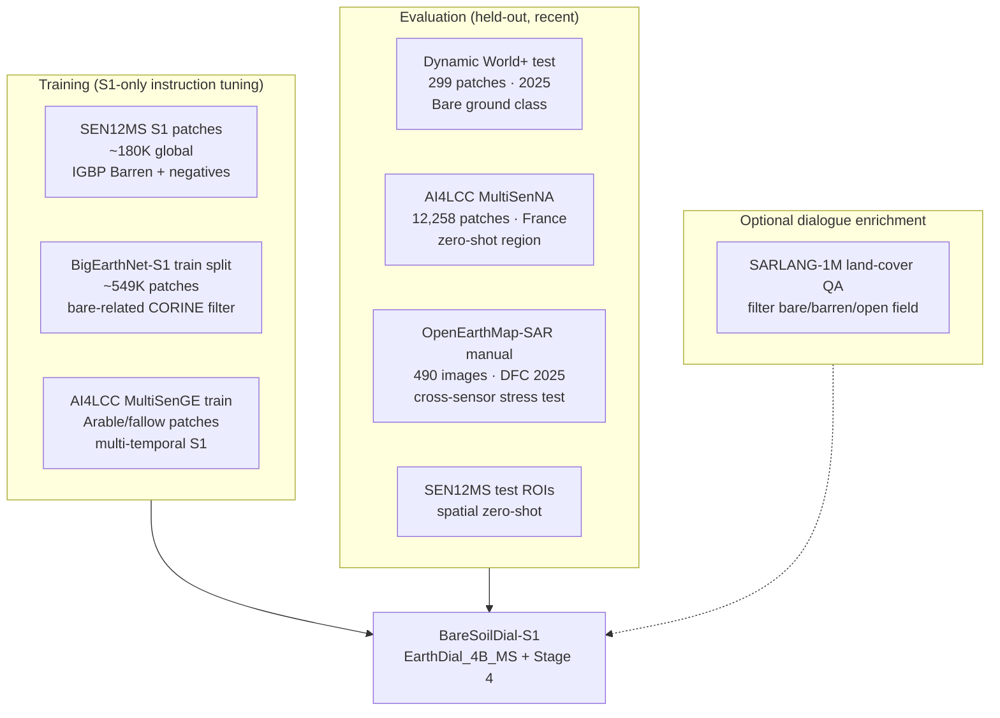
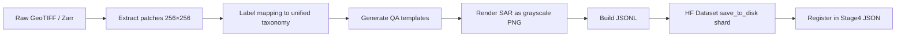

# BareSoil-S1 VLM: Dataset Strategy & Conversion Guide

> **Goal:** Build a **Sentinel-1 SAR-only** Vision-Language Model for **general LULC bare-soil classification + dialogue**, extending EarthDial as the base.  
> **Repo base:** `EarthDial-main/` (+ existing draft in `papers/EarthDial-main/baresoil/` — currently **RGB/S2**, not S1)

---

## 1. Critical Finding: No Ready-Made S1 Bare-Soil VLM Dataset Exists

| What exists | Gap |
|---|---|
| EarthDial Stage-3 SAR (ships, QuakeSet, Satlas S1 captions) | **No LULC / bare-soil focus** |
| `baresoil/` extension (AID, LCZ, BigEarthNet-S2) | **No Sentinel-1 modality** |
| SARLANG-1M (2025) | ~1M SAR VLM pairs, 16 land-cover types — **mixed SAR sensors, not S1-only**, bare soil not primary |
| OpenEarthMap-SAR (DFC 2025) | Has **bareland** class — but **Umbra SAR**, not Sentinel-1 |

**Conclusion:** You must **convert** segmentation / scene-classification / pixel-label datasets into EarthDial-style instruction shards. This is normal and matches how EarthDial built 11M pairs from labels + templates.

---

## 2. What EarthDial Already Used (AVOID for Eval / Claim Novelty)

| Source | S1? | Task | In EarthDial? |
|---|---|---|---|
| **Satlas_S1** | ✅ GRD VH | Caption / localization QA | ✅ Stage 3 (~1.68M QA) |
| **ship_dataset_v0 / SRSDD** | ✅ | Ship detection / grounding | ✅ Stage 3 |
| **QuakeSet** | ✅ bi-temporal | Earthquake yes/no | ✅ Stage 3 |
| **BigEarthNet** (RGB + S2 MS) | S1 paired | Multi-label CORINE | ✅ Stage 2/3 |
| **AI4LCC** | ✅ multi-temp S1 | LULC segmentation | ❌ **Not used** |
| **Dynamic World+** | ✅ S1+DW labels | Global LULC seg | ❌ **Not used** |
| **SEN12MS** | ✅ VV+VH | IGBP scene + seg labels | ❌ **Not used** |
| **OpenEarthMap-SAR** | ❌ (Umbra) | 8-class LULC + bareland | ❌ **Not used** |

Use **AI4LCC**, **Dynamic World+**, and **SEN12MS held-out ROIs** as your **primary eval benchmarks** to prove generalization beyond EarthDial training.

---

## 3. Recommended Dataset Stack



### Tier A — Primary (Sentinel-1, large, convertible)

#### 3.1 SEN12MS ⭐ Best for large-scale S1 LULC training

| Field | Detail |
|---|---|
| **Link** | [GitHub schmitt-muc/SEN12MS](https://github.com/schmitt-muc/SEN12MS) · [DOI 10.14459/2019mp1474000](https://doi.org/10.14459/2019mp1474000) |
| **Size** | **180,662** patch triplets (S1 + S2 + LC labels) |
| **S1 bands** | VV + VH, σ° dB, 10 m, 256×256 px |
| **Bare-soil class** | IGBP **Barren** (class 16) → simplified **Barren** (class 9): *exposed soil, sand, rocks* |
| **Also useful** | Croplands (post-harvest bare), Grassland, Open Shrubland |
| **Why good** | Global ROIs, seasonal diversity, **not in EarthDial**, native S1 |
| **Limitation** | Scene-level + pixel LC; Barren is **minority class** (~few %) — need balanced sampling |

#### 3.2 BigEarthNet-S1 ⭐ Largest S1 patch archive

| Field | Detail |
|---|---|
| **Link** | [bigearth.net](https://bigearth.net/) · v2.0: **549,488** S1+S2 pairs |
| **S1** | Dual-pol GRD, 120×120 px @ 10 m |
| **Labels** | CORINE Level-3 → 19-class nomenclature |
| **Bare-related CORINE** | Beaches/dunes/sands, natural grassland & sparsely vegetated, **arable land** (fallow) |
| **Why good** | Massive scale for instruction generation |
| **Caution** | EarthDial **already trained** on BigEarthNet (RGB/MS). Use **S1-only**, **bare-class filter**, and **official test split only for eval** — or exclude overlapping patches entirely and eval on AI4LCC/DW+ |

#### 3.3 AI4LCC (MultiSenGE + MultiSenNA) ⭐ Best recent S1 LULC benchmark

| Field | Detail |
|---|---|
| **Link** | [doi.theia.data-terra.org/ai4lcc](https://doi.theia.data-terra.org/ai4lcc/?lang=en) · [DOI 10.25577/563q-qd29](https://doi.org/10.25577/563q-qd29) |
| **Size** | MultiSenGE **8,157** + MultiSenNA **12,258** = **20,415** multi-temporal patches |
| **S1** | Sentinel-1 GRD time series per patch, 256×256 @ 10 m |
| **Labels** | 14-class LULC (OCSGE2 France); bare proxy: **Open Spaces, Mineral (12)** — rare (0.01%); **Arable Lands (6)** ~39% (fallow/bare cycles) |
| **License** | CC-BY-NC 4.0 |
| **HF mirror** | [wtr001/S1_AI4LCC](https://huggingface.co/datasets/wtr001/S1_AI4LCC) (S1-only Zarr, 5-class simplification) |
| **Strategy** | Train on **MultiSenGE** → eval **zero-shot on MultiSenNA** (different French region) |

---

### Tier B — Primary Eval (Recent, not in EarthDial)

#### 3.4 Dynamic World+ ⭐ 2025 global S1+LULC benchmark

| Field | Detail |
|---|---|
| **Paper** | JSTARS 2025 · [LULCFormer GitHub](https://github.com/uoe-haoyu/LULCFormer) |
| **Size** | **16,893 train** + **299 test/val** patches (510×510 px @ 10 m) |
| **S1** | Sentinel-1 aligned with Google Dynamic World |
| **Bare class** | Dynamic World label **`Bare ground`** (class index 7 in DW v1) |
| **Why good** | Very recent, global, authoritative DW labels, **pure held-out test** |
| **Use** | **Primary zero-shot benchmark** for bare-soil dialogue accuracy |

#### 3.5 OpenEarthMap-SAR (DFC 2025) — Cross-sensor eval only

| Field | Detail |
|---|---|
| **Link** | [Zenodo](https://zenodo.org/records/14950559) · [GitHub cliffbb/OpenEarthMap-SAR](https://github.com/cliffbb/OpenEarthMap-SAR) |
| **Size** | 5,033 images (1024×1024), 1.5M segments; **490 manually labeled** for seg eval |
| **SAR** | **Umbra** (0.15–0.5 m), **NOT Sentinel-1** |
| **Bare class** | **`bareland`** (8-class LULC) |
| **Use** | Stress-test **SAR generalization** across sensors; **do not train** if claiming S1-specific model |

---

### Tier C — Optional VLM-style enrichment (not S1-only)

#### 3.6 SARLANG-1M (Apr 2025)

| Field | Detail |
|---|---|
| **Link** | [arXiv:2504.03254](https://arxiv.org/abs/2504.03254) · [GitHub Jimmyxichen/SARLANG-1M](https://github.com/Jimmyxichen/SARLANG-1M) |
| **Size** | **1,126,277** image-text pairs; land-cover QA ~80 templates × 16 LC classes |
| **S1?** | Mixed SAR (Sentinel-1 + airborne + other) |
| **Use** | Borrow **dialogue templates** and augment phrasing; filter land-cover + bare/open-field; **do not use as sole S1 training source** |

---

## 4. Recommended Train / Eval Split

| Split | Dataset | Patches (approx) | Role |
|---|---|---:|---|
| **Train** | SEN12MS S1 (Barren + balanced negatives) | 50K–120K sampled | Core S1 bare-soil diversity |
| **Train** | BigEarthNet-S1 (bare CORINE classes only) | 80K–200K | Scale + multi-label dialogue |
| **Train** | AI4LCC MultiSenGE (S1 only) | 8,157 × ~5 QA each ≈ 40K | Multi-temporal LULC dialogue |
| **Val** | SEN12MS held-out ROIs | ~5K | Hyperparam / early stop |
| **Test-1** | **Dynamic World+** official test | **299** | Primary zero-shot (2025) |
| **Test-2** | **AI4LCC MultiSenNA** | **12,258** | Regional zero-shot (France) |
| **Test-3** | BigEarthNet-S1 official test (bare filter) | ~5K | Same sensor, different split |
| **Test-4** | OpenEarthMap-SAR manual 490 | 490 | Cross-sensor generalization |

**Target instruction volume:** 150K–300K S1 QA pairs (compare: EarthDial Stage 3 SAR = 1.68M but for ships/captions, not LULC).

---

## 5. Unified Bare-Soil Taxonomy (reuse from `baresoil/taxonomy.py`)

Map all source labels → 7 unified classes:

| Unified | Bare-positive? | S1-relevant sources |
|---|---|---|
| `bare_soil` | ✅ | DW Bare ground, OEM bareland, IGBP Barren, LCZ bare soil |
| `sparse_vegetation` | ✅ | CORINE sparsely vegetated, DW Shrub/scrub |
| `desert_sand` | ✅ | CORINE beaches/dunes, IGBP barren sand |
| `bare_rock_paved` | ✅ | LCZ bare rock/paved, OEM developed/road |
| `agricultural_fallow` | ✅ | CORINE arable, AI4LCC Arable Lands, DW Cropland (bare period) |
| `burnt_barren` | ✅ | (add fire scars from xBD if temporal) |
| `non_bare` | ❌ | All other classes |

Add SAR-specific hard negatives: **smooth bare radar backscatter** confused with **water**, **wet soil**, **urban flat roofs**.

---

## 6. EarthDial-Compatible Data Format

### 6.1 Training shard schema (`load_from_disk`)

Each sample in the HuggingFace `Dataset` folder:

```python
{
  "jpg": PIL.Image or numpy,      # single-channel SAR rendered as grayscale PNG/JPG
  # OR for dual-pol: stack VV as jpg, pass VH as second key — EarthDial S1 ship uses bands=1
  "conversations": json.dumps([
    {"from": "human", "value": "<prompt with tokens>"},
    {"from": "gpt",  "value": "<answer>"}
  ])
}
```

### 6.2 Stage config entry (`shell/data/Stage4_BareSoil_S1.json`)

```json
{
  "BareSoil_SEN12MS_train": {
    "annotation": "/data/baresoil_s1/sen12ms_train_shard",
    "image_key": "jpg",
    "conversation": "conversations",
    "bands": 1,
    "normalization": "s1",
    "dynamic_image": false,
    "repeat_time": 1
  },
  "BareSoil_AI4LCC_GE_train": {
    "annotation": "/data/baresoil_s1/ai4lcc_ge_shard",
    "image_key": "jpg",
    "conversation": "conversations",
    "bands": 1,
    "normalization": "s1",
    "dynamic_image": false
  }
}
```

### 6.3 S1 modality & task tokens (extend `constants.py`)

```python
# Already in EarthDial:
S1_VH_10_TOKEN = "[s1_vh_10]"   # 10 m GRD — use this for your project
S1_VH_1_TOKEN  = "[s1_vh_1]"    # Satlas high-res — do NOT use for SEN12MS

# Add (from baresoil extension):
BARESOIL = "[baresoil]"
CLASSIFY = "[classify]"
```

**Example instruction:**

```
[baresoil] [s1_vh_10] [classify] <image>
Classify dominant surface from SAR backscatter.
Options: bare soil, sparse vegetation, desert sand, bare rock or paved,
agricultural fallow, burnt barren, non bare.
```

### 6.4 S1 preprocessing (match EarthDial)

From `constants.py` + `dataset.py`:

- Use **`normalization: "s1"`** → mean **-20.26**, std **5.91** (dB scale)
- **`bands: 1`** → single VH channel (or average VV+VH to 1 ch for simplicity)
- Token: **`[s1_vh_10]`** for 10 m Sentinel-1 GRD

---

## 7. Conversion Pipeline (Step-by-Step)



### Step 1 — Download raw data

```bash
# SEN12MS: request download from TUM / follow GitHub instructions
# AI4LCC: register at https://doi.theia.data-terra.org/ai4lcc/
# Dynamic World+: clone https://github.com/uoe-haoyu/LULCFormer (check data README)
# BigEarthNet-S1: https://bigearth.net/
```

### Step 2 — Extract S1 patches

```python
import rasterio
import numpy as np
from PIL import Image

def s1_patch_to_png(vh_db: np.ndarray, out_path: str):
    """VH in dB → uint8 grayscale for EarthDial jpg key."""
    vh = np.clip(vh_db, -35, 5)
    vh_norm = ((vh + 35) / 40 * 255).astype(np.uint8)
    Image.fromarray(vh_norm, mode="L").convert("RGB").save(out_path)
```

For dual-pol: EarthDial `sequential_vit_features` expects `[B, C, H, W]` — with `bands=1` use **VH only** (standard for land applications) or **mean(VV, VH)**.

### Step 3 — Map labels to unified taxonomy

```python
from baresoil.taxonomy import map_label, unified_display_name

IGBP_TO_UNIFIED = {
    9: "bare_soil",      # simplified Barren
    6: "agricultural_fallow",  # Croplands
    4: "sparse_vegetation",    # Grasslands
    # ...
}
DW_TO_UNIFIED = {
    "Bare ground": "bare_soil",
    "Crops": "agricultural_fallow",
    # ...
}
```

For **pixel-level segmentation** (AI4LCC, Dynamic World+): compute **dominant class** per patch, or sample **multiple QA types**:
- Scene classification (dominant class)
- Binary VQA: "Is bare soil visible? yes/no"
- Percentage bucket: none / low / medium / high bare fraction
- Region QA (if you crop bare-dominated sub-patches)

### Step 4 — Generate instruction pairs

Reuse templates from `baresoil/instruct_templates.py` — add S1 variants:

```python
CLASSIFY_S1 = [
    "[baresoil] [s1_vh_10] [classify] <image>\n"
    "From Sentinel-1 SAR, classify surface: {options}.",
    "[s1_vh_10] <image>\n[baresoil] Is exposed bare soil dominant? Options: {options}.",
]

VQA_S1 = [
    "[baresoil] [s1_vh_10] <image>\n"
    "In this SAR image, is bare or barren land present? Answer yes or no.",
    "[s1_vh_10] <image>\n[baresoil] "
    "Could smooth dark backscatter be confused with water rather than bare soil? Explain briefly.",
]
```

**Multi-temporal (AI4LCC):** use EarthDial pattern `image_key: "jpg_A,jpg_B"` + token `[s1_vh_temp_10]`:

```
[baresoil] [changedet] [s1_vh_temp_10] <image>
Did bare exposed area increase between the two SAR acquisitions?
```

### Step 5 — Build HuggingFace shard

```python
from datasets import Dataset, Features, Image as HFImage, Value
import json

rows = []
for sample in samples:
    rows.append({
        "jpg": sample["png_path"],  # path or PIL
        "conversations": json.dumps([
            {"from": "human", "value": sample["prompt"]},
            {"from": "gpt",  "value": sample["answer"]},
        ]),
    })

ds = Dataset.from_list(rows)
ds.save_to_disk("baresoil_s1/sen12ms_train_shard")
```

### Step 6 — Register & fine-tune (Stage 4)

```bash
# Base checkpoint: EarthDial_4B_MS (already has S1 fusion path)
torchrun ... src/earthdial/train/finetune.py \
  --model_name_or_path checkpoints/EarthDial_4B_MS \
  --meta_path shell/data/Stage4_BareSoil_S1.json \
  --freeze_backbone True \
  --conv_style phi3-chat \
  ...
```

---

## 8. Evaluation Protocol

| Metric | Task | Benchmark |
|---|---|---|
| **Accuracy** | 7-class unified classification | Dynamic World+ test |
| **Binary F1** | bare-positive vs non-bare | All test sets |
| **Macro-F1** | rare class (bare_soil) | AI4LCC MultiSenNA |
| **ROUGE-L** | SAR image caption (bare focus) | Generated from DW+ labels |
| **Cohen's κ** | vs pixel dominant class | Segmentation-derived tests |
| **Zero-shot Δ** | vs EarthDial_4B_MS baseline | Same prompts, greedy decode |

Run like existing EarthDial eval:

```bash
GPUS=4 ./src/earthdial/eval/eval.sh ./checkpoints/BareSoilDial_S1 rs_classification --dynamic
```

(You'll need a custom `rs_baresoil_s1/` eval module mirroring `rs_classification/`.)

---

## 9. Novelty Claims You Can Make

1. **First S1-only bare-soil conversational VLM** (EarthDial = ships/quakes; baresoil draft = RGB/S2)
2. **Held-out eval on 2025 benchmarks** (Dynamic World+, DFC OpenEarthMap-SAR) not seen by EarthDial
3. **Regional zero-shot** MultiSenGE → MultiSenNA (France cross-region)
4. **SAR-specific dialogue**: moisture confusion, speckle, fallow vs bare rock disambiguation
5. **Unified 7-class bare taxonomy** across IGBP, CORINE, Dynamic World, OEM

---

## 10. Practical Warnings

| Issue | Mitigation |
|---|---|
| Bare soil is **rare** in AI4LCC (0.01% mineral) | Oversample; use **arable/fallow** + **IGBP Barren**; synthetic hard negatives |
| BigEarthNet overlap with EarthDial | S1-only channel + held-out test + eval on AI4LCC/DW+ |
| SEN12MS labels are MODIS 500 m upsampled | Prefer **scene labels** or **dominant pixel**; note label noise in paper |
| No native VLM text for S1 bare soil | Template + optional LLM paraphrase (like EarthDial used InternLM-XComposer2) |
| AI4LCC license NC | Academic use OK; check commercial restrictions |
| OpenEarthMap-SAR ≠ S1 | Use only for **cross-sensor** eval, not training |

---

## 11. Quick Start Checklist

- [ ] Copy `papers/EarthDial-main/baresoil/` into `EarthDial-main/baresoil/`
- [ ] Add `[baresoil]` token + `CLASSIFY_TEMPLATES_S1` in `instruct_templates.py`
- [ ] Download **SEN12MS** + **Dynamic World+** + **AI4LCC MultiSenGE/NA**
- [ ] Implement `build_instruct_s1.py` (mirror `build_instruct_v01.py`)
- [ ] Create `Stage4_BareSoil_S1.json`
- [ ] Fine-tune from **`EarthDial_4B_MS`** (not RGB checkpoint)
- [ ] Eval on **Dynamic World+ 299 test** + **MultiSenNA zero-shot**

---

## References

- EarthDial: [arXiv:2412.15190](https://arxiv.org/abs/2412.15190)
- SEN12MS: Schmitt et al., ISPRS 2020
- AI4LCC: Wenger et al., ISPRS/Remote Sensing 2022–2025
- Dynamic World+: JSTARS 2025, [github.com/uoe-haoyu/LULCFormer](https://github.com/uoe-haoyu/LULCFormer)
- OpenEarthMap-SAR: Xia et al., IEEE GRSM 2025, [Zenodo](https://zenodo.org/records/14950559)
- SARLANG-1M: [arXiv:2504.03254](https://arxiv.org/abs/2504.03254)
- BigEarthNet-S1: [bigearth.net](https://bigearth.net/)
