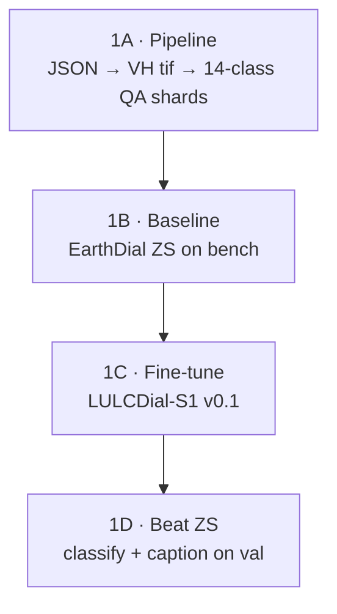

# Stage 1 — Summer Intern Guide (4 substages)

> **Parent roadmap:** `[AI4LCC_S1_VLM_MTech_3Stage_Roadmap.md](AI4LCC_S1_VLM_MTech_3Stage_Roadmap.md)`  
> **Duration:** 8–10 weeks  
> **Goal:** Working **LULCDial-S1 v0.1** that beats **EarthDial ZS** on AI4LCC validation

---

## Quick glossary


| Term                   | Meaning                                                                                                                                                                                                |
| ---------------------- | ------------------------------------------------------------------------------------------------------------------------------------------------------------------------------------------------------ |
| **ZS**                 | **Zero-shot** — use pretrained **EarthDial_4B_MS** **without** training on AI4LCC. Ask it LULC questions on S1 images; record how wrong it is. That number is your **baseline**.                       |
| **LULCDial-S1**        | **Same EarthDial model** (ViT + projector + LLM), **fine-tuned** on your AI4LCC QA shards. **Not a new architecture.** It is a **checkpoint name** for “EarthDial adapted for S1 land-cover dialogue.” |
| **Fine-tune**          | Continue training EarthDial weights on your new question–answer pairs so the model learns OCSGE 14-class SAR dialogue.                                                                                 |
| `[baresoil]` **token** | One new **text token** in the prompt (like `[s1_vh_10]`). Tells the model “this is land-cover / LULC task.” This is **not** a new neural network layer.                                                |


### Is LULCDial-S1 “EarthDial + new layer”?

**No — not a new layer.**

```
EarthDial_4B_MS  =  InternViT (vision)  +  MLP projector  +  Phi-3 LLM (language)
LULCDial-S1      =  SAME stack, weights updated after training on AI4LCC QA data
```

What changes when you fine-tune:


| What changes                                        | What stays the same                        |
| --------------------------------------------------- | ------------------------------------------ |
| Model **weights** (learned from your QA data)       | **Architecture** (no new blocks added)     |
| Optional new prompt token `[baresoil]` in tokenizer | Same input: S1 VH image + text question    |
| Saved as new folder `checkpoints/LULCDial_S1_v0.1/` | Still runs through EarthDial `finetune.py` |


Think of it like: **same student (EarthDial), new textbook chapter (AI4LCC QA)** — not a different person.

---


## Overview — 4 substages




| Substage             | One-line goal                                | Exit check                   |
| -------------------- | -------------------------------------------- | ---------------------------- |
| **1A Pipeline**      | Turn raw AI4LCC into EarthDial training data | Shards + bench JSONL on disk |
| **1B Baseline (ZS)** | Measure EarthDial **before** your training   | `earthdial_zs_baseline.json` |
| **1C Fine-tune**     | Train **LULCDial-S1 v0.1** on shards         | Checkpoint saved             |
| **1D Beat ZS**       | Prove fine-tune helped                       | Metrics better than 1B       |


---


## Substage 1A — Pipeline (JSON → VH → QA shards)

**What:** Build instruction data EarthDial can read.

**Input (on disk):**

```
data/baresoil_s1/ai4lcc/multisenge/
├── labels/     ← 8,157 JSON files  ✅ you have this
└── s1/         ← Sentinel-1 .tif     ⏳ download s1.tgz (~110 GB)
```

**Steps:**


| Step | What happens                                                                               | Code                                     |
| ---- | ------------------------------------------------------------------------------------------ | ---------------------------------------- |
| 1    | Read each `31TFN_7196_514.json` → tile, x, y, **14-class label IDs**, list of S1 filenames | `baresoil/ai4lcc.py`                     |
| 2    | Pick **one S1 date** per patch (median of 2020)                                            | `pick_median_s1_file()`                  |
| 3    | Open `.tif` → take **band 2 (VH)** → 256×256 image                                         | `baresoil/s1_io.py`                      |
| 4    | Build **3 QA pairs** per patch using **official OCSGE names**                              | `baresoil/instruct_templates.py`         |
| 5    | Save HuggingFace shards + val bench JSONL                                                  | `build_instruct_s1.py`, `build_bench.py` |


**Commands:**

```powershell
cd e:\MTP\earth2\EarthDial-main

python -m baresoil.build_instruct_s1 ^
  --labels-dir data/baresoil_s1/ai4lcc/multisenge/labels ^
  --s1-dir data/baresoil_s1/ai4lcc/multisenge/s1 ^
  --out-dir data/baresoil_s1/shards/ai4lcc_ge_train ^
  --split all

python -m baresoil.build_bench ^
  --labels-dir data/baresoil_s1/ai4lcc/multisenge/labels ^
  --s1-dir data/baresoil_s1/ai4lcc/multisenge/s1 ^
  --out-jsonl data/baresoil_s1/bench/v0.1/ai4lcc_val.jsonl
```

**Outputs:**


| File                            | ~Size              |
| ------------------------------- | ------------------ |
| `shards/ai4lcc_ge_train_train/` | ~22k QA rows       |
| `shards/ai4lcc_ge_train_val/`   | ~2k QA rows        |
| `bench/v0.1/ai4lcc_val.jsonl`   | held-out eval list |


**Done when:** `manifest.json` inside shard folder shows `num_samples > 0` and no mass `missing_s1` skips.

**Weeks:** 2–3 (blocked until `s1.tgz` is extracted)

---


## Substage 1B — Baseline: EarthDial ZS

**What:** **ZS = zero-shot.** Run **off-the-shelf EarthDial_4B_MS** on your bench **without any AI4LCC training**.

**Why:** You must show the professor *“before vs after”*. If you only show fine-tuned results, nobody knows if your data helped.

**How:**

1. Download checkpoint: `akshaydudhane/EarthDial_4B_MS` from Hugging Face
2. Load `bench/v0.1/ai4lcc_val.jsonl`
3. For each sample: send S1 image + classify/caption prompt (same templates as training)
4. Compare model answer vs ground-truth 14-class labels
5. Save metrics → `data/baresoil_s1/metrics/earthdial_zs_baseline.json`

**What you expect:** EarthDial will often **guess wrong** on S1 LULC — it was trained on BigEarthNet **optical/S2**, and S1 for **ships/quakes**, not OCSGE dialogue.

**Metrics to record:**


| Task                                  | Metric                     |
| ------------------------------------- | -------------------------- |
| Classification (14-class multi-label) | Macro-F1, example-F1       |
| Caption                               | ROUGE-L (optional in v0.1) |
| Dialogue turn 1                       | Accuracy                   |


**Done when:** Baseline JSON file exists with numbers you can put in a table.

**Weeks:** 4 (after 1A)

---


## Substage 1C — Fine-tune LULCDial-S1 v0.1

**What:** Train EarthDial on your shards → save as **LULCDial-S1 v0.1**.

**Config:** `src/shell/data/Stage4_BareSoil_S1.json` points to train/val shards.

**Training recipe (EarthDial Stage 4):**


| Setting         | Value                                      |
| --------------- | ------------------------------------------ |
| Base checkpoint | `EarthDial_4B_MS`                          |
| Data            | `ai4lcc_ge_train_train` / `_val`           |
| Bands           | 1 (S1 VH)                                  |
| Normalization   | `s1`                                       |
| Task token      | `[baresoil]` (registered in `finetune.py`) |


**What actually gets updated:** model weights during supervised fine-tuning on your QA pairs (image + question → answer). Same as EarthDial paper Stage 3/4 — **not** building a new model from scratch.

**Output checkpoint:**

```
EarthDial-main/checkpoints/LULCDial_S1_v0.1/
```

**Done when:** Training finishes; loss decreases; checkpoint loads for inference.

**Weeks:** 4–6 (needs GPU — 8× A100 ideal per EarthDial README; fewer GPUs = longer)

---


## Substage 1D — Beat ZS on classify + caption (val)

**What:** Run **same bench** as 1B, but with **LULCDial-S1 v0.1** instead of raw EarthDial.

**Compare:**


| Model            | Trained on AI4LCC? | Role             |
| ---------------- | ------------------ | ---------------- |
| EarthDial_4B_MS  | **No** (ZS)        | Baseline (1B)    |
| LULCDial-S1 v0.1 | **Yes**            | Your result (1D) |


**Success targets (Stage 1 exit):**


| Metric                  | Target                           |
| ----------------------- | -------------------------------- |
| 14-class macro-F1 (val) | **≥ +10 points** over ZS         |
| Caption ROUGE-L         | Better than ZS                   |
| Dialogue turn-1         | ≥ 70%                            |
| Qualitative             | 10 good SAR explanation examples |


**Also do:** Short error analysis — when does model confuse Water vs Open Spaces Mineral, urban vs arable?

**Save:** `data/baresoil_s1/metrics/lulcdial_v0.1.json`

**Deliverable:** Intern report PDF + demo notebook.

**Weeks:** 6–10

---


## Timeline (weeks)


| Week | Substage | Focus                                                         |
| ---- | -------- | ------------------------------------------------------------- |
| 1    | Setup    | Env, EarthDial_4B_MS download, update templates to 14 classes |
| 2–3  | **1A**   | Download `s1.tgz`, build shards + bench                       |
| 4    | **1B**   | EarthDial **ZS** baseline                                     |
| 4–6  | **1C**   | Fine-tune **LULCDial-S1 v0.1**                                |
| 6–7  | **1D**   | Eval + beat ZS                                                |
| 7–10 | **1D**   | Error analysis + intern report                                |


---


## What to tell your professor (30 seconds)

> **ZS** means we test EarthDial **without** training on AI4LCC first — that is our baseline.  
> **LULCDial-S1** is the **same EarthDial architecture**, fine-tuned on AI4LCC question–answer data for Sentinel-1 land-cover dialogue — we are **not** adding a new neural layer, we are **adapting weights** and a task token.  
> Stage 1 proves the AI4LCC QA conversion is useful because **LULCDial-S1 beats zero-shot EarthDial** on classification and captioning.

---


## Related files


| File                                                                                                                 | Purpose                 |
| -------------------------------------------------------------------------------------------------------------------- | ----------------------- |
| `[BenchmarkGuide/AI4LCC/BareSoil_AI4LCC_Workflow_Guide.md](BenchmarkGuide/AI4LCC/BareSoil_AI4LCC_Workflow_Guide.md)` | Detailed pipeline steps |
| `[EarthDial-main/baresoil/README.md](EarthDial-main/baresoil/README.md)`                                             | Run commands            |
| `[readGuide.md](readGuide.md)`                                                                                       | What to read first      |


