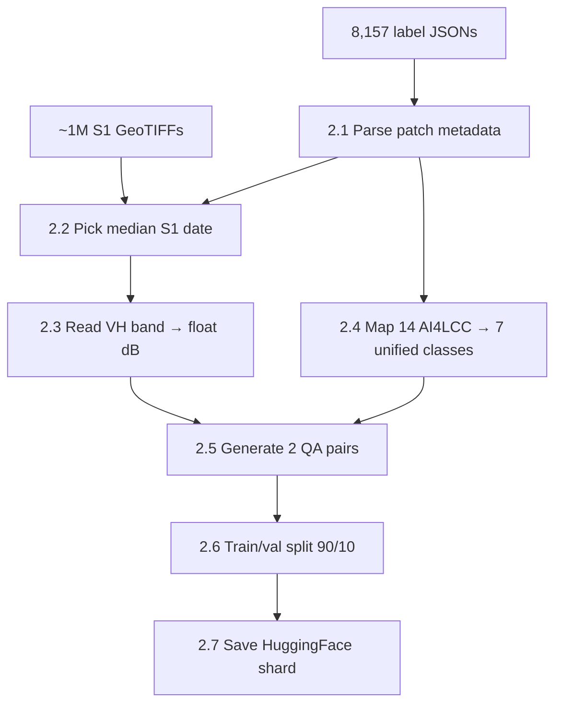
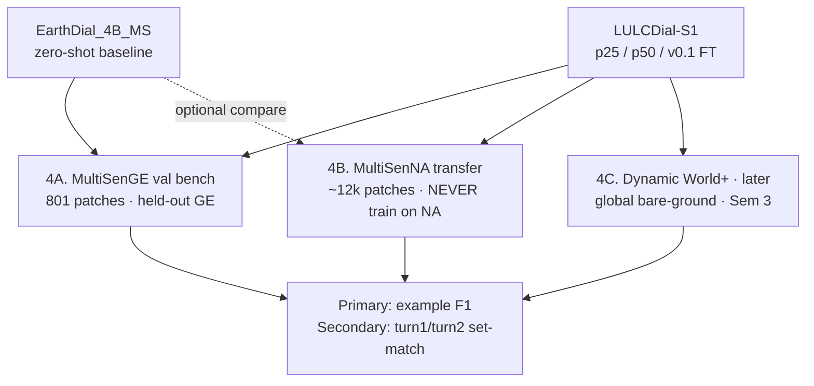

# LULCDial-S1 — AI4LCC MultiSenGE Workflow Guide

> **Purpose:** Explain **every step** of the MultiSenGE → EarthDial fine-tune → evaluation workflow for supervisors / PI.  
> **Product name:** **LULCDial-S1** (same EarthDial architecture, AI4LCC-adapted weights). Legacy title “BareSoilDial” retired.  
> **Audience:** Technical committee + non-specialist reviewers.  
> **Code location:** `LULCDial-s1/baresoil/`  
> **Status (2026-07):** Stage 1 GE eval **done** (ZS → 100% FT). **Next:** MultiSenNA transfer.  
> **Dataset reference:** [`MultiSenGE_AI4LCC_Complete_Analysis.md`](MultiSenGE_AI4LCC_Complete_Analysis.md)

---

## 1. One-slide summary (for PI)

**Problem:** EarthDial understands Sentinel-1 for **ships and earthquakes**, but not **bare soil / land-cover dialogue**.

**Solution:** Take the official French **AI4LCC MultiSenGE** dataset (8,157 patches, Sentinel-1 + expert LULC labels), convert it into **question–answer training pairs** in EarthDial’s format, fine-tune **EarthDial_4B_MS** into **LULCDial-S1**, and evaluate on **held-out MultiSenGE val**, then **MultiSenNA** (transfer), and later **global** Dynamic World+.

**Why MultiSenGE first:** Official 10 m Sentinel-1 GRD patches, 14-class urban/agriculture labels, ~110 GB (not 500 GB like SEN12MS), **not already used by EarthDial**.


---

## 2. End-to-end pipeline (four phases)

| Phase | What happens | Who runs it | Output |
|---|---|---|---|
| **1. Download** | Get official MultiSenGE labels + S1 imagery | Student | Raw folders on disk |
| **2. Convert** | Pick one S1 date per patch → VH image → labels → 2 QA each → shard | Script `build_instruct_s1.py` | ~16k training samples |
| **3. Train** | EarthDial Stage 4 fine-tune on AI4LCC S1 QA (25→50→100% scaling) | EarthDial `finetune.py` + PARAM `sbatch` | **LULCDial-S1** checkpoints (`p25` / `p50` / `v0.1`) |
| **4. Evaluate** | GE val bench (801) + ZS baseline; then MultiSenNA transfer; DW+ later | `predict_zero_shot` + `eval_zero_shot` | example F1 + dialogue set-match |

---

## 3. Phase 1 — Download official AI4LCC data

### 3.1 What we download (and what we skip)

| Asset | URL | Size | Status | Why we need it |
|---|---|---:|---|---|
| **labels.tgz** | `https://s3.unistra.fr/a2s_datasets/MultiSenGE/labels.tgz` | ~4 MB | ✅ Done | One JSON per patch — links S1 filenames to LULC class IDs |
| **s1.tgz** | `https://s3.unistra.fr/a2s_datasets/MultiSenGE/s1.tgz` | ~110 GB | ⏳ You download | Actual Sentinel-1 VV+VH GeoTIFFs (many dates per patch) |
| **ground_reference.tgz** | same portal | ~25 MB | Optional | Pixel-level 14-class masks (for future segmentation QA) |
| **s2.tgz** | same portal | Large | **Skip (Stage 1)** | Optical — not needed for S1-only bare-soil VLM |
| **HF `wtr001/S1_AI4LCC`** | HuggingFace | — | **Do not use** | Huge reprocessed tile mosaics, not 256×256 training patches |

### 3.2 Folder layout after extract

```text
LULCDial-s1/data/baresoil_s1/ai4lcc/multisenge/
├── labels/                    ← 8,157 files  e.g. 31TFN_4626_514.json
└── s1/                        ← ~1M GeoTIFFs  e.g. 31TFN_20200930_S1_4626_514.tif
```

### 3.3 What one label JSON contains (example)

**File:** `31TFN_4626_514.json`

```json
{
  "corresponding_s1": "31TFN_20200930_S1_4626_514.tif;31TFN_20201012_S1_4626_514.tif;...",
  "corresponding_s2": "31TFN_20200805_S2_4626_514.tif;...",
  "projection": "PROJCS[\"WGS 84 / UTM zone 31N\", ...]",
  "labels": "2;5;6;9;11"
}
```

| Field | Meaning | How we use it |
|---|---|---|
| `corresponding_s1` | All Sentinel-1 scenes for this patch in 2020 (`;`-separated) | **Pick one date** (median) → single training image |
| `corresponding_s2` | Sentinel-2 dates | Ignored in Stage 1 (S1-only) |
| `labels` | **Which of 14 classes appear** in the patch (multi-label list) | Map to **7 unified bare-soil classes** → QA answers |
| `projection` | UTM CRS | Metadata only for now |

**Important for PI:** The JSON says which classes are **present**, not exact pixel percentages. For scene-level QA we take the **most frequent mapped class** among those IDs (see Step 2.4).

### 3.4 What one S1 GeoTIFF contains

| Property | Value |
|---|---|
| Size | **256 × 256** pixels |
| Ground resolution | **10 m** (2.56 km × 2.56 km on ground) |
| Band 1 | **VV** backscatter (dB) |
| Band 2 | **VH** backscatter (dB) — **we use this band** |
| Dates | Many per patch across **2020** (multitemporal archive) |

**Why VH only:** EarthDial’s Sentinel-1 convention uses **VH at 10 m** (`[s1_vh_10]`). VH is standard for land-cover / moisture sensitivity in C-band SAR.

---

## 4. Phase 2 — Conversion pipeline (`baresoil/`)

This is the core engineering work. Each sub-step below maps to code in `LULCDial-s1/baresoil/`.



**Command (after `s1.tgz` is extracted):**

```powershell
cd e:\MTP\earth2\LULCDial-s1
python -m baresoil.build_instruct_s1 ^
  --labels-dir data/baresoil_s1/ai4lcc/multisenge/labels ^
  --s1-dir data/baresoil_s1/ai4lcc/multisenge/s1 ^
  --out-dir data/baresoil_s1/shards/ai4lcc_ge_train ^
  --split all
```

---

### Step 2.1 — Parse patch metadata

**Module:** `baresoil/patch_meta.py` → `parse_label_json()`, `iter_patches()`

**What it does:**

1. Reads every `*.json` in `labels/` (expect **8,157** files).
2. Parses filename `31TFN_4626_514.json` → tile=`31TFN`, grid x=`4626`, y=`514`.
3. Splits `labels` field → list of integers e.g. `[2, 5, 6, 9, 11]`.
4. Splits `corresponding_s1` → list of S1 filenames for that patch.
5. Builds a **`PatchMeta`** record per spatial patch.

**Output (in memory):** 8,157 patch records — **one record = one spatial location**, not one S1 date.

**Why:** MultiSenGE stores **one patch × many dates**. Training needs **one image per patch** for stable QA.

---

### Step 2.2 — Pick median S1 date per patch

**Module:** `baresoil/patch_meta.py` → `pick_median_s1_file()`

**Rule:**

```python
sorted_files = sorted(meta.s1_files)   # chronological by filename (YYYYMMDD in name)
chosen = sorted_files[len(sorted_files) // 2]   # middle date
```

**Example:** If a patch has S1 on Sep 30, Oct 12, Oct 24, … → pick the **middle** file after sorting.

**Why median (explain to PI):**

| Alternative | Problem |
|---|---|
| First date | May be noisy or early-season wet soil |
| Random date | Not reproducible |
| All dates | Would explode dataset size (~1M images); EarthDial Stage 1 uses **one view per patch** |
| **Median date** | Stable, reproducible, roughly mid-year 2020 — good compromise |

**Resolve file on disk:** `pick_s1_path()` looks for the `.tif` under `s1/` (direct path or recursive search).

**If S1 missing:** Patch is **skipped** (counted in `manifest.json` → `skipped.missing_s1`).

---

### Step 2.3 — Extract VH band → EarthDial float image

**Module:** `baresoil/s1_vh_io.py` → `read_s1_vh_db()`, `vh_db_to_pil()`

**Steps inside `read_s1_vh_db`:**

1. Open GeoTIFF with **rasterio**.
2. Read **band 2** (VH). If only one band, use band 1.
3. If values look like linear sigma0 (0–1), convert: `10 * log10(sigma0)`.
4. Clip to **[-50, 10] dB** ( sane SAR range ).
5. Verify shape is **256 × 256**.
6. Store as **float32 PIL** image (`mode="F"`) — **not** 8-bit PNG.

**Why float dB:** EarthDial’s S1 training path uses **`normalization: "s1"`** with constants `S1_MEAN = -20.26`, `S1_STD = 5.91` (same as upstream EarthDial Sentinel-1 tasks).

**What we do NOT do:** RGB false-color PNG for training (only optional `vh_db_to_preview_png()` for human inspection in bench previews).

---

### Step 2.4 — Taxonomy: keep official **14 OCSGE** class names

**Module:** `baresoil/taxonomy.py`

**Supervisor decision (locked):** do **not** remap to a custom 7-class bare-soil taxonomy. QA answers use **official MultiSenGE / OCSGE display names** (e.g. `Arable Lands`, `Open Spaces, Mineral`, `Forests`).

MultiSenGE has **14 expert classes** (IDs 1–14). MultiSenNA adds coastal class **15 = Beaches, Sand**.

#### 14 AI4LCC classes (source — what the model says)

| ID | Name | Notes for thesis |
|---:|---|---|
| 1–5 | Urban subclasses | Built / paved — usually non-vegetated mineral surfaces |
| **6** | Arable Lands | Seasonal soil exposure possible |
| 7–8 | Vineyards, Orchards | Agricultural |
| **9** | Grasslands | Natural / agricultural |
| 10 | Groves and Hedges | Sparse vegetation |
| 11 | Forests | Natural |
| **12** | **Open Spaces, Mineral** | Closest official proxy to “bare / mineral open space” |
| 13–14 | Wetland, Water | Natural / water |

#### How answers are built (Stage 1)

1. Read JSON `labels: "2;5;6;9;11"` → list of **present** class IDs.  
2. Map IDs → **official names** via `taxonomy.py`.  
3. **Classify / dialogue turn 1:** comma-separated present names.  
4. **Dialogue turn 2:** subset that are natural/agricultural (`natural_class_names_from_ids`).  
5. Dominant class (if needed): lowest present OCSGE id (`dominant_ocsge_name`) — not a 7-class remapping.

**Limitation to disclose:** JSON lists **presence**, not pixel area. Optional future: majority vote from `ground_reference.tif`.

---

### Step 2.5 — Generate two QA pairs per patch

**Module:** `baresoil/instruct_templates.py`

Each patch produces **2 conversations** (same VH image):

| # | Template function | Question (short) | Answer |
|---|---|---|---|
| 1 | `build_classify_qa()` | Classify land cover — choose all that apply (14 OCSGE names) | e.g. `Sparse Built-Up, Arable Lands, Forests` |
| 2 | `build_dialogue_turns()` | Turn 1: all classes; Turn 2: natural/ag subset | Turn 2: e.g. `Arable Lands, Forests` |

**Special tokens (EarthDial registers these):**

```
[baresoil] [s1_vh_10] [classify] <image>   ← task 1
[baresoil] [s1_vh_10] <image>              ← task 2 (dialogue)
```

**Scale:**

| Item | Count |
|---|---:|
| Patches | 8,157 |
| QA per patch | 2 |
| **Max instruction rows** | **~16,314** |
| After 90/10 split | ~14.7k train + ~1.6k val (approx.) |

---

### Step 2.6 — Train / validation split (90 / 10)

**Module:** `build_instruct_s1.py` → `_split_bucket()`

**Rule:** Deterministic hash on patch ID (e.g. `31TFN_4626_514`):

```python
hash(patch_stem) % 1000 < 900  →  train
else                           →  val
```

**Why hash split:** Same patch never appears in both train and val; **reproducible** across runs; no manual CSV needed.

**What we do NOT use for Stage 1 train/val:** Random split by QA row (would leak same patch into both splits).

---

### Step 2.7 — Save HuggingFace shard (EarthDial format)

**Module:** `build_instruct_s1.py` → `Dataset.from_dict(...).save_to_disk()`

**Output folders:**

```text
data/baresoil_s1/shards/
├── ai4lcc_ge_train_train/     ← ~90% of QA rows
│   ├── dataset_info.json
│   ├── manifest.json
│   └── arrow files (jpg + conversations columns)
└── ai4lcc_ge_train_val/       ← ~10% held-out
```

**Each row schema:**

```python
{
  "jpg": PIL.Image float32 256×256,   # VH dB values
  "conversations": '[{"from":"human","value":"..."},{"from":"gpt","value":"..."}]'
}
```

**manifest.json** records: sample count, patches count, skipped files (missing S1, bad tif).

---

### Step 2.8 — Build evaluation bench (optional but recommended)

**Module:** `baresoil/build_bench.py`

**Purpose:** JSONL file for **metrics** without loading full HF shard — one row per **val patch**.

```powershell
python -m baresoil.build_bench ^
  --labels-dir data/baresoil_s1/ai4lcc/multisenge/labels ^
  --s1-dir data/baresoil_s1/ai4lcc/multisenge/s1 ^
  --out-jsonl data/baresoil_s1/bench/v0.1/ai4lcc_val.jsonl ^
  --preview-dir data/baresoil_s1/bench/previews
```

**Each JSONL row:** patch_id, s1_path, label_ids, label_names, classify Q/A, dialogue turns, optional preview PNG.

---

## 5. Phase 3 — EarthDial fine-tuning (Stage 4)

### 5.1 Config file

**Path:** `LULCDial-s1/src/shell/data/Stage4_BareSoil_S1.json`

Points EarthDial trainer to your shards:

| Key | Path | Settings |
|---|---|---|
| `BareSoil_AI4LCC_GE_train` | `.../shards/ai4lcc_ge_train_train` | `bands: 1`, `normalization: "s1"` |
| `BareSoil_AI4LCC_GE_val` | `.../shards/ai4lcc_ge_train_val` | same |

### 5.2 Model and tokens

| Item | Value |
|---|---|
| Base checkpoint | **EarthDial_4B_MS** (Hugging Face) |
| New task token | **`[baresoil]`** registered in `finetune.py` |
| Existing S1 token | **`[s1_vh_10]`** (already in EarthDial) |
| Modality | **Single-band VH** SAR (not RGB, not S2) |

### 5.3 What training teaches the model

The VLM learns to:

1. Read **256×256 VH backscatter** (not optical color).
2. Answer **land-surface questions** in natural language.
3. Associate token **`[baresoil]`** with bare-soil / LULC dialogue (not ship detection).

**What PI should hear:** We are **not** training a new radar physics model from scratch — we **adapt** a pretrained vision-language model with ~16k domain-specific Q&A pairs, same philosophy EarthDial used for 11M RS pairs.

### 5.4 Deliverable

**Checkpoint name:** **LULCDial-S1** (e.g. `LULCDial-s1/checkpoints/LULCDial_S1_v0.1/` after 100% fine-tune). Same EarthDial architecture; new weights for OCSGE 14-class S1 dialogue (`[baresoil]` + `[s1_vh_10]`).

---

## 6. Phase 4 — Evaluation strategy



**Stage 1 status (2026-07):** **4A done** (ZS F1 ≈ 0.019 → 100% FT F1 ≈ 0.799). **4B next.** **4C later.**

### 6.1 Evaluation A — MultiSenGE val (development) ✅

| Aspect | Detail |
|---|---|
| Data | `bench/v0.1/ai4lcc_val.jsonl` — **801** MultiSenGE val patches (+ packed `s1_val_bench`) |
| Tasks | Classify (multi-label present classes) + 2-turn dialogue |
| Taxonomy | **OCSGE 14-class** present-class lists (not a collapsed 7-class bare-only scheme) |
| Purpose | Beat ZS; measure data scaling (25% / 50% / 100% FT) |
| Leakage | Val patches disjoint from train shard |
| **Primary metric** | **example F1** (set overlap with partial credit) |
| **Secondary** | Dialogue **turn1 / turn2 exact set-match** accuracy (all-or-nothing) |
| Scorer | `baresoil/eval_zero_shot.py` |

### 6.2 Evaluation B — MultiSenNA (regional transfer) ⭐ NEXT

| Aspect | Detail |
|---|---|
| Region | Nouvelle-Aquitaine (western France) — **different geography from MultiSenGE** |
| Patches | ~**12k** (`multisenna_bench.jsonl` on PARAM) |
| Rule | **Never train on MultiSenNA** — transfer / regional zero-shot |
| Model | Prefer best GE FT checkpoint (`LULCDial_S1_v0.1`); compare to EarthDial ZS |
| Metrics | Same as 4A: example F1 + turn1/turn2 set-match |
| Thesis claim | “GE-trained LULCDial-S1 transfers to unseen French LULC (NA)” |

### 6.3 Evaluation C — Dynamic World+ (global, later / Sem 3)

| Aspect | Detail |
|---|---|
| Patches | ~299 test |
| Class | **Bare ground** (Dynamic World index 7) |
| Purpose | Global benchmark with an explicit bare class — **after** MultiSenNA |
| Note | Different label space than OCSGE 14-class; treat as separate protocol |

### 6.4 Baseline and scaling comparison

| Model | Role | GE val example F1 (Stage 1) |
|---|---|---:|
| **EarthDial_4B_MS** (zero-shot) | Pretrained RS VLM, no AI4LCC FT | ≈ **0.019** |
| **LULCDial-S1 p25** (25% data) | Scaling point | ≈ **0.782** |
| **LULCDial-S1 p50** (50% data) | Scaling point | ≈ **0.783** |
| **LULCDial-S1 v0.1** (100% data) | Best GE checkpoint for transfer | ≈ **0.799** |

**Target (intern):** Beat EarthDial ZS on the GE val bench (achieved). Dialogue exact set-match stays harder (~0.12 / ~0.37) — report beside F1, do not replace F1.

---

## 7. What we deliberately exclude (say this to PI)

| Excluded | Reason |
|---|---|
| HuggingFace `wtr001/S1_AI4LCC` black mosaics | Wrong format (full tiles, not 256² patches); reprocessed |
| MultiSenNA in **training** | Would invalidate zero-shot eval |
| Sentinel-2 in Stage 1 | Thesis is **S1-only** dialogue at inference |
| All S1 dates per patch | Cost / redundancy; median date is enough for v0.1 |
| Urban-only patches as “bare soil” positives | Classes 1–5 map to paved — use as **negatives** or separate class |

---

## 8. Resource and timeline estimate

| Resource | Estimate |
|---|---|
| Disk (S1 extract) | ~110 GB raw + ~10 GB shards |
| RAM | 16 GB+ for shard build |
| GPU (fine-tune) | 1× A100 or equivalent; LoRA/full FT per EarthDial recipe |
| Patch build time | ~1–3 hours for 8k patches (depends on disk) |
| Fine-tune | Hours to 1 day (depends on epochs) |

| Milestone | Dependency |
|---|---|
| Labels parsed | ✅ Done (8,157 JSON) |
| S1 downloaded | User action (`s1.tgz`) |
| Shards built | After S1 extract |
| Bench JSONL | After S1 extract |
| Fine-tune | After shards |
| MultiSenNA eval | Separate MultiSenNA S1 download |

---

## 9. FAQ for supervisor meeting

**Q: Why not train on the whole 1 million S1 time slices?**  
A: MultiSenGE has ~1M **date×patch** files but only **8,157 spatial patches**. Using all dates would repeat the same geography with slight speckle/noise changes — expensive with little new semantic signal for v0.1. Median-date **one image per patch** matches EarthDial’s instruction format and keeps ~16k QA manageable.

**Q: Where does “bare soil” come from if AI4LCC has no bare-soil class?**  
A: Class **12 (Open Spaces, Mineral)** and partially **6 (Arable)** and **9 (Grasslands)** map to our unified bare-related taxonomy. We document this mapping in the thesis (not claiming pixel-perfect bare soil semantics).

**Q: How is this different from EarthDial’s existing SAR training?**  
A: EarthDial Stage 3 SAR = **ships, captions, earthquake change**. We add **`[baresoil]` LULC dialogue** on Sentinel-1 — new task, new labels, new benchmark.

**Q: Why France only?**  
A: MultiSenGE is the best **official S1 + fine LULC** package that fits disk budget. MultiSenNA + Dynamic World+ provide **geographic and global** eval later.

**Q: Is the pipeline automated?**  
A: Yes — one command builds shards from official folders; config JSON plugs into EarthDial trainer.

**Q: What can go wrong?**  
A: (1) S1 path mismatch after extract — fix `--s1-dir`. (2) Mixed patches → wrong dominant class from JSON — future fix with ground reference raster. (3) Class imbalance — forest/arable dominate; report per-class F1, not accuracy alone.

---

## 10. File map (code ↔ step)

| Step | File | Main function |
|---|---|---|
| Parse JSON | `baresoil/patch_meta.py` | `iter_patches()`, `parse_label_json()` |
| Pick S1 date | `baresoil/patch_meta.py` | `pick_median_s1_file()` |
| Read VH | `baresoil/s1_vh_io.py` | `read_s1_vh_db()`, `vh_db_to_pil()` |
| Taxonomy | `baresoil/taxonomy.py` | `dominant_unified_from_ids()`, `map_ai4lcc_id()` |
| QA text | `baresoil/instruct_templates.py` | `build_classify_qa()`, `build_binary_bare_qa()`, `build_vqa_surface_qa()` |
| Build shards | `baresoil/build_instruct_s1.py` | `build_shard()`, `main()` |
| Build bench | `baresoil/build_bench.py` | `main()` |
| EarthDial config | `src/shell/data/Stage4_BareSoil_S1.json` | dataset paths |
| Token registration | `src/earthdial/train/finetune.py` | `BARESOIL` token |

---

## 11. Suggested presentation order (10 minutes)

1. **Motivation** (1 min) — EarthDial gap on bare soil / LULC.  
2. **Dataset choice** (2 min) — MultiSenGE: 8k patches, S1 10 m, France, official.  
3. **Pipeline diagram** (3 min) — Walk Phase 2 steps 2.1–2.7 with one example patch.  
4. **Training** (1 min) — EarthDial_4B_MS + `[baresoil]` + ~16k QA.  
5. **Evaluation plan** (2 min) — Val / MultiSenNA / DW+.  
6. **Status & ask** (1 min) — Need disk for 110 GB S1; timeline to first F1 numbers.

---

*Guide aligned with `LULCDial-s1/baresoil/` (14-class OCSGE, example F1 + set-match). MultiSenNA bench builder exists; Stage 1 GE scaling complete Jul 2026. Next: NA transfer.*
