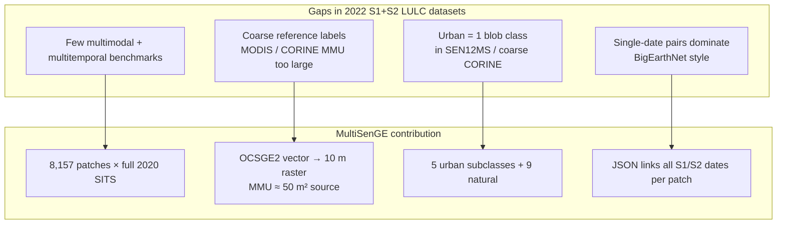
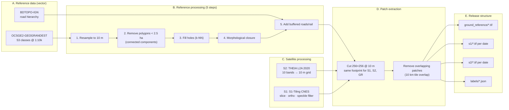
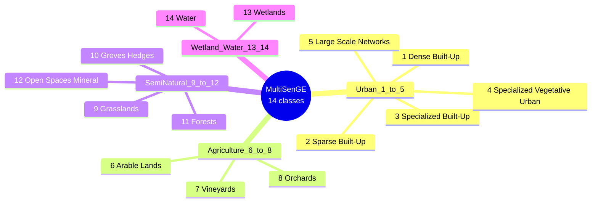
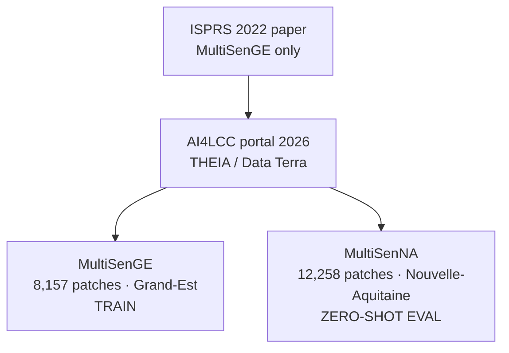
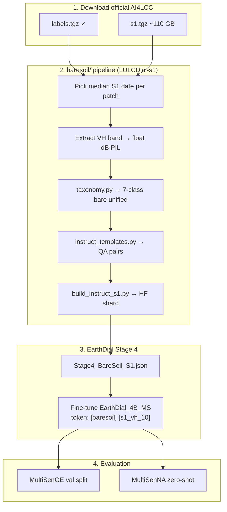

# MultiSenGE / AI4LCC — Complete Dataset Analysis

> **Source paper:** Wenger, R., Puissant, A., Weber, J., Idoumghar, L., Forestier, G. (2022).  
> **Title:** MULTISENGE: A Multimodal and Multitemporal Benchmark Dataset for Land Use/Land Cover Remote Sensing Applications  
> **Venue:** ISPRS Annals, Vol. V-3-2022, pp. 635–640  
> **DOI:** [10.5194/isprs-annals-V-3-2022-635-2022](https://doi.org/10.5194/isprs-annals-V-3-2022-635-2022)  
> **Local PDF:** `paperRelatedToDataset/multiSenge_AI4LCC.pdf`  
> **Distribution (2026):** [AI4LCC collection — THEIA / Data Terra](https://doi.theia.data-terra.org/ai4lcc/?lang=en)  
> **License:** CC-BY-NC 4.0 (AI4LCC portal) · Etalab v2 (OCSGE source)

---

## 1. Executive summary

**MultiSenGE** is a French regional benchmark that pairs **Sentinel-1 SAR**, **Sentinel-2 multispectral time series**, and **high-resolution vector LULC labels** at **10 m** over the **Grand-Est** region (eastern France). It was created because existing S1+S2 datasets (BigEarthNet, SEN12MS) lacked **multitemporal** depth and **fine urban LULC** classes.

| Property | Value |
|---|---|
| **Spatial extent** | Grand-Est, **57,433 km²** (~10.6% of France) |
| **Reference year** | 2019/2020 |
| **Spatial patches (triplets)** | **8,157** non-overlapping **256×256** @ 10 m |
| **S2 temporal images** | **72,033** patches |
| **S1 temporal images** | **1,012,227** patches |
| **S2 tiles** | **14** Sentinel-2 MGRS tiles |
| **LULC classes (final raster)** | **14** (5 urban + 9 natural) |
| **Tasks supported** | Semantic segmentation, scene classification, multimodal fusion, multitemporal DL |

The dataset is now distributed under the **AI4LCC** umbrella. A sister collection **MultiSenNA** (Nouvelle-Aquitaine, **12,258** patches) was added later for cross-region evaluation — same schema, different geography.

---

## 2. Paper objectives

### 2.1 Primary objective

Build and release a **large-scale, open, multimodal + multitemporal** LULC benchmark where:

- Every patch has **aligned S1 (VV+VH)**, **S2 (10 bands)**, and **pixel-level ground reference**.
- Labels are **more accurate and finer** than MODIS (SEN12MS) or CORINE-only coarse mapping (BigEarthNet).
- Researchers can benchmark **deep learning** for segmentation and classification without building the pipeline from scratch.

### 2.2 Secondary objectives

1. **Urban fabric detail:** Split urban areas into **5 subclasses** (dense built-up, sparse built-up, etc.) — impossible with SEN12MS (1 urban class via MODIS) or limited CORINE urban detail in BigEarthNet.
2. **Temporal depth:** Provide **full 2020 image time series** per patch (not single-date pairs only).
3. **Baseline science:** Publish **U-Net + VGG-16** baselines on urban classes (Metz / tile T31UGQ) to anchor future work.
4. **Community tooling:** JSON metadata per patch + [MultiSenGE-Tools](https://github.com/r-wenger/MultiSenGE-Tools) for parsing dates and filenames.

### 2.3 What the paper is *not* trying to do

- Not a global dataset (regional France only in this paper).
- Not a VLM / language dataset (no QA, captions, or dialogue).
- Not an optical-only product — S1 is a first-class modality.
- Not focused on **bare soil** as a named class (see §8 for your thesis mapping).

---

## 3. Research gaps the paper addresses



### 3.1 Comparison with prior datasets (from paper)

| Dataset | S1+S2 | Temporal | Reference | Urban classes | Patches (spatial units) |
|---|---|---|---|---|---|
| **BigEarthNet** | ✅ pairs | Mostly single-date | CORINE (19 labels, 11 used) | Coarse | 590,326 pairs |
| **SEN12MS** | ✅ triplets | Seasonal splits | MODIS LC | **1** urban class | 180,662 |
| **MultiSenGE** | ✅ triplets | **Full 2020 SITS** | **OCSGE2-GEOGRANDEST** | **5** urban subclasses | **8,157** (non-overlap) |

**Key claim:** OCSGE2 has **MMU &lt; 50 m²** and was built by **visual interpretation of aerial photography (2019/2020)** — much closer to **10 m Sentinel** resolution than CORINE (25 ha MMU) or MODIS (500 m).

---

## 4. Data sources

### 4.1 Source inventory

| Layer | Source | Access | Role |
|---|---|---|---|
| **LULC vectors** | [OCSGE2-GEOGRANDEST](https://www.geograndest.fr) | Open (Etalab v2) | Primary reference; 53 classes at 1:10,000 |
| **Road network** | BDTOPO-IGN | IGN vector lines | Road importance + buffering for class 5 |
| **Sentinel-2 L2A** | [THEIA Land](https://www.theia-land.fr) | `theia_download` script | 2020 SITS, cloud &lt; 10% |
| **Sentinel-1 GRD** | PEPS / EODAG via **S1-Tiling** (CNES) | Ascending + descending 2020 | VV+VH, sliced to S2 grid |

### 4.2 Study area

- **Region:** Grand-Est (Alsace → Ardennes / Marne), eastern France.
- **Area:** 57,433 km².
- **S2 tiling:** 14 tiles (paper Figure 1 — Sentinel-2 MGRS grid over the region).
- **Why this region:** OCSGE2-GEOGRANDEST was available as a **new, accurate, open** regional vector LULC database.

### 4.3 OCSGE original hierarchy (before simplification)

OCSGE2 uses **four nomenclature levels**. At the coarsest (**level 1**):

| Level-1 ID | Name |
|---|---|
| 1 | Artificial surfaces |
| 2 | Agricultural areas |
| 3 | Forest / semi-natural areas |
| 4 | Water surfaces |

At the finest level used in mapping (**1:10,000**), there are **53 LULC classes** with minimum element size **50 m²**.

The paper **reclassifies level-3 OCSGE classes** into **14 raster classes** suitable for 10 m segmentation (Table 1 in paper).

---

## 5. Methodology — how the dataset was built

### 5.1 End-to-end production workflow



### 5.2 Reference rasterization (detail)

**Step 1 — Resampling:** Vector OCSGE level-3 classes semantically merged → **14-class** typology (§6).

**Step 2 — Small polygon removal:** Connected-component filtering per class. Polygons **&lt; 2.5 ha (250 pixels @ 10 m)** set to **no-label / blank** — removes noise invisible at 10 m (stricter than CORINE MMU).

**Step 3 — Hole filling:** k-nearest-neighbor imputation (Troyanskaya et al., 2001) with distance-weighted neighbors.

**Step 4 — Smoothing:** Mathematical morphology **closure** with rectangular structuring element (smoother class boundaries — paper Figure 3c vs 3b).

**Step 5 — Road injection:** Large-scale networks (class 5) from OCSGE railways + BDTOPO major roads, buffered **30 m** (highways) or **10 m** (secondary roads/rail) then rasterized at 10 m.

### 5.3 Sentinel-2 processing

| Setting | Detail |
|---|---|
| Product | L2A surface reflectance (atmospherically corrected) |
| Year | **2020** |
| Cloud filter | **&lt; 10%** cloud cover per scene |
| Download | THEIA `theia_download` (Hagolle, 2021) |
| Bands kept | **10 bands** @ unified 10 m: B2, B3, B4, B8 (native 10 m) + B5, B6, B7, B8A, B11, B12 (20 m → **cubic resample** to 10 m) |

### 5.4 Sentinel-1 processing (S1-Tiling / CNES)

| Step | Operation |
|---|---|
| 1 | Auto-download S1 GRD via **EODAG** (multi-server) |
| 2 | **Slice** SAR scenes to **Sentinel-2 tile grid** |
| 3 | **Orthorectify** sliced scenes |
| 4 | **Multi-temporal speckle filter** (preserves spatial structure) |
| Output per patch | **VV + VH stacked** (2 channels), 256×256, 10 m GRD |

### 5.5 Triplet patch construction

```
One spatial patch (256×256 px, 2.56 km × 2.56 km on ground):
├── Ground reference : {tile}_GR_{x}_{y}.tif          (1 label raster)
├── Sentinel-2      : {tile}_{date}_S2_{x}_{y}.tif   (n dates × 10 bands)
├── Sentinel-1      : {tile}_{date}_S1_{x}_{y}.tif   (m dates × VV+VH)
└── Metadata        : {tile}_{x}_{y}.json            (classes + file lists)
```

**Post-process:** Remove spatially **overlapping** patches (mainly from **10 km Sentinel-2 tile overlap**) → **8,157** independent triplets.

**Temporal scale (paper):**

- ~**72,033** S2 patch-time slices across all triplets.
- ~**1,012,227** S1 patch-time slices (higher revisit → more dates per patch).

---

## 6. Class taxonomy — 14 classes and hierarchy

### 6.1 Final 14-class typology (pixel values 1–14)

Paper Table 1 + Figure 4 color legend.

#### Urban fabric — 5 subclasses (IDs 1–5)

| ID | Class name | OCSGE level-1 parent | Description (for DL) |
|---|---|---|---|
| **1** | Dense Built-Up | Urban (1) | Compact urban blocks, high impervious fraction |
| **2** | Sparse Built-Up | Urban (1) | Lower density housing / mixed urban |
| **3** | Specialized Built-Up Areas | Urban (1) | Industrial, commercial, special urban zones |
| **4** | Specialized but Vegetative Areas | Urban (1) | Urban green / vegetated specialized zones |
| **5** | Large Scale Networks | Urban (1) | Major roads, highways, railways (buffered vectors) |

#### Natural / agricultural — 9 subclasses (IDs 6–14)

| ID | Class name | OCSGE level-1 parent | Bare-soil relevance for your thesis |
|---|---|---|---|
| **6** | Arable Lands | Agricultural (2) | **High** — ploughed / bare fields, fallow |
| **7** | Vineyards | Agricultural (2) | Medium — seasonal bare soil between rows |
| **8** | Orchards | Agricultural (2) | Medium — partial canopy, exposed soil |
| **9** | Grasslands | Semi-natural (3) | Medium — sparse vegetation / dry grass |
| **10** | Groves and Hedges | Semi-natural (3) | Low |
| **11** | Forests | Semi-natural (3) | None (dense vegetation) |
| **12** | **Open Spaces, Mineral** | Semi-natural (3) | **Highest** — quarries, bare mineral, open ground |
| **13** | Wetlands | Wetlands (4) | Low (wet, not bare) |
| **14** | Water Surfaces | Water (5) | None |

### 6.2 Hierarchy diagram



### 6.3 Important: no explicit “bare soil” class

MultiSenGE does **not** label a class named “bare soil.” For **BareSoilDial-S1**, map:

| MultiSenGE ID | Your unified class (`taxonomy.py`) |
|---|---|
| 12 Open Spaces, Mineral | `bare_soil` |
| 6 Arable Lands | `agricultural_fallow` |
| 9 Grasslands | `sparse_vegetation` |
| 1–5 Urban | `bare_rock_paved` or `non_bare` (context-dependent) |
| 11 Forest, 14 Water, 13 Wetland | `non_bare` |

Use **ground reference raster** (`*_GR_*.tif`) for **dominant pixel class** per patch, not only the semicolon list in JSON (which is **multi-label presence**, not proportions).

---

## 7. Dataset structure on disk

### 7.1 Four folders (official AI4LCC / MultiSenGE)

```text
MultiSenGE/
├── labels/              # 8,157 JSON files
├── ground_reference/    # 8,157 label GeoTIFFs (256×256, class IDs)
├── s1/                  # ~1M files — {tile}_{date}_S1_{x}_{y}.tif
└── s2/                  # ~72k files — {tile}_{date}_S2_{x}_{y}.tif
```

### 7.2 JSON label file schema (real example)

**File:** `31TFN_4626_514.json` (from your local `labels/` extract)

```json
{
  "corresponding_s2": "31TFN_20200805_S2_4626_514.tif;...",
  "corresponding_s1": "31TFN_20200930_S1_4626_514.tif;...",
  "projection": "PROJCS[\"WGS 84 / UTM zone 31N\", ...]",
  "labels": "2;5;6;9;11"
}
```

| Field | Meaning |
|---|---|
| `corresponding_s1` | All S1 filenames for this patch (`;`-separated) |
| `corresponding_s2` | All S2 filenames for this patch |
| `projection` | WKT — patch CRS (UTM zone depends on tile) |
| `labels` | **Class IDs present** in patch (multi-label), e.g. `2;5;6;9;11` = Sparse Built-Up + Roads + Arable + Grassland + Forest |

### 7.3 S1 GeoTIFF format (per patch-date)

| Property | Value |
|---|---|
| Size | **256 × 256** pixels |
| GSD | **10 m** |
| Bands | **2** — Band 1 = **VV**, Band 2 = **VH** |
| Values | Sigma0 **backscatter in dB** (GRD preprocessed) |
| Pol | Dual-pol GRD |

### 7.4 Download URLs (AI4LCC / MultiSenGE)

| Asset | URL |
|---|---|
| Portal | https://doi.theia.data-terra.org/ai4lcc/?lang=en |
| Labels | https://s3.unistra.fr/a2s_datasets/MultiSenGE/labels.tgz (~4 MB) |
| S1 | https://s3.unistra.fr/a2s_datasets/MultiSenGE/s1.tgz (~110 GB) |
| S2 | https://s3.unistra.fr/a2s_datasets/MultiSenGE/s2.tgz (large) |
| Ground ref | https://s3.unistra.fr/a2s_datasets/MultiSenGE/ground_reference.tgz (~25 MB) |
| Tools | https://github.com/r-wenger/MultiSenGE-Tools |

**MultiSenNA** (eval only for you): https://s3.unistra.fr/a2s_datasets/MultiSenNA/s1.tgz

---

## 8. Image examples (from paper figures)

The PDF contains the canonical visual references. Open `multiSenge_AI4LCC.pdf` at these figures:

### Figure 1 — Study area

- Grand-Est region outline with **14 Sentinel-2 tile footprints**.
- Use to understand geographic coverage and tile IDs (`31TFN`, `31UGQ`, etc.).

### Figure 3 — Label cleaning effect

| Panel | Content |
|---|---|
| **(a)** | Sentinel-2 **RGB** (true-color style) |
| **(b)** | Reference **before** small-polygon removal (noisy boundaries) |
| **(c)** | Reference **after** connected-components + hole fill + closure (clean 10 m labels) |

**Lesson:** Always train on **processed** `ground_reference` rasters, not raw OCSGE vectors.

### Figure 4 — Class color legend

- Official **14-class color map** for segmentation masks.
- Required when visualizing `*_GR_*.tif` or overlaying predictions.

### Figure 5 — Triplet example (most important for your work)

| Panel | Modality | Visualization |
|---|---|---|
| **(a)** | Sentinel-2 | **RGB** (mono-temporal example) |
| **(b)** | Sentinel-1 | **VV=Red, VH=Green** composite (SAR is **not** natural color) |
| **(c)** | Ground reference | **14-class color-coded** label raster |

```
┌─────────────────┬─────────────────┬─────────────────┐
│  Fig 5a: S2 RGB │ Fig 5b: S1 SAR  │ Fig 5c: LULC    │
│  (optical)      │ R=VV  G=VH      │ 14-class mask   │
│  fields, forest │ speckled texture│ solid colors    │
└─────────────────┴─────────────────┴─────────────────┘
```

### Figure 6 — Baseline segmentation (Metz)

- Compares U-Net-IRRG prediction vs ground truth on urban test tiles.
- Shows baseline **F1 ≈ 0.52–0.66** on urban subclasses — hard problem.

### Local preview tip (S1 only)

After downloading one S1 patch, **do not** open raw float TIFF in Windows Photos. Use percentile stretch (see `LULCDial-s1/baresoil/s1_vh_io.py`).

---

## 9. Baseline experiments in the paper

### 9.1 Setup

| Item | Choice |
|---|---|
| Task | Urban **semantic segmentation** (classes 1–5 + aggregated “other” as class 6) |
| Area | **Metz**, tile **T31UGQ** |
| Split | 80% train / 20% val (spatial split per Saraiva et al., 2020) |
| Models | U-Net + VGG-16 backbone (ImageNet pretrained vs random) |
| Input | Single-date **S2 IRRG** ± NDVI, NDBI, eNDVI indices |
| Loss | Weighted categorical cross-entropy (class imbalance) |

### 9.2 Results (Metz test)

| Metric | U-Net-IRRG | U-Net-Index |
|---|---|---|
| Weighted F1 | **0.7364** | 0.7214 |
| Class 1 F1 | 0.5199 | 0.4822 |
| Class 5 (roads) F1 | 0.5862 | 0.4295 |

**Takeaway:** Even with **optical** single-date S2, urban subclasses are hard. **Multitemporal S1+S2** (the main value of MultiSenGE) was left to follow-up PhD work — **your VLM + S1 dialogue work fills a different gap**.

---

## 10. AI4LCC collection today (beyond this paper)



| Collection | Region | Patches | Your use |
|---|---|---:|---|
| **MultiSenGE** | Grand-Est (east) | 8,157 | **Training** + val |
| **MultiSenNA** | Nouvelle-Aquitaine (west) | 12,258 | **Held-out regional eval** |

Same file naming, JSON schema, and 14-class typology.

---

## 11. Workflow for BareSoilDial-S1 (your project)



### 11.1 What you use vs ignore

| Use | Ignore (for S1 bare-soil VLM) |
|---|---|
| `s1/` VV+VH patches | `s2/` (unless ablation) |
| `labels/*.json` + `ground_reference/` | HF `wtr001/S1_AI4LCC` tile mosaics |
| Class 6, 9, 12 for bare-positive mining | Class 1–5 only patches for bare-soil positives |
| MultiSenNA for eval | Training on MultiSenNA (leaks zero-shot) |

### 11.2 Expected training scale

| Item | Count |
|---|---|
| Spatial patches | 8,157 |
| QA templates per patch | 3 (classify + binary bare + VQA) |
| Max instruction pairs | **~24,471** (before filtering / caps) |
| Intern target | 30–50K QA (can add templates or S2 ablation later) |

---

## 12. Limitations you must know

1. **Regional bias:** France only — not global bare-soil diversity (pair with SEN12MS or DW+ later if needed).
2. **No bare-soil class name:** Map class 12 + arable/grass carefully; document in thesis.
3. **Label year vs S1 dates:** Reference from 2019/2020 photo-interpretation; S1 is 2020 time series — minor temporal mismatch possible.
4. **Multi-label JSON:** `labels` field lists **presence**, not **dominance** — use `*_GR_*.tif` for scene-level dominant class QA.
5. **Class imbalance:** Arable + forest dominate; oversample classes 12, 6, 9 for bare-soil tasks.
6. **License:** CC-BY-NC 4.0 — confirm commercial use restrictions for your deployment context.
7. **Storage:** Full S1 archive ~110 GB; plan extract path and shard export to ~10 GB PNG/float shards.

---

## 13. Key citations

```bibtex
@article{wenger2022multisenge,
  author  = {Wenger, Romain and Puissant, Anne and Weber, Jonathan and Idoumghar, Lhassane and Forestier, Germain},
  title   = {{MULTISENGE}: A Multimodal and Multitemporal Benchmark Dataset for Land Use/Land Cover Remote Sensing Applications},
  journal = {ISPRS Annals of the Photogrammetry, Remote Sensing and Spatial Information Sciences},
  volume  = {V-3-2022},
  pages   = {635--640},
  year    = {2022},
  doi     = {10.5194/isprs-annals-V-3-2022-635-2022}
}
```

**Follow-up (deeper DL on same data):** Wenger et al., Remote Sensing, 15(1), 151, 2022 — ConvLSTM + multimodal segmentation.  
**Cross-region extension:** Wenger et al., Remote Sensing Letters, 2025 — MultiSenNA + fine-tuning.

---

## 14. Quick reference card

| Question | Answer |
|---|---|
| What is MultiSenGE? | S1+S2+LULC benchmark, Grand-Est, 2020, 10 m, 256² patches |
| How many spatial patches? | **8,157** |
| How many classes? | **14** (5 urban + 9 natural) |
| S1 format? | 256×256 GeoTIFF, **VV+VH**, dB, many dates per patch |
| Where are labels? | JSON + `*_GR_*.tif` per patch |
| Best bare-related classes? | **12** (mineral/open), **6** (arable), **9** (grassland) |
| Official download? | https://doi.theia.data-terra.org/ai4lcc/ |
| Your conversion code? | `LULCDial-s1/baresoil/build_instruct_s1.py` |
| EarthDial token? | `[baresoil] [s1_vh_10] [classify] <image>` |

---

*Document created for LULCDial-S1 / `e:\MTP\earth2\` workspace. Figures 1–6 refer to panels in `BenchmarkGuide/AI4LCC/multiSenge_AI4LCC.pdf`.*
