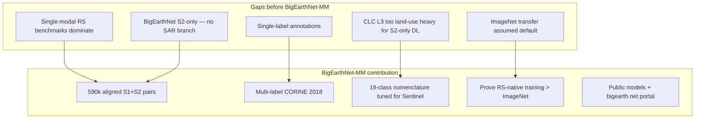
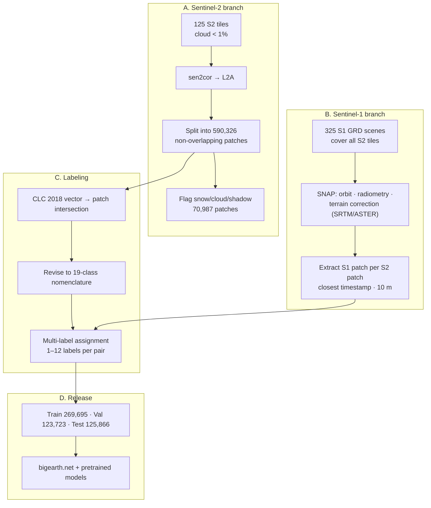
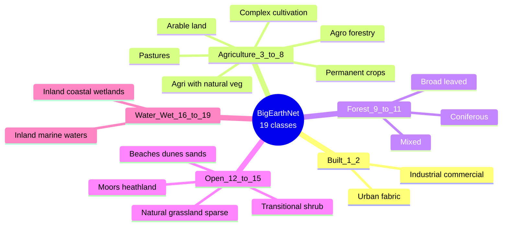
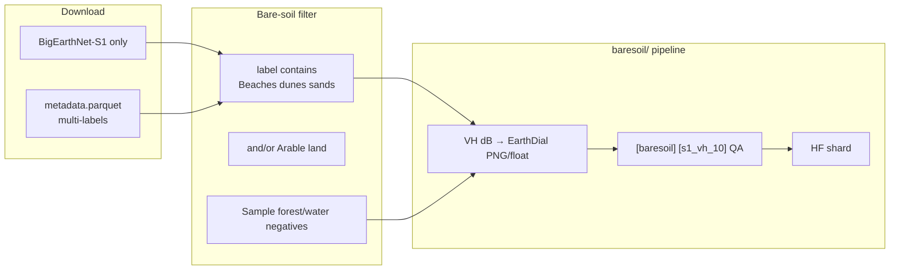

# BigEarthNet / BigEarthNet-MM — Complete Dataset Analysis

> **Source paper (your PDF):** Sumbul, G., de Wall, A., Kreuziger, T., Marcelino, F., Costa, H., Benevides, P., Caetano, M., Demir, B., Markl, V. (2021).  
> **Title:** BigEarthNet-MM: A Large Scale Multi-Modal Multi-Label Benchmark Archive for Remote Sensing Image Classification and Retrieval  
> **Venue:** arXiv:2105.07921v2 [cs.CV]  
> **Local PDF:** `paperRelatedToDataset/bigEarthNet.pdf`  
> **Portal:** [bigearth.net](https://bigearth.net)  
> **License:** Community Data License Agreement – Permissive (CDLA-Permissive-1.0)  
> **Related papers:** BigEarthNet S2-only ([arXiv:2001.06372](https://arxiv.org/abs/2001.06372)); **reBEN v2.0** (IGARSS 2025) — refined 549,488-pair release

---

## 1. Executive summary

**BigEarthNet** is Europe’s flagship **large-scale multi-label** land-cover dataset built from **CORINE Land Cover 2018** and Sentinel imagery. Your PDF introduces **BigEarthNet-MM**, which adds **Sentinel-1 VV+VH** to the original **Sentinel-2** patches for **multi-modal** classification and retrieval.

| Property | BigEarthNet-MM (2021 paper) | BigEarthNet v2.0 (2025 portal) |
|---|---|---|
| **Pairs** | **590,326** S1+S2 | **549,488** S1+S2 (refined) |
| **Countries** | 10 European countries | Same 10 countries |
| **Patch size** | **120×120** px @ 10 m (core grid) | Same structure |
| **Labels** | **Multi-label** CORINE-derived | **19-class** nomenclature + pixel ref maps |
| **CLC source** | CLC **2018** (2017–2018 imagery) | CLC2018 v2020_u1 |
| **Tasks** | Multi-label classification, CBIR, fusion | + segmentation (pixel ref maps in v2) |
| **Time period** | Jun 2017 – May 2018 | Same |

**For BareSoilDial-S1:** BigEarthNet is **high value for scale** but **risky for novelty** — EarthDial already trained on **BigEarthNet RGB/MS**. Use **S1-only**, **bare-related class filter**, and **held-out test split**. Prefer **AI4LCC** for primary training if disk is limited.

---

## 2. Paper objectives

### 2.1 Primary objective

Provide a **590,326-pair** archive of **aligned Sentinel-1 + Sentinel-2** patches with **multi-label CORINE-based annotations** to support:

- Multi-modal deep learning (stacked S1+S2 volumes)
- Multi-label scene classification
- Content-based image retrieval (CBIR)

### 2.2 Problems the paper solves

| Problem | BigEarthNet-MM response |
|---|---|
| Most RS archives are **single-modal** | Adds **S1 GRD** paired to every S2 patch |
| Most archives are **single-label** | **Multi-label** (1–12 labels per patch; 96.8% have ≤5) |
| **ImageNet transfer** fails on RS spectra/semantics | Show **train-from-scratch on BigEarthNet** beats ImageNet fine-tune |
| Original BigEarthNet is **S2-only** | **BigEarthNet-MM** = same labels + S1 twin |
| Raw CLC L3 (43 classes) is hard from single-date S2 | Introduce **19-class** revised nomenclature |

### 2.3 What the paper is *not* doing

- Not multitemporal (single closest S1 date per S2 patch; no SITS)
- Not global (10 European countries only)
- Not high-resolution labels (CLC **MMU 25 ha**, min width **100 m**)
- Not a VLM / dialogue dataset
- Not speckle-filtered SAR (application-dependent; CARD4L recommendation)

---

## 3. Research gaps addressed



### 3.1 Comparison with related archives (paper context)

| Dataset | Modal | Labels | Patches | Europe | Multi-label |
|---|---|---|---:|---|
| EuroSAT | S2 | 10 class | 27,000 | ✅ | ❌ |
| SEN1-2 | S1+S2 | none | 564,768 | Global | ❌ |
| SEN12MS | S1+S2+MODIS | IGBP | 180,662 | Global | scene + seg |
| BigEarthNet (S2) | S2 | CORINE 19/43 | 590,326 | ✅ | ✅ |
| **BigEarthNet-MM** | **S1+S2** | **CORINE 19** | **590,326** | ✅ | ✅ |
| MultiSenGE | S1+S2+ref | OCSGE 14 | 8,157 | France | seg |

**BigEarthNet strength:** largest **European multi-label** archive with **paired SAR**.  
**BigEarthNet weakness vs AI4LCC:** coarse CORINE MMU, no temporal series, **EarthDial overlap**.

---

## 4. Data sources

### 4.1 Source inventory

| Layer | Source | Details |
|---|---|---|
| **Labels** | [CORINE Land Cover 2018](https://land.copernicus.eu/pan-european/corine-land-cover) | CLC L3 vector → patch multi-labels; ~**85%** accuracy |
| **Sentinel-2** | Copernicus S2A/S2B | **125 tiles** (paper) / **115 tiles** (v2.0); cloud **&lt;1%** at tile level |
| **Sentinel-1** | Copernicus S1 GRD | **325 scenes** (paper) / **312 scenes** (v2.0); IW dual-pol |
| **Atmospheric correction** | sen2cor | L2A surface reflectance |
| **S1 processing** | ESA SNAP / S1TBX | Orbit, noise, calibration, terrain correction |

### 4.2 Geographic coverage (10 countries)

Austria · Belgium · Finland · Ireland · Kosovo · Lithuania · Luxembourg · Portugal · Serbia · Switzerland

### 4.3 Temporal coverage

| Aspect | Detail |
|---|---|
| Acquisition window | **June 2017 – May 2018** |
| Season mix (paper, 590k) | Autumn **143,557** · Winter **72,877** · Spring **175,937** · Summer **126,913** |
| Label year | CLC **2018** (maps from 2017–2018) — aligned with imagery |

### 4.4 CORINE constraints (critical for bare-soil work)

| CLC property | Value | Impact |
|---|---|---|
| **MMU** | **25 hectares** | Patches can mix classes; labels are coarse |
| **Min mapping width** | **100 m** | Thin features lost |
| **Level-3 classes** | **44** defined; **43** in BigEarthNet | Land cover + land **use** mixed |
| **Accuracy** | ~85% | Ceiling for supervised learning |

---

## 5. Methodology — how the dataset was built

### 5.1 End-to-end workflow



### 5.2 Sentinel-2 patch construction

| Band GSD | Patch spatial size | Bands (typical) |
|---|---|---|
| **10 m** | **120 × 120** px | B2, B3, B4, B8 |
| **20 m** | **60 × 60** px | B5, B6, B7, B8A, B11, B12 |
| **60 m** | **20 × 20** px | B1, B9 (often excluded in DL exps) |

- **L2A** via sen2cor; **B10 (cirrus)** omitted in L2A output.
- Experiments in paper: use **10 m + 20 m bands** (20 m cubic-resampled to 10 m); **skip 60 m** bands B1/B9.
- **Non-overlapping** patches within each tile.

### 5.3 Sentinel-1 patch construction

| Step | Processing |
|---|---|
| Product | GRD **IW** dual-pol (**VV**, **VH**) |
| Pre-processing | Precise orbit · border/thermal noise removal · radiometric calibration · Range-Doppler terrain correction |
| DEM | SRTM30 (&lt;60°N) or ASTER (&gt;60°N) |
| Backscatter | **σ° in dB** |
| Speckle | **None** (user choice; CARD4L-aligned) |
| Alignment | One S1 patch per S2 patch — **closest acquisition time** |
| Resolution | **10 m** ground spacing |
| Labels | **Inherited from paired S2 patch** |

### 5.4 Quality exclusions

| Exclusion | Count (paper) | Notes |
|---|---:|---|
| S2 fully snow/cloud/shadow | **70,987** | Listed at [bigearth.net/#downloads](https://bigearth.net/#downloads) |
| Pairs with **no label** after 19-class mapping | **57** | Dropped from experiments |
| v2.0 additional drops | → **549,488** total | 4 tiles failed QC; unlabeled patches removed (reBEN 2025) |

---

## 6. Class taxonomy

### 6.1 Two nomenclatures

| Scheme | Classes | Use case |
|---|---:|---|
| **CLC Level-3 (original)** | **43** | Fine-grained CORINE fidelity |
| **BigEarthNet 19-class (recommended)** | **19** | DL classification / retrieval |

**Revision rules (paper §II-A):**

- **10** CLC classes **kept** as-is (e.g. Broad-leaved forest, Beaches/dunes/sands)
- **22** CLC classes **grouped** into **9** merged classes (e.g. Moors + Sclerophyllous → one class)
- **11** CLC classes **removed** (land-use-heavy or needs time series / tide)

**Removed examples:** Airports, Burnt areas, Intertidal flats, Dump sites, Sport and leisure facilities, Construction sites, etc.

### 6.2 Nineteen-class nomenclature (primary)

| ID | Class name | # images (S2 paper Table; excl. snow/cloud) | Bare-soil relevance |
|---:|---|---:|---|
| 1 | Urban fabric | 74,891 | paved / urban |
| 2 | Industrial or commercial units | 11,865 | non-bare |
| 3 | **Arable land** | **194,148** | **agricultural fallow** (merged irrigated + non-irrigated + rice) |
| 4 | Permanent crops | 29,350 | partial |
| 5 | Pastures | 98,997 | vegetated |
| 6 | Complex cultivation patterns | 104,203 | mixed ag |
| 7 | Land principally occupied by agriculture, with significant areas of natural vegetation | 130,637 | mixed |
| 8 | Agro-forestry areas | 30,649 | vegetated |
| 9 | Broad-leaved forest | 141,300 | non-bare |
| 10 | Coniferous forest | 164,775 | non-bare |
| 11 | Mixed forest | 176,567 | non-bare |
| 12 | **Natural grassland and sparsely vegetated areas** | **12,022** | **sparse vegetation** (merges CLC grassland + sparsely vegetated) |
| 13 | Moors, heathland and sclerophyllous vegetation | 16,267 | shrub / sparse |
| 14 | Transitional woodland-shrub | 148,950 | shrub |
| 15 | **Beaches, dunes, sands** | **1,536** | **desert_sand / bare sand** |
| 16 | Inland wetlands | 22,100 | wet |
| 17 | Coastal wetlands | 1,566 | wet |
| 18 | Inland waters | 67,277 | water |
| 19 | Marine waters | 74,877 | water |



### 6.3 CLC Level-3 classes **not** in 19-class (43 → 19 mapping)

Representative **43-class** entries relevant to bare ground (from TorchGeo / CLC):

| CLC L3 (43-class) | Fate in 19-class |
|---|---|
| Non-irrigated arable land | → **Arable land** |
| Permanently irrigated land | → **Arable land** |
| Rice fields | → **Arable land** |
| Natural grassland | → **Natural grassland and sparsely vegetated** |
| **Sparsely vegetated areas** | → **Natural grassland and sparsely vegetated** |
| **Beaches, dunes, sands** | → **kept (class 15)** |
| **Bare rock** | **Removed** (not in 19-class) |
| **Burnt areas** | **Removed** |
| Mineral extraction sites | Often removed / unlabeled in v2 |

**There is no dedicated “bare soil” class** — closest are **Beaches/dunes/sands**, **Arable land** (post-harvest bare periods), and **sparsely vegetated** merge.

### 6.4 Multi-label statistics

| Statistic | Value |
|---|---|
| Labels per patch | **1 – 12** |
| Patches with **≤5** labels | **96.80%** |
| Patches with **&gt;9** labels | **23** only |
| Unlabeled after 19-class | **57** pairs |

---

## 7. Dataset structure on disk

### 7.1 BigEarthNet v2.0 layout ([description doc](https://bigearth.net/static/documents/Description_BigEarthNet_v2.pdf))

```text
BigEarthNet/
├── S2/                          # Sentinel-2 patches per tile
├── S1/                          # Sentinel-1 patches (paired filenames)
├── reference_maps/              # Pixel-level class IDs (v2.0)
├── metadata.parquet             # All patches except snow/cloud/shadow flagged
├── metadata_for_patches_with_snow_cloud_or_shadow.parquet
└── (tile-based folder hierarchy)
```

### 7.2 Modalities per patch pair

| Modality | Channels | Size | Values |
|---|---|---:|---|
| **S2** | 12 bands (10m+20m+60m groups) | 120×120 core @ 10m | L2A reflectance |
| **S1** | **VV + VH** | 120×120 @ 10m | **dB** backscatter |
| **Reference map (v2)** | Class ID per pixel | matches S2 grid | 19- or 43-class ID |

### 7.3 Official train / val / test split (590k paper)

| Split | Pairs |
|---|---:|
| **Train** | 269,695 |
| **Validation** | 123,723 |
| **Test** | 125,866 |
| **Total used** | 519,284 (after removing 57 unlabeled + snow/cloud policy in exps) |

Use **official split** for fair comparison — do not random-shuffle patches (spatial correlation).

### 7.4 Download

| Resource | URL |
|---|---|
| Portal | https://bigearth.net |
| S2 only | BigEarthNet-S2 download |
| S1 only | BigEarthNet-S1 download |
| S1+S2 | Combined archives |
| HF pretrained models | Linked from portal |
| Pipeline code | [bigearthnet-pipeline](https://github.com/) (reproducibility) |
| Class list PDF | https://bigearth.eu/BigEarthNetListofClasses.pdf |
| Snow/cloud list | http://bigearth.net/#downloads |

**Size:** Large multi-TB archive — download **S1-only** subset if training BareSoilDial-S1.

---

## 8. Image examples (from paper figures)

Open `bigEarthNet.pdf`:

### Figure 1 — Retrieval example (BigEarthNet-MM)

Each row shows **query pair** (S1+S2) and **retrieved pairs** at ranks 1, 5, 100.

| Strategy | Behavior |
|---|---|
| **Train from BigEarthNet-MM** | Retrieves semantically similar pairs (Urban fabric + Arable land + forest classes match query) |
| **ImageNet transfer** | Retrieves wrong classes even at rank 5 (Urban/Arable in query but not in retrieved) |

**Panels per pair:** Sentinel-1 and Sentinel-2 thumbnails with **multi-label text** (19-class names).

### BigEarthNet S2-only paper (arXiv 2001.06372) — Figure 3

Example S2 patch with **multi-label chips** from 19-class nomenclature — useful for understanding label multiplicity in one 120×120 window.

### Visual interpretation tips

| Modality | How to view |
|---|---|
| **S2** | Standard RGB (B4,B3,B2) or false color |
| **S1** | **R=VV, G=VH, B=VV/VH** composite — not natural color |
| **Labels** | Multi-label list — patch can be **Arable + Forest + Urban** simultaneously |

---

## 9. Baseline experiments (paper §III)

### 9.1 Experimental setup

| Setting | Value |
|---|---|
| Fusion | Stack **VV, VH** + resampled **S2 10m+20m bands** into one volume |
| Models | VGG16/19, ResNet50/101/152 |
| Task | Multi-label classification + CBIR (χ² distance on features) |
| Optimizer | Adam, lr=10⁻³, sigmoid cross-entropy |
| Training | 100 epochs from scratch **or** ImageNet pretrain + 10-epoch fine-tune per modality |
| Output layer | **19 neurons** (sigmoid multi-label) |
| Hardware | 4× NVIDIA Tesla V100 |

### 9.2 Key results — ImageNet vs BigEarthNet training (ResNet50, Table I)

| Class | ImageNet transfer F2 | BigEarthNet scratch F2 |
|---|---:|---:|
| Urban fabric | 56.27% | **71.99%** |
| Arable land | 80.05% | **83.62%** |
| **Beaches, dunes, sands** | 43.67% | **63.39%** |
| Natural grassland and sparsely vegetated | 14.11% | **43.88%** |
| Moors, heathland and sclerophyllous | 5.29% | **59.91%** |
| **Average (macro F2)** | **39.81%** | **67.23%** |

**Takeaway:** RS-native training dominates; gap is largest on **complex / rare** land-cover classes — exactly the bare/open land problem.

### 9.3 Overall model comparison (Table II)

| Model | Hamming loss ↓ | One-error ↓ | Recall ↑ | F2 ↑ |
|---|---:|---:|---:|---:|
| VGG16 | 0.078 | 7.35% | 76.97% | 76.18% |
| **ResNet50** | **0.074** | **5.93%** | **80.05%** | **78.73%** |
| ResNet152 | 0.073 | 6.42% | 78.13% | 77.46% |

---

## 10. BigEarthNet vs BigEarthNet-MM vs reBEN v2.0

| Version | Year | S1 | S2 | Pairs | Notes |
|---|---|---|---|---:|---|
| BigEarthNet | 2019/2020 | ❌ | ✅ | 590,326 | arXiv 2001.06372; 19-class nomenclature introduced |
| **BigEarthNet-MM** | **2021** | **✅** | **✅** | **590,326** | **Your PDF**; multi-modal retrieval |
| reBEN / v2.0 | 2025 | ✅ | ✅ | **549,488** | Refined labels, reference maps, 4 tiles dropped |

---

## 11. Implications for BareSoilDial-S1

### 11.1 EarthDial overlap warning

EarthDial Stage 2/3 uses **BigEarthNet RGB and multispectral** shards (`BigEarthNet_FINAL_RGB`, `BigEarthNet_MS`). Claims of novelty on **S2 BigEarthNet** are weak.

**Safe strategy:**

| Do | Don't |
|---|---|
| Train on **S1 channel only** | Train on S2 RGB/MS for novelty claims |
| Filter **bare-related** multi-labels | Use full 19-class without imbalance handling |
| Use **official test split** (125,866) | Random patch split |
| Compare vs **EarthDial_4B_MS** baseline | Claim SOTA on BigEarthNet RGB without disclosure |

### 11.2 Bare-related class mining

| 19-class label | Your `taxonomy.py` | Approx. frequency |
|---|---|---:|
| Beaches, dunes, sands | `desert_sand` | **1,536** patches |
| Arable land | `agricultural_fallow` | **194,148** |
| Natural grassland and sparsely vegetated | `sparse_vegetation` | **12,022** |
| Transitional woodland-shrub | `sparse_vegetation` (optional) | 148,950 |

**Oversample** classes 15 and 12; **balance** against forest/water negatives.

### 11.3 Workflow diagram



### 11.4 When to use BigEarthNet vs AI4LCC vs SEN12MS

| Criterion | BigEarthNet-S1 | AI4LCC | SEN12MS |
|---|---|---|---|
| **Priority for intern** | Optional (scale) | **Primary** | Later (global) |
| **Label quality** | CORINE 25 ha MMU | OCSGE ~10 m | MODIS 500 m |
| **Bare class** | Beaches/sand (rare) | Open Spaces/Mineral | IGBP Barren (rare) |
| **EarthDial overlap** | **High (S2)** | None | Low |
| **Europe only** | ✅ | France | Global |
| **Storage** | Multi-TB | ~110 GB S1 | ~510 GB |

---

## 12. Limitations

1. **CLC MMU 25 ha** — labels blurry at 120×120 (1.2 km) patch scale; multi-label mixing.
2. **No bare soil class** — Bare rock removed; burnt areas removed.
3. **Beaches/dunes/sands rare** — 1,536 patches (~0.26% of corpus).
4. **Single-date** — cannot separate irrigated vs rain-fed arable without time series.
5. **S1 RFI artifacts** — paper acknowledges radio-frequency interference in some patches.
6. **Snow/cloud patches** — 70,987 flagged; exclude for classification.
7. **Europe-only** — no tropical desert / arid bare-soil diversity.
8. **EarthDial trained on BigEarthNet S2** — S1-only + held-out test required for thesis story.
9. **v1 vs v2 patch count** — use **v2.0 metadata** for new work (549,488 pairs).

---

## 13. Key citations

```bibtex
@article{sumbul2021bigearthnetmm,
  title   = {{BigEarthNet-MM}: A Large Scale Multi-Modal Multi-Label Benchmark Archive for Remote Sensing Image Classification and Retrieval},
  author  = {Sumbul, Gencer and de Wall, Arne and Kreuziger, Tristan and Marcelino, Filipe and Costa, Hugo and Benevides, Pedro and Caetano, M{\'a}rio and Demir, Beg{\"u}m and Markl, Volker},
  journal = {arXiv preprint arXiv:2105.07921},
  year    = {2021}
}

@inproceedings{sumbul2019bigearthnet,
  title     = {{BigEarthNet}: A Large-Scale Benchmark Archive for Remote Sensing Image Understanding},
  author    = {Sumbul, Gencer and Charfuelan, Marlon and Demir, Beg{\"u}m and Markl, Volker},
  booktitle = {IEEE IGARSS},
  year      = {2019}
}
```

**v2.0:** K. Clasen et al., "reBEN: Refined BigEarthNet Dataset for Remote Sensing Image Analysis," IGARSS 2025.

---

## 14. Quick reference card

| Question | Answer |
|---|---|
| What is BigEarthNet-MM? | **590k** aligned **S1+S2** pairs, Europe, multi-label CORINE |
| Patch size? | **120×120** @ 10 m (1.2 km × 1.2 km) |
| S1 format? | **VV+VH**, dB, 10 m, no speckle filter |
| S2 format? | **12-band** L2A (use 10m+20m bands in DL) |
| How many classes? | **19** recommended (43 CLC L3 original) |
| Bare-related classes? | **Beaches/dunes/sands**, Arable, Sparsely vegetated merge |
| Official split? | Train **269,695** / Val **123,723** / Test **125,866** |
| Download? | https://bigearth.net |
| License? | CDLA-Permissive-1.0 |
| EarthDial overlap? | **Yes (S2)** — use **S1-only** for your thesis |
| Your conversion code? | `EarthDial-main/baresoil/build_instruct_s1.py` (extend for BEN) |

---

*Document created for BareSoilDial-S1 / earth2 workspace. Figure 1 in `bigEarthNet.pdf` shows multi-modal retrieval examples. Class counts from BigEarthNet S2 paper Table 2 (arXiv:2001.06372). v2.0 statistics from [bigearth.net](https://bigearth.net).*
