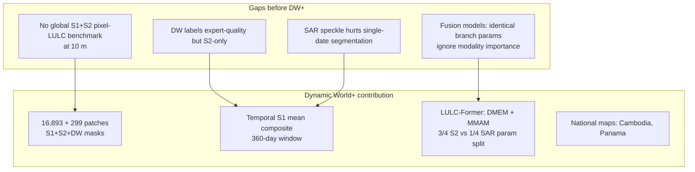
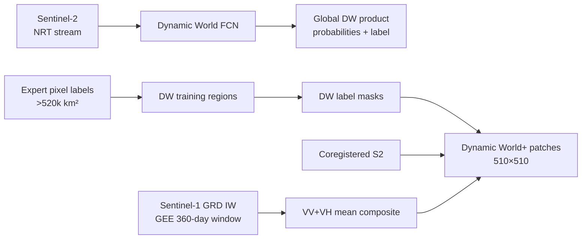
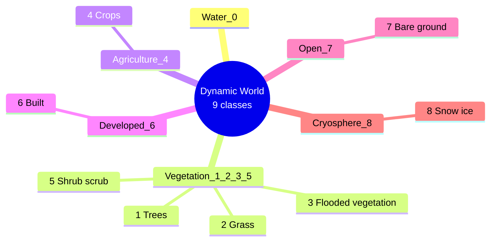
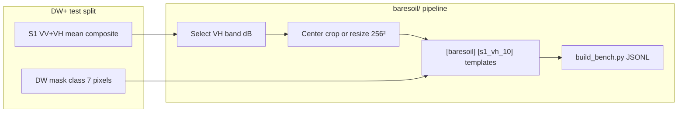

# Dynamic World / Dynamic World+ — Complete Dataset Analysis

> **Source paper (your PDF):** Yu, H., Li, G., Liu, H., Zhu, S., Xu, J., Dong, W., Li, C., Shi, J. (2026).  
> **Title:** Synergistic Fusion of Sentinel-1 and Sentinel-2 for Global LULC Mapping: The Multimodal Network LULC-Former and Dynamic World+ Dataset  
> **Venue:** IEEE JSTARS, Vol. 19, pp. 2511–2524  
> **DOI:** [10.1109/JSTARS.2025.3641788](https://doi.org/10.1109/JSTARS.2025.3641788)  
> **Local PDF:** `paperRelatedToDataset/dynamicWorld.pdf`  
> **Code / data portal:** [github.com/uoe-haoyu/LULCFormer](https://github.com/uoe-haoyu/LULCFormer)  
> **License:** CC-BY 4.0 (paper)  
> **Parent product:** [Dynamic World](https://developers.google.com/earth-engine/datasets/catalog/GOOGLE_DYNAMICWORLD_V1) (Brown et al., *Sci. Data* 2022) — **Sentinel-2–derived**, near-real-time global 10 m LULC

---

## 1. Executive summary

Your PDF is **not** the original Google Dynamic World paper. It introduces **Dynamic World+ (DW+)**: a **global, pixel-level LULC segmentation benchmark** that keeps **Dynamic World expert labels** but adds **coregistered Sentinel-1 VV+VH** composites aligned to each label patch. The authors also propose **LULC-Former**, a lightweight dual-branch transformer for S1+S2 fusion.

| Property | Google Dynamic World (2022) | **Dynamic World+ (this PDF)** |
|---|---|---|
| **Modalities** | Sentinel-2 only (model input) | **Sentinel-2 + Sentinel-1** |
| **Labels** | 9-class expert LULC | **Same 9 DW classes** (pixel masks) |
| **Resolution** | 10 m | 10 m |
| **Coverage** | Global NRT product; **>520,000 km²** expert-labeled training footprint | Subset with **both S1 and S2** available |
| **Patches** | Millions of tiles (product) | **16,893 train** + **299 test/val** |
| **Patch size** | Tile-based product | **510 × 510 px** @ 10 m (**5.1 km × 5.1 km**) |
| **S1 processing** | — | **360-day mean composite** (VV+VH), descending orbit |
| **Task** | NRT land-cover mapping | **Semantic segmentation** benchmark |
| **Bare-soil class** | **`bare` (label index 7)** — “Bare ground” | Same — **explicit bare class** |

**For BareSoilDial-S1:** Use DW+ as **held-out zero-shot evaluation only** (Sem 3). Do **not** train on the 16,893 DW+ train patches if you claim zero-shot on the **299** test set. Primary training remains **AI4LCC MultiSenGE**. DW+ gives a **global** S1+LULC benchmark with a named **Bare ground** class — complementary to France-only AI4LCC.

---

## 2. Paper objectives

### 2.1 Primary objective

Close the gap in **global multimodal LULC** benchmarks by:

1. Extending authoritative **Dynamic World** labels with **temporally aligned Sentinel-1** SAR.
2. Proposing **LULC-Former** — efficient S1+S2 fusion (DMEM + MMAM modules) for **pixelwise 9-class segmentation**.

### 2.2 Problems the paper solves

| Problem | DW+ / LULC-Former response |
|---|---|
| Global LULC products mostly **S2-only** (DW, ESRI, FROM-GLC10) | Adds **S1** to DW label patches |
| SAR+optical fusion models are **heavy** or use **shallow fusion** | **26.7 M** params, **59.58% mIoU** on DW+ |
| Feature **heterogeneity** between SAR and MSI ignored | **Dual-branch** + **bidirectional cross-attention** (DMEM) |
| Class imbalance in global LULC | **Focal loss** (α-balanced) |
| Speckle in single-date SAR | **360-day temporal mean** composite per patch |

### 2.3 What the paper is *not* doing

- Not replacing the operational **Dynamic World NRT product** (still S2-driven inference).
- Not a VLM, caption, or dialogue dataset.
- Not multitemporal **sequences** as model input (S1 is one **mean composite**, not a time series tensor).
- Not focused on **bare soil** as a standalone research theme — Bare ground is one of nine classes, typically **minority**.
- Not providing EarthDial-ready instruction shards out of the box.

---

## 3. Research gaps addressed



### 3.1 Comparison with related global products (from paper §II-A)

| Product | S1 | S2 | DL-based | Resolution | Notes |
|---|---|---|---|---|---|
| ESA WorldCover | ✅ | ✅ | RF / composite | 10 m | Not DW label lineage |
| **Dynamic World** | ❌ | ✅ | FCN | 10 m | **NRT**, 9 prob bands + label |
| ESRI LULC | ❌ | ✅ | U-Net | 10 m | S2 only |
| FROM-GLC10 | ❌ | ✅ | Transfer learning | 10 m | S2 only |
| **Dynamic World+** | **✅** | **✅** | **LULC-Former** (benchmark) | **10 m** | **DW labels + S1 composite** |

### 3.2 Comparison with your other thesis datasets

| Dataset | Global | S1 | Label type | Patches | Bare class |
|---|---|---|---|---:|---|
| **AI4LCC MultiSenGE** | ❌ France | ✅ multitemporal | 14-class seg | 8,157 | Open Spaces/Mineral (12) |
| **SEN12MS** | ✅ | ✅ seasonal | IGBP 17→11 | 180,662 | Barren (rare) |
| **BigEarthNet-MM** | ❌ Europe | ✅ single-date | Multi-label CORINE | 590,326 | Beaches/sands (rare) |
| **DW+** | **✅** | **✅ mean composite** | **9-class DW seg** | **17,192 total** | **Bare ground (7)** |

**DW+ strength:** only **global 10 m** benchmark with **DW Bare ground** + **paired S1** in one release.  
**DW+ weakness:** **small test set (299)**, large patches (510²), S1 is **temporal mean** (not same as AI4LCC multitemporal stacks), train split overlaps DW expert geography.

---

## 4. Parent dataset — Google Dynamic World (2022)

DW+ **reuses labels** from Brown et al. (*Sci. Data* 9, 251, 2022). Understanding the parent product is required to use DW+ correctly.

### 4.1 What Dynamic World is

| Property | Detail |
|---|---|
| **Producer** | Google + World Resources Institute |
| **Input** | Sentinel-2 L1C time series |
| **Output** | Per-pixel **class probabilities** (9 bands) + **Top-1 label** band |
| **Resolution** | **10 m** |
| **Temporal** | Near-real-time; ~**2–5 day** latency from S2 acquisition |
| **GEE collection** | `GOOGLE/DYNAMICWORLD/V1` |
| **Labeled area** | **>520,000 km²** (25 experts + 45 non-experts) |
| **Model** | Fully convolutional network on S2 |

### 4.2 Nine Dynamic World classes (label indices 0–8)

| Index | Band / class name | Color (GEE) | Description | Bare-soil relevance |
|---:|---|---|---|---|
| 0 | `water` | #419BDF | Permanent and seasonal water | `non_bare` |
| 1 | `trees` | #397D49 | Forests and large plantations | `non_bare` |
| 2 | `grass` | #88B053 | Natural grassland, pasture, parks | `sparse_vegetation` |
| 3 | `flooded_vegetation` | #7A87C6 | Mangroves, inundated vegetation | `non_bare` |
| 4 | `crops` | #E49635 | Row and paddy crops | `agricultural_fallow` |
| 5 | `shrub_and_scrub` | #DFC35A | Open shrub vegetation | `sparse_vegetation` |
| 6 | `built` | #C4281B | Buildings, roads, urban open space | `bare_rock_paved` (partial) |
| **7** | **`bare`** | **#A59B8F** | **Deserts, exposed rock, bare soil** | **`bare_soil`** |
| 8 | `snow_and_ice` | #B39FE1 | Permanent / seasonal snow | `non_bare` |

**Bare ground definition (Google):** rock or soil with **little to no vegetation** — deserts, salt flats, dry lake beds, mines, exposed soil.  
**Confusion risk (paper motivation):** built-up vs bare soil are **spectrally similar in S2**; S1 structure/moisture helps disambiguation — directly relevant to your S1-VLM thesis.

### 4.3 Dynamic World vs Dynamic World+



---

## 5. Dynamic World+ dataset construction

### 5.1 Patch inventory

| Split | Patches | Role |
|---|---:|---|
| **Train** | **16,893** | LULC-Former training (paper) |
| **Test / validation** | **299** | Benchmark evaluation |
| **Total** | **17,192** | Full DW+ release |

Patches without **descending-orbit S1** coverage in the **±180-day** window around the label date are **discarded** (reason for subset vs full DW labeled area).

### 5.2 Spatial and radiometric specs

| Property | Value |
|---|---|
| **Patch size** | **510 × 510** pixels |
| **Ground sampling** | **10 m** (Sentinel native) |
| **Footprint** | **5.1 km × 5.1 km** per patch |
| **Label raster** | DW **9-class** semantic mask (same resolution) |
| **S2** | Coregistered multispectral (RGB shown in Fig. 3; model uses **multi-band** MSI) |
| **S1** | **2 channels: VV, VH** — GRD IW, 10 m |
| **CRS** | Per-patch UTM (inherits from DW / GEE processing) |

### 5.3 Sentinel-1 processing pipeline (paper §III-A)

| Step | Detail |
|---|---|
| **Product** | Sentinel-1 **GRD**, **IW** swath, **10 m** |
| **Orbit** | **Descending only** (consistency) |
| **Temporal window** | **360 days** centered on label date (**±180 days**) |
| **Retrieval** | Google Earth Engine — all scenes in window |
| **Composite** | **Pixel-wise mean** of VV and VH → speckle reduction |
| **Rationale** | Preserves spatial detail better than heavy spatial filtering |

**Difference from AI4LCC:** MultiSenGE keeps **per-date S1 files** (~1M slices); DW+ collapses time to **one mean image** per patch.

### 5.4 Normalization (LULC-Former training)

Applied **per band** on the training corpus:

1. **Welford online algorithm** → mean, std, **1st / 99th percentiles**
2. **Percentile clip** to [p1, p99]
3. **Standardize** clipped values

For **BareSoilDial-S1 / EarthDial**, you will likely re-normalize with EarthDial S1 stats (`S1_MEAN=-20.26`, `S1_STD=5.91`) on **VH** (or VV+VH channels) rather than copying LULC-Former exact preprocessing.

### 5.5 Expected on-disk layout (inferred — confirm from LULCFormer repo)

Official layout is distributed via [LULCFormer GitHub](https://github.com/uoe-haoyu/LULCFormer). Typical structure for segmentation benchmarks:

```text
dynamic_world_plus/
├── train/
│   ├── s1/          # VV+VH composites, 510×510
│   ├── s2/          # multispectral stacks
│   └── labels/      # DW 9-class masks (0–8)
├── test/            # 299 patches — same schema
└── split.json       # optional index
```

**Local path (your project):** `EarthDial-main/data/baresoil_s1/dynamic_world_plus/`

---

## 6. Class taxonomy — nine classes and bare-soil mapping

### 6.1 Hierarchy (flat — no nested taxonomy)

Dynamic World uses a **single-level 9-class** scheme (not CORINE / IGBP). DW+ preserves it exactly for segmentation.



### 6.2 Mapping to BareSoilDial-S1 unified taxonomy (`taxonomy.py`)

| DW index | DW name | `taxonomy.py` unified | Bare-positive? |
|---:|---|---|---|
| 7 | **Bare ground** | `bare_soil` | ✅ |
| 4 | Crops | `agricultural_fallow` | ✅ (seasonal bare) |
| 5 | Shrub & scrub | `sparse_vegetation` | ✅ |
| 2 | Grass | `sparse_vegetation` | ✅ (dry grass / partial) |
| 6 | Built | `bare_rock_paved` | partial |
| 0, 1, 3, 8 | Water, Trees, Flooded veg, Snow | `non_bare` | ❌ |

### 6.3 Eval metrics for bare soil on DW+

For **BareSoil-Bench-S1**, recommended slices:

| Metric | Definition on DW+ test |
|---|---|
| **Binary IoU** | Unified `bare_soil` vs all other classes |
| **Per-class IoU** | Class 7 only (strict DW bare) |
| **Macro-F1** | 7-class unified mapping (see `BareSoil_S1_VLM_Dataset_Guide.md`) |
| **Confusion pairs** | bare ↔ built, bare ↔ crops, bare ↔ shrub (paper highlights built/crop confusion) |

Paper reports **LULC-Former** highest IoU on: water **88.87%**, built **78.92%**, snow/ice **80.08%**, shrub **74.90%**, crops **46.55%** — crops and minority classes remain hardest; **focal loss** specifically targets imbalance.

---

## 7. LULC-Former (brief — model in same PDF)

Included because it defines how DW+ was validated; you are **not** required to use LULC-Former for EarthDial eval.

### 7.1 Architecture highlights

| Component | Role |
|---|---|
| **Dual branch** | MSI branch (spectral) + SAR branch (structure/texture) |
| **DMEM** | Bidirectional **SAR↔Spectral cross-attention** + efficient self-attention |
| **MMAM** | Channel reweighting fusion (GAP + parallel MLPs) |
| **Param split** | **3/4** channels to spectral branch, **1/4** to SAR (imbalanced allocation) |
| **Decoder** | All-MLP, output **H/4 × W/4 × 9** then upsample logic in training |
| **Loss** | **Focal loss** (α-balanced) |

### 7.2 Reported benchmark results (DW+ test)

| Model | mIoU | OA | F1 | Params | FLOPs |
|---|---:|---:|---:|---:|---:|
| **LULC-Former** | **59.58%** | **79.48%** | **71.68%** | **26.70 M** | 109.59 G |
| SegFormer (mono) | lower | — | — | — | — |
| CMX / multimodal baselines | lower | — | — | heavier | — |

### 7.3 Modality ablation (paper Table V — key for your S1-only VLM)

| Input | mIoU (approx.) | Implication |
|---|---:|---|
| **S2 + S1 dual-branch** | **~59.6%** | Full fusion best |
| S2 multispectral alone | higher than SAR-only | Spectral dominates |
| **SAR only** | **inadequate** | SAR alone cannot match segmentation SOTA |

**Thesis angle:** Your **EarthDial S1-only** model is **harder** than LULC-Former’s fusion task — DW+ eval proves whether **language-aligned S1 representations** recover bare signal without S2 at inference.

---

## 8. Training protocol (paper §V — reference only)

| Hyperparameter | Value |
|---|---|
| Input size | **510 × 510** |
| Optimizer | AdamW, lr **5×10⁻⁴**, cosine schedule |
| Epochs | **200** |
| Batch size | **4** (8× RTX 2080 Ti) |
| Augmentation | Random rotation, flip |
| Framework | PyTorch 2.1.1 |
| Inference | Sliding window 510², soft blending at overlaps |

**Do not replicate for BareSoilDial-S1 training** — use EarthDial fine-tune recipe on AI4LCC shards instead.

---

## 9. Image examples (from paper figures)

Open `dynamicWorld.pdf` at these figures:

### Figure 3 — Representative DW+ patch

| Panel | Content |
|---|---|
| **(a)** | **DW label mask** — 9-class colors |
| **(b)** | **Sentinel-2 RGB** (bands 4-3-2) |
| **(c)** | **Sentinel-1 composite** (VV, VH, VV) — water = dark low backscatter |

### Figure 5 — Qualitative segmentation comparison

- Official **Dynamic World** map looks **fragmented**; LULC-Former smoother boundaries.
- Red zoom boxes: **crop vs grass/shrub** confusion for mono-modal baselines.
- **Built vs crop** boundary — only ESRI and LULC-Former match visual built extent well.

### Figure 6 — National-scale maps (Cambodia, Panama)

- Demonstrates **transfer** of model trained on DW+ patches to **country-scale** tiling.
- Not additional labeled data — **inference demo** only.

---

## 10. Download and access

| Resource | URL |
|---|---|
| **Paper data / code** | https://github.com/uoe-haoyu/LULCFormer |
| **Parent DW (GEE)** | https://developers.google.com/earth-engine/datasets/catalog/GOOGLE_DYNAMICWORLD_V1 |
| **DW explorer** | https://dynamicworld.app |
| **Original DW paper** | [doi:10.1038/s41597-022-01307-4](https://doi.org/10.1038/s41597-022-01307-4) |

**Note:** As of project setup, the GitHub repo contains **model code** (`segformer_lg_unbalanced.py`, backbones); **confirm dataset tarball URLs** in repo releases or contact authors (Wenquan Dong, Changjian Li) if data links are not yet posted.

**Suggested download target:**

```text
e:\MTP\earth2\EarthDial-main\data\baresoil_s1\dynamic_world_plus\
```

---

## 11. Implications for BareSoilDial-S1

### 11.1 Role in your 3-stage roadmap

| Stage | DW+ usage |
|---|---|
| **Stage 1 (intern)** | **Skip** — train AI4LCC only |
| **Stage 2** | Optional: build **S1-only QA** from DW+ **test** patches for dialogue eval |
| **Stage 3 (paper)** | **Primary global zero-shot** segmentation / VQA benchmark (**299** patches) |

### 11.2 Train vs eval discipline

| Do | Don't |
|---|---|
| Train on **AI4LCC MultiSenGE** | Train on DW+ **16,893** then eval on DW+ **299** without disclosure |
| Eval **zero-shot** on **299 test** | Leak test patches into EarthDial Stage-4 JSON |
| Hold **MultiSenNA** as second zero-shot | Confuse **DW (S2 product)** with **DW+ (S1+labels benchmark)** |
| Map class **7 → `bare_soil`** | Treat **built (6)** as bare soil |
| Resize/crop **510→256** for EarthDial | Assume DW+ patches are 256×256 like AI4LCC |

### 11.3 Conversion workflow (EarthDial)



**Patch size mismatch:**

| Dataset | Patch | EarthDial default |
|---|---|---|
| AI4LCC | 256×256 | Native |
| **DW+** | **510×510** | **Resize or center-crop to 256** |

**S1 format mismatch:**

| Dataset | S1 representation |
|---|---|
| AI4LCC | Per-date GRD slices (pick one or stack) |
| **DW+** | **Single temporal mean** per patch |

### 11.4 Suggested bench JSONL fields

```json
{
  "id": "dwp_test_00042",
  "image": "path/to/vh_preview.png",
  "s1_array": "path/to/vh_float.tif",
  "label_scheme": "dynamic_world",
  "raw_label": 7,
  "unified_label": "bare_soil",
  "question": "[baresoil] [s1_vh_10] What land cover dominates this patch?",
  "answer": "bare soil"
}
```

### 11.5 When to use DW+ vs AI4LCC vs SEN12MS

| Criterion | DW+ | AI4LCC | SEN12MS |
|---|---|---|---|
| **Your priority** | **Global eval** | **Primary train** | Optional scale |
| **Bare class name** | **Bare ground** | Open Spaces/Mineral | Barren (IGBP) |
| **Test size** | **299** (small) | 12,258 (MultiSenNA) | ROI-held-out |
| **S1 temporal** | Mean composite | Full 2020 SITS | Seasonal quartiles |
| **Label quality** | DW experts, 10 m | OCSGE ~10 m | MODIS 500 m |
| **EarthDial overlap** | **None** | **None** | Low |

---

## 12. Limitations

1. **Small test set (299)** — high variance on rare **Bare ground** class metrics.
2. **Train/test geographic overlap risk** — both drawn from DW labeled regions; zero-shot is **across patches**, not necessarily new continents.
3. **S1 temporal mean** — loses phenology that AI4LCC exploits; not comparable to multitemporal S1 stacks.
4. **S2-dependent labels** — DW masks inherit **S2-era** confusion (bare vs built); S1 helps but does not eliminate label noise.
5. **Descending orbit only** — geographic gaps where ascending-only coverage exists.
6. **360-day window** — discards many DW labeled locations without S1 match → biased subset.
7. **Large 510² patches** — mixed land-cover per patch; scene-level VQA may need **dominant-class** rules from mask histograms.
8. **Not dialogue-native** — you must generate QA via `instruct_templates.py`.
9. **GitHub data availability** — verify download mirrors early; may need author contact.
10. **Plain Dynamic World unsuitable for S1 eval** — operational DW is **S2-inference**; use **DW+** for Sentinel-1 benchmarks.

---

## 13. Key citations

```bibtex
@article{yu2026lulcformer,
  title   = {Synergistic Fusion of {Sentinel-1} and {Sentinel-2} for Global {LULC} Mapping: The Multimodal Network {LULC-Former} and {Dynamic World+} Dataset},
  author  = {Yu, Hao and Li, Gen and Liu, Haoyu and Zhu, Songyan and Xu, Jian and Dong, Wenquan and Li, Changjian and Shi, Jiancheng},
  journal = {IEEE Journal of Selected Topics in Applied Earth Observations and Remote Sensing},
  volume  = {19},
  pages   = {2511--2524},
  year    = {2026},
  doi     = {10.1109/JSTARS.2025.3641788}
}

@article{brown2022dynamicworld,
  title   = {Dynamic World, Near Real-Time Global 10 m Land Use Land Cover Mapping},
  author  = {Brown, Caleb F. and Brumby, Steven P. and Guzder-Williams, Brandon and others},
  journal = {Scientific Data},
  volume  = {9},
  number  = {1},
  pages   = {251},
  year    = {2022},
  doi     = {10.1038/s41597-022-01307-4}
}
```

---

## 14. Quick reference card

| Question | Answer |
|---|---|
| What is in `dynamicWorld.pdf`? | **Dynamic World+** dataset + **LULC-Former** model (JSTARS 2026) |
| What is Dynamic World (parent)? | Google **S2-only** global 10 m **NRT** LULC (`GOOGLE/DYNAMICWORLD/V1`) |
| DW+ patches? | **16,893 train + 299 test**, **510×510** @ 10 m |
| S1 format? | **VV+VH**, GRD IW, **10 m**, **360-day mean** composite |
| How many classes? | **9** (same as Dynamic World) |
| Bare-soil class? | Index **7** — **`bare` / Bare ground** |
| Download? | https://github.com/uoe-haoyu/LULCFormer |
| License? | **CC-BY 4.0** (paper) |
| Use for BareSoilDial-S1? | **Eval only** (zero-shot on **299** test) |
| Train on DW+? | **No** (if claiming zero-shot DW+ benchmark) |
| EarthDial patch size? | Crop/resize **510 → 256** |
| Your bench builder? | `EarthDial-main/baresoil/build_bench.py` (extend for `dynamic_world`) |
| Your taxonomy map? | `EarthDial-main/baresoil/taxonomy.py` — `scheme="dynamic_world"` |

---

*Document created for BareSoilDial-S1 / earth2 workspace. Parent Dynamic World class definitions from [Google Earth Engine catalog](https://developers.google.com/earth-engine/datasets/catalog/GOOGLE_DYNAMICWORLD_V1) and Brown et al. (2022). DW+ statistics from `paperRelatedToDataset/dynamicWorld.pdf` (Yu et al., JSTARS 2026).*
