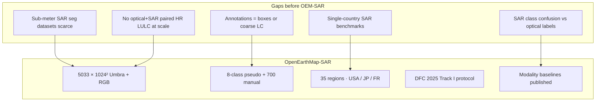
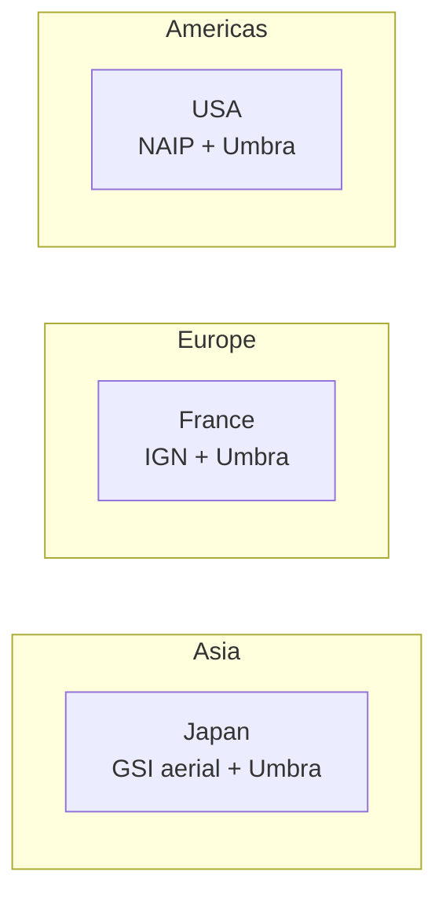
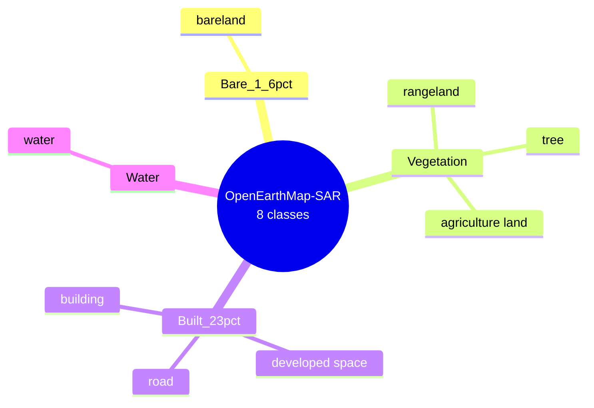
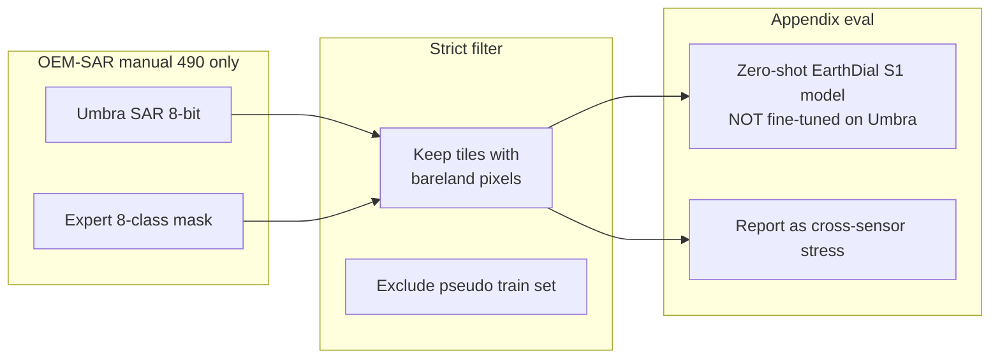

# OpenEarthMap / OpenEarthMap-SAR — Complete Dataset Analysis

> **Source paper (your PDF):** Xia, J., Chen, H., Broni-Bediako, C., Wei, Y., Song, J., Yokoya, N. (2025).  
> **Title:** OpenEarthMap-SAR: A Benchmark Synthetic Aperture Radar Dataset for Global High-Resolution Land Cover Mapping  
> **Venue:** arXiv:2501.10891v2 [eess.IV] · also *IEEE GRSS Magazine* (2025)  
> **Local PDF:** `paperRelatedToDataset/openEarthMap.pdf`  
> **Zenodo:** [14622048](https://zenodo.org/records/14622048) · DFC 2025 bundles: [14950559](https://zenodo.org/records/14950559)  
> **Code:** [github.com/cliffbb/OpenEarthMap-SAR](https://github.com/cliffbb/OpenEarthMap-SAR)  
> **Contest:** [IEEE GRSS Data Fusion Contest 2025 — Track I](https://www.grss-ieee.org/community/technical-committees/2025-ieee-grss-data-fusion-contest/)  
> **Parent dataset:** [OpenEarthMap](https://open-earthmap.org/) (Xia et al., WACV 2023) — **optical** sub-meter LULC benchmark  
> **SAR license:** Umbra Lab imagery — **CC BY 4.0** (per paper Fig. 2 caption)

---

## 1. Executive summary

**OpenEarthMap-SAR (OEM-SAR)** extends the **OpenEarthMap** optical benchmark with **paired high-resolution SAR** imagery for **sub-meter semantic segmentation** under all-weather conditions. It is **not** a Sentinel-1 dataset — SAR comes from **Umbra Space** Spotlight acquisitions (**0.15–0.5 m GSD**), paired with **aerial RGB** from NAIP (USA), IGN (France), and GSI (Japan).

| Property | OpenEarthMap (parent, 2023) | **OpenEarthMap-SAR (this PDF)** |
|---|---|---|
| **Modalities** | Aerial / satellite **RGB** | **RGB + Umbra SAR** (paired, manually aligned) |
| **Resolution** | Sub-meter (~0.25–0.5 m) | **0.15–0.5 m** SAR + matched optical |
| **Images** | Large global optical corpus | **5,033** tiles × **1024×1024** px |
| **Regions** | Global (many countries) | **35 regions** in **USA, Japan, France** |
| **Classes** | Multi-class LULC (OEM scheme) | **8 classes** (same naming as OEM family) |
| **Labels** | Expert / model-assisted | **4,333 pseudo** + **700 manual** (20/region) |
| **Eval set** | OEM benchmarks | **490** expert-labeled tiles (**14/region**) |
| **Segments** | — | **~1.5 million** pseudo segments |
| **Bare class** | Present in OEM lineage | **`bareland`** — explicit, but **noisy** |
| **Sensor for SAR** | — | **Umbra** (VV or HH amplitude), **not Sentinel-1** |

**For BareSoilDial-S1:** OEM-SAR is **not suitable for primary Sentinel-1 training or main benchmarks**. Use it only as an **optional Sem 3 appendix** — **cross-sensor / domain-shift stress test** (Umbra vs Copernicus S1). It has a named **`bareland`** class, but pseudo-label quality for bareland is **very poor** (10.6% agreement with manual labels).

---

## 2. Paper objectives

### 2.1 Primary objective

Bridge the gap in **sub-meter SAR semantic segmentation** benchmarks by releasing:

1. **5,033** coregistered **optical + SAR** 1024² patches across **35** diverse regions.
2. **8-class** land-cover masks at **0.15–0.5 m** — mostly **pseudo-labeled** from pretrained OpenEarthMap models, with **partial manual QA**.
3. Standardized **train/eval protocols** and **baseline results** (U-Net, SegFormer, VMamba) for Optical, SAR, and SAR+Optical.

### 2.2 Problems the paper solves

| Problem | OEM-SAR response |
|---|---|
| Few **public sub-meter SAR** segmentation datasets | **5,033** Umbra + aerial RGB pairs |
| SAR annotation is expensive and expert-heavy | **Pseudo labels** at scale + **700** manual patches |
| Geographic bias in prior SAR benchmarks (single country) | **3 continents**, **35** regions |
| Unknown SAR-vs-optical segmentation gap | Systematic modality ablation (Table IV) |
| No contest-grade multimodal SAR LULC task | **IEEE GRSS DFC 2025 Track I** official dataset |

### 2.3 What the paper is *not* doing

- **Not Sentinel-1 / Copernicus** — Umbra commercial X-band Spotlight SAR.
- Not **10 m** satellite scale (unlike AI4LCC, DW+, SEN12MS).
- Not a **VLM, dialogue, or caption** dataset.
- Not **fully manually labeled** — **86%** of training tiles are pseudo-only (4333/5033).
- Not reliable for **bare-soil science** without heavy filtering — bareland pseudo labels disagree with experts (**~2% IoU**).
- Not multitemporal — single-date pairs per tile (with possible acquisition time mismatch between SAR and optical).

---

## 3. Research gaps addressed



### 3.1 Comparison with other high-resolution SAR datasets (paper Table I)

| Dataset | GSD (m) | Task | Classes | Countries | Regions |
|---|---:|---|---:|---:|
| FU-SAR | 3 | LC | 4 | 1 | 8 |
| GF-3 Building | 1 | BE | 2 | 7 | 9 |
| BDD | 1.2–3.3 | CD | 3 | 8 | 9 |
| SpaceNet 6 | 0.5 | BE | 2 | 1 | 1 |
| BRIGHT | 0.3–1 | CD | 3 | 12 | 21 |
| **OpenEarthMap-SAR** | **0.15–0.5** | **LC** | **8** | **3** | **35** |

**OEM-SAR strength:** most **regions** and **LULC classes** among sub-meter SAR segmentation sets in Table I.  
**OEM-SAR weakness vs your thesis stack:** wrong **sensor family** (Umbra ≠ Sentinel-1), **pseudo-label noise**, **HR aerial** domain unlike **10 m GRD**.

### 3.2 Comparison with BareSoilDial-S1 primary datasets

| Dataset | SAR sensor | GSD | Global | Bare class | Role for you |
|---|---|---:|---|---|---|
| **AI4LCC** | Sentinel-1 GRD | 10 m | France | Open Spaces/Mineral | **Primary train** |
| **DW+** | Sentinel-1 GRD | 10 m | Global subset | Bare ground | **Primary eval** |
| **SEN12MS** | Sentinel-1 GRD | 10–20 m | Global | IGBP Barren | Optional scale |
| **BigEarthNet-MM** | Sentinel-1 GRD | 10 m | Europe | Beaches/sands | Optional scale |
| **OEM-SAR** | **Umbra Spotlight** | **0.15–0.5 m** | 3 countries | **bareland** | **Appendix only** |

---

## 4. Data sources

### 4.1 Source inventory

| Layer | Provider | Access | Bands / product | Role |
|---|---|---|---|---|
| **SAR** | [Umbra Space](http://umbra-open-data-catalog.s3-website.us-west-2.amazonaws.com) | Open catalog | **Spotlight** amplitude; **VV or HH** | Primary SAR modality |
| **Optical (USA)** | [NAIP](https://datagateway.nrcs.usda.gov) | USDA | RGB aerial | Training / fusion |
| **Optical (France)** | [IGN BD ORTHO](https://geoservices.ign.fr/bdortho) | CC BY 2.0 | RGB | Training / fusion |
| **Optical (Japan)** | [GSI](https://maps.gsi.go.jp/development/ichiran.html) | GSI terms | RGB | Training / fusion |
| **Pseudo labels** | Pretrained **OpenEarthMap** models [21]–[25] | Generated | 8-class masks | Bulk training labels |
| **Manual labels** | Expert annotators | 20 images / region | 8-class masks | QA + **490-tile** benchmark |

### 4.2 Geographic coverage (35 regions)



Regions span **urban and rural** mixes — cities, agriculture, forests, coasts, infrastructure. See **Fig. 1** in `openEarthMap.pdf` for exact footprints.

### 4.3 Preprocessing pipeline

| Modality | Processing |
|---|---|
| **Optical** | DN → **reflectance** → standardized **8-bit** RGB |
| **SAR** | Provider preprocessing → **8-bit** amplitude (single-pol **VV or HH** per image) |
| **Coregistration** | Experts manually aligned SAR–optical pairs; cross-checked |
| **Format** | GeoTIFF (DFC 2025 distribution) |

**Implication for EarthDial:** values are **8-bit display amplitude**, not Sentinel-1 **sigma0 dB GRD**. Your `s1_io.py` dB normalization (`S1_MEAN`, `S1_STD`) does **not** apply directly — treat as a **different sensor branch** if you ever use OEM-SAR.

---

## 5. Classes, labels, and data splits

### 5.1 Eight land-cover classes

Consistent with OpenEarthMap, LoveDA, and DeepGlobe-style sub-meter taxonomies.

| ID | Class name | Color (HEX) | Pixel count (M) | Pixel % | Segments (K) | Bare-soil relevance |
|---:|---|---|---:|---:|---:|---|
| — | **Bareland** | `#800000` | **85** | **1.6%** | **8.7** | **`bare_soil`** |
| — | Rangeland | `#00FF24` | 1263 | 23.9 | 392.3 | `sparse_vegetation` |
| — | Developed space | `#949494` | 1222 | 23.1 | 451.2 | `bare_rock_paved` |
| — | Road | `#FFFFFF` | 415 | 7.9 | 69.4 | `bare_rock_paved` |
| — | Tree | `#226126` | 755 | 14.3 | 342.1 | `non_bare` |
| — | Water | `#0045FF` | 543 | 10.3 | 19.3 | `non_bare` |
| — | Agriculture land | `#4BB549` | 344 | 6.5 | 9.3 | `agricultural_fallow` |
| — | Building | `#DE1F07` | 640 | 12.1 | 178.5 | `non_bare` |

**Bareland is rare** (1.6% pixels) and **under-segmented** in pseudo labels (only **8.7K** segments vs **451K** for developed space).

### 5.2 Pseudo vs manual label quality (paper Table III)

Agreement and IoU between **pseudo** and **700 manual** reference patches:

| Class | Agreement | IoU |
|---|---:|---:|
| **Bareland** | **0.1063** | **0.0211** |
| Rangeland | 0.7827 | 0.4705 |
| Developed space | 0.6959 | 0.5251 |
| Road | 0.7038 | 0.6129 |
| Tree | 0.6899 | 0.6413 |
| Water | 0.9396 | 0.8483 |
| Agriculture land | 0.6692 | 0.5809 |
| Building | 0.8708 | 0.7812 |
| **Mean** | **0.6823** | **0.5602** |

**Critical for thesis:** do **not** train BareSoilDial-S1 on OEM-SAR **pseudo** bareland labels — models trained on optical pseudo-masks **fail to transfer** to SAR bare surfaces (paper §II-B, §IV).

### 5.3 Annotation counts

| Label type | Count | Notes |
|---|---:|---|
| **Total images** | **5,033** | 1024×1024 each |
| **Pseudo-labeled** | **4,333** | Used in “P” training scenarios |
| **Manual per region** | **20** | **700** total (35 × 20) |
| **Benchmark eval tiles** | **490** | **14 manual labels / region** for segmentation scoring |
| **Pseudo segments** | **~1.5 M** | Derived from pseudo masks |

### 5.4 Training scenarios (paper §II-B)

| Scenario | Training labels | Images (approx.) |
|---|---|---:|
| **P** | Pseudo only | **4,333** |
| **P+R1** | Pseudo + **1 real / region** | 4,333 + **35** |
| **P+R5** | Pseudo + **5 real / region** | 4,333 + **175** |
| **R1** | **1 real / region** only | **35** |
| **R5** | **5 real / region** only | **175** |

**Official eval:** semantic segmentation scored on **490** manually labeled images (not the full 700 — 14/region held for benchmark).

### 5.5 DFC 2025 Track I protocol (contest extension)

From [GRSS DFC 2025](https://www.grss-ieee.org/community/technical-committees/2025-ieee-grss-data-fusion-contest/) and Zenodo [14950559](https://zenodo.org/records/14950559):

| Phase | What you get |
|---|---|
| **Train** | Paired **optical + SAR** + **pseudo** 8-class masks |
| **Val / test inference** | Often **SAR-only** tiles for submission |
| **Val / test labels** | **Expert manual** masks (released separately: `dfc25_track1_val_labels.zip`, `dfc25_track1_test_labels.zip`) |

**Challenge themes:** multimodal fusion + **noisy pseudo labels**.

---

## 6. Dataset structure on disk

### 6.1 Zenodo download bundles

| Archive | Zenodo record | Contents |
|---|---|---|
| Main dataset | [14622048](https://zenodo.org/records/14622048) | Full OEM-SAR release |
| DFC 2025 train/val | [14950559](https://zenodo.org/records/14950559) | `dfc25_track1_trainval.zip` |
| DFC 2025 test images | [14950559](https://zenodo.org/records/14950559) | `dfc25_track1_test.zip` |
| DFC 2025 labels | [14950559](https://zenodo.org/records/14950559) | `dfc25_track1_val_labels.zip`, `dfc25_track1_test_labels.zip` |

### 6.2 Expected layout (typical after unzip)

```text
openearthmap_sar/
├── train/
│   ├── sar/           # Umbra 8-bit amplitude TIFF, 1024×1024
│   ├── optical/       # RGB TIFF (NAIP / IGN / GSI)
│   └── labels/        # 8-class masks (pseudo for bulk set)
├── val/
│   ├── sar/
│   └── optical/       # may be omitted in SAR-only eval phase
├── test/
│   └── sar/
└── manual_labels/     # 490-tile expert eval set (DFC val/test label zips)
```

**Local path (your project):** `EarthDial-main/data/baresoil_s1/openearthmap_sar/` (optional — not required for Stage 1).

### 6.3 Pairing convention

Each tile shares a **common geocode** after manual alignment. Filenames are region-indexed in DFC packs — use the [OpenEarthMap-SAR GitHub](https://github.com/cliffbb/OpenEarthMap-SAR) dataloader for exact pairing keys.

---

## 7. Class taxonomy — mapping to BareSoilDial-S1

### 7.1 Hierarchy (flat 8-class)



### 7.2 Mapping to unified taxonomy (`taxonomy.py`)

| OEM-SAR class | `taxonomy.py` unified | Bare-positive? |
|---|---|---|
| **bareland** | `bare_soil` | ✅ |
| rangeland | `sparse_vegetation` | ✅ |
| agriculture land | `agricultural_fallow` | ✅ (seasonal) |
| developed space | `bare_rock_paved` | partial |
| road | `bare_rock_paved` | partial |
| tree | `non_bare` | ❌ |
| water | `non_bare` | ❌ |
| building | `non_bare` | ❌ |

Add scheme key: `scheme="openearthmap"` or `scheme="oem_sar"` in `taxonomy.py` when you implement appendix eval.

### 7.3 Bareland definition (operational)

Paper groups **bareland** with other OEM benchmarks — open soil / exposed ground without dominant vegetation or built structures at **sub-meter** scale. Because labels are **optical-model pseudo**, “bareland” often reflects **optical appearance** (brown tones, low vegetation) that **does not match** Umbra backscatter — hence **2.1% IoU** vs manual SAR-aware labels.

---

## 8. Baseline experiments (paper §III)

### 8.1 Models and modalities

| Model | Type | Modalities tested |
|---|---|---|
| **U-Net** | CNN encoder–decoder | Optical, SAR, SAR+Optical |
| **SegFormer** | Transformer | Optical, SAR, SAR+Optical |
| **VMamba** | State-space (Mamba) | Optical, SAR, SAR+Optical |

### 8.2 Key quantitative findings (Table IV summary)

| Modality | Typical mIoU range | Best case (model) |
|---|---|---|
| **Optical** | **56–66%** | VMamba **R5: 65.72%** |
| **SAR alone** | **31–36%** | SegFormer P: **37.23%** |
| **SAR+Optical** | **57–66%** | VMamba **R5: 66.05%** |

**Headline conclusions from paper:**

1. **Optical ≫ SAR** for sub-meter LULC segmentation when labels are optical-derived.
2. **Real labels matter** — Optical mIoU jumps (e.g. U-Net **56.56% P → 65.10% R5**).
3. **SAR+Optical** helps VMamba most; U-Net/SegFormer fusion gains are modest vs optical alone.
4. **Bareland IoU is near zero on SAR** in pseudo-label training (U-Net SAR **P: 0.00%** bareland IoU); only **R5** with real labels reaches **~13–38%** depending on model/modality.

### 8.3 Per-class insight for bare soil

| Observation | Implication for BareSoilDial-S1 |
|---|---|
| Bareland highest IoU with **Optical R5** (U-Net **32.63%**) | Labels encode **color/texture**, not SAR physics |
| SAR bareland IoU **≤13.12%** even with R5 | Umbra **≠** S1; don’t expect S1 model to transfer |
| Water/building pseudo labels most reliable | Safer for generic seg baselines, not bare soil |
| Agriculture benefits from SAR+Optical fusion | Crops have structure in SAR; bare soil does not |

---

## 9. Image examples (from paper figures)

Open `openEarthMap.pdf` at:

### Figure 1 — 35 region locations

World map of all **USA, Japan, France** study sites.

### Figure 2 — Triplet examples (9 columns × 3 rows)

Each column: **SAR (Umbra)** | **Optical RGB** | **8-class label mask**

| Row block | Source |
|---|---|
| Cols 1–3 | France (IGN) |
| Cols 4–6 | Japan (GSI) |
| Cols 7–9 | USA (NAIP) |

**Visual lesson:** SAR shows speckle + geometry; optical shows color; masks follow **optical semantics**.

### Figure 3 — U-Net segmentation comparison

Qualitative **P** vs **R5** for Optical, SAR, SAR+Optical — SAR-alone maps are fragmented; optical maps sharper on roads/buildings/bare patches.

---

## 10. Download and access

| Resource | URL |
|---|---|
| **Zenodo (main)** | https://zenodo.org/records/14622048 |
| **Zenodo (DFC 2025 packs)** | https://zenodo.org/records/14950559 |
| **GitHub (code + baselines)** | https://github.com/cliffbb/OpenEarthMap-SAR |
| **DFC leaderboard** | Codalab — DFC2025 Track I (linked from Zenodo README) |
| **Umbra open catalog** | http://umbra-open-data-catalog.s3-website.us-west-2.amazonaws.com |
| **Parent OpenEarthMap** | https://open-earthmap.org/ |
| **arXiv** | https://arxiv.org/abs/2501.10891 |

**Suggested local path (optional appendix only):**

```text
e:\MTP\earth2\EarthDial-main\data\baresoil_s1\openearthmap_sar\
```

---

## 11. Implications for BareSoilDial-S1

### 11.1 Role in your 3-stage roadmap

| Stage | OEM-SAR usage |
|---|---|
| **Stage 1 (intern)** | **Skip** — not Sentinel-1 |
| **Stage 2** | **Skip** unless exploring cross-sensor failure modes |
| **Stage 3 (paper)** | **Optional Test-4** — 490-tile **manual** subset only; disclose sensor mismatch |

### 11.2 Why not primary train/eval

| Issue | Detail |
|---|---|
| **Wrong SAR sensor** | Umbra Spotlight **≠** Copernicus **Sentinel-1 GRD** (C-band IW, 10 m) |
| **Wrong resolution** | **0.15–0.5 m** vs **10 m** thesis stack |
| **Label domain mismatch** | Pseudo masks from **optical** OpenEarthMap models |
| **Bareland label noise** | **2.1% IoU** pseudo vs manual for bareland |
| **EarthDial S1 norm** | `S1_MEAN` / `S1_STD` tuned for **Sentinel-1 VH dB**, not Umbra 8-bit |
| **Novelty story** | Training on OEM-SAR does **not** support “Sentinel-1 bare-soil VLM” claims |

### 11.3 If you use it anyway (appendix protocol)



| Do | Don't |
|---|---|
| Eval on **490 manual** tiles | Train on **4,333 pseudo** labels for bare soil |
| Report **sensor domain gap** explicitly | Claim OEM-SAR = Sentinel-1 benchmark |
| Use **bareland-only** tile filter | Trust pseudo bareland for quantitative bare-soil F1 |
| Compare **failure cases** qualitatively | Merge OEM metrics with AI4LCC / DW+ tables without caveat |

### 11.4 Patch size vs EarthDial

| Dataset | Patch size | EarthDial default |
|---|---|---|
| AI4LCC | 256×256 | Native |
| DW+ | 510×510 | Resize/crop to 256 |
| **OEM-SAR** | **1024×1024** | **Downsample or sliding-window**; 4× larger than AI4LCC |

### 11.5 Suggested appendix table row

| Benchmark | Sensor | Tiles | Bare class | Role |
|---|---|---:|---|---|
| BareSoil-Bench-S1 (main) | Sentinel-1 VH | DW+ 299 + MultiSenNA | DW bare / OCSGE mineral | Primary zero-shot |
| **OEM-SAR (appendix)** | **Umbra VV/HH** | **≤490** manual | **bareland** | Cross-sensor stress |

---

## 12. Limitations

1. **Not Sentinel-1** — fundamental mismatch with BareSoilDial-S1 / EarthDial `_MS` S1 channel.
2. **Pseudo-label dominance** — 86% of corpus; **68%** mean agreement with manual labels.
3. **Bareland pseudo labels unusable** — **10.6%** agreement, **2.1%** IoU vs experts.
4. **Optical–SAR acquisition mismatch** — different dates/angles → label noise (paper §IV).
5. **Single-pol amplitude** — VV **or** HH per image, not dual-pol stacks like S1 GRD.
6. **8-bit SAR** — dynamic range compressed; unlike sigma0 dB science products.
7. **Geographic scope** — only **3 countries**, 35 regions — not global generalization.
8. **Class imbalance** — bareland **1.6%** pixels; developed/rangeland dominate.
9. **HR aerial domain** — roads/buildings at 15 cm scale ≠ 10 m agricultural bare fields in AI4LCC.
10. **DFC test SAR-only** — contest tests SAR generalization from optical-derived pseudo train — **harder** than your paired S1+label setting.
11. **No dialogue annotations** — must synthesize QA via `instruct_templates.py` if used at all.
12. **Storage** — multi-GB to TB depending on full vs DFC subset; lower priority than AI4LCC `s1.tgz`.

---

## 13. Parent dataset — OpenEarthMap (WACV 2023)

OEM-SAR inherits class philosophy from **OpenEarthMap** (Xia et al., WACV 2023):

| Property | OpenEarthMap (optical) |
|---|---|
| **Task** | Global **high-resolution** LULC mapping |
| **Modal** | Optical imagery (various HR sources) |
| **Role in OEM-SAR** | Pretrained models **[21]–[25]** generate **pseudo SAR labels** |
| **Citation** | Xia, Yokoya, Adriano, Broni-Bediako — WACV 2023 |

**Lineage warning:** OEM-SAR labels are **optical-model opinions** projected onto SAR tiles — not independent SAR photointerpretation except for **700/490** manual patches.

---

## 14. Key citations

```bibtex
@article{xia2025openearthmapsar,
  title   = {{OpenEarthMap-SAR}: A Benchmark Synthetic Aperture Radar Dataset for Global High-Resolution Land Cover Mapping},
  author  = {Xia, Junshi and Chen, Hongruixuan and Broni-Bediako, Clifford and Wei, Yimin and Song, Jian and Yokoya, Naoto},
  journal = {arXiv preprint arXiv:2501.10891},
  year    = {2025}
}

@inproceedings{xia2023openearthmap,
  title     = {{OpenEarthMap}: A Benchmark Dataset for Global High-Resolution Land Cover Mapping},
  author    = {Xia, Junshi and Yokoya, Naoto and Adriano, Bruno and Broni-Bediako, Clifford},
  booktitle = {IEEE/CVF Winter Conference on Applications of Computer Vision (WACV)},
  pages     = {6254--6264},
  year      = {2023}
}
```

**Magazine version:** IEEE GRSS Magazine, 2025 — [doi:10.1109/mgrs.2025.3599512](https://doi.org/10.1109/mgrs.2025.3599512)

---

## 15. Quick reference card

| Question | Answer |
|---|---|
| What is in `openEarthMap.pdf`? | **OpenEarthMap-SAR** — Umbra SAR + aerial RGB, 8-class LULC |
| Sentinel-1? | **No** — **Umbra Space** Spotlight SAR (VV or HH) |
| Images / size? | **5,033** × **1024×1024**, GSD **0.15–0.5 m** |
| Regions? | **35** in **USA, Japan, France** |
| Classes? | **8** — includes **`bareland`** |
| Train labels? | **4,333 pseudo** (+ optional 35/175 manual) |
| Eval labels? | **490** expert manual (**14 / region**) |
| Bareland pixel share? | **1.6%** (rare) |
| Pseudo bareland quality? | **~2% IoU** vs manual — **do not trust** |
| Best baseline mIoU? | **66.05%** VMamba SAR+Optical R5 |
| SAR-alone mIoU? | **~32–37%** — much worse than optical |
| Download? | Zenodo **14622048** / DFC **14950559** |
| DFC 2025? | **Track I** official dataset |
| Use for BareSoilDial-S1? | **Appendix / cross-sensor only** — **not primary** |
| EarthDial path? | `data/baresoil_s1/openearthmap_sar/` (optional) |
| Taxonomy scheme? | `scheme="openearthmap"` in `taxonomy.py` |

---

*Document created for BareSoilDial-S1 / earth2 workspace. Statistics and Table II–IV values from `paperRelatedToDataset/openEarthMap.pdf` (Xia et al., arXiv:2501.10891v2). DFC 2025 protocol from [GRSS IEEE](https://www.grss-ieee.org/community/technical-committees/2025-ieee-grss-data-fusion-contest/) and Zenodo record 14950559.*
