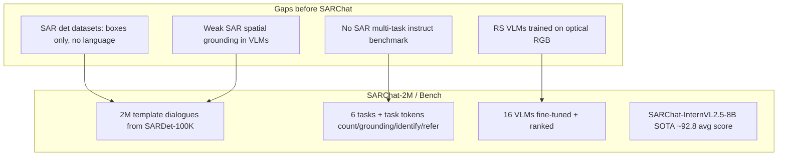
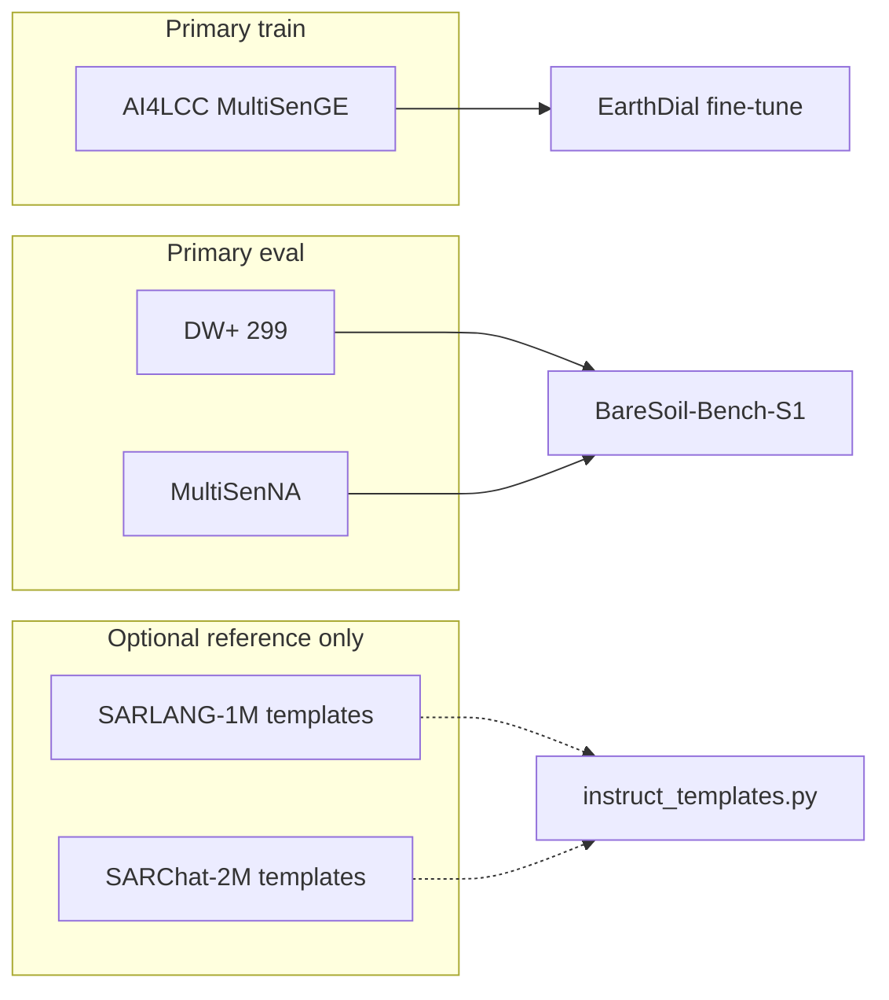

# SARChat-2M / SARChat-Bench-2M — Complete Dataset Analysis

> **Source paper (your PDF):** Ma, Z., Xiao, X., Dong, S., Wang, P., Wang, H., Pan, Q. (2025).  
> **Title:** SARChat-Bench-2M: A Multi-Task Vision-Language Benchmark for SAR Image Interpretation  
> **Venue:** arXiv:2502.08168v5 [cs.CL]  
> **Local PDF:** `paperRelatedToDataset/shareChat-Bench2M.pdf`  
> **Code / release:** [github.com/JimmyMa99/SARChat](https://github.com/JimmyMa99/SARChat)  
> **License (repo):** CC BY-NC 4.0  
> **Upstream imagery:** [SARDet-100K](https://github.com/zcablii/SARDet_100K) (+ 10 SAR detection corpora)  
> **Related SAR-VLM work:** [SARLANG-1M](https://arxiv.org/abs/2504.03254) (same era; different construction)

**Naming note:** Your filename uses *shareChat*; the official project name is **SARChat** (SAR + Chat).

---

## 1. Executive summary

**SARChat-2M** is a **template-generated instruction dataset** for **SAR object-centric VLM** training — classification, counting, spatial grounding, cross-modal ID, and referring — built almost entirely from **bounding-box annotations** in **SARDet-100K**. **SARChat-Bench** is the paired **6-task evaluation suite** used to fine-tune and rank **16 mainstream VLMs**.

| Property | Value |
|---|---|
| **Dialogue samples** | **2,063,548** (1,836,912 train + 226,636 test) |
| **Unique SAR images** | **~105k** lineage (SARDet-100K after cleaning; not 2M images) |
| **GSD range** | **0.3–10 m** (paper abstract) |
| **Object classes** | **6** — ship, aircraft, car, tank, bridge, harbor |
| **Tasks** | **6** — classification, fine-grained description, counting, grounding, cross-modal ID, referring |
| **Text origin** | **Rule templates** from bbox geometry + 3×3 grid (not human chat) |
| **Sensors** | **Mixed** — Gaofen-3, **Sentinel-1**, TerraSAR-X, RadarSat-2, etc. (via SARDet-100K) |
| **Land cover / bare soil** | **None** |
| **Maritime / military bias** | **Ship ~47%** of category samples |

**For BareSoilDial-S1:** SARChat is **not** a training or evaluation dataset for your thesis. It is **object-detection dialogue** (ships, tanks, aircraft), not **Sentinel-1 10 m LULC / bare-soil** semantics. Use at most to **borrow grounding/counting QA patterns** — same tier as SARLANG-1M. **Do not** mix into primary AI4LCC fine-tune without diluting the bare-soil story.

---

## 2. Paper objectives

### 2.1 Primary objective

Provide the **first large-scale SAR multimodal dialogue benchmark** (~2M samples) so VLMs can:

1. Learn **instruction-following** on SAR (not natural RGB images).
2. Perform **six structured tasks** including **bbox grounding** with `{<x1><y1><x2><y2>}` tokens.
3. Establish **SARChat-Bench** as a standardized leaderboard (16 VLMs, multi-metric).

### 2.2 Problems the paper solves

| Problem | SARChat response |
|---|---|
| Optical RS VLMs (GeoChat, RSGPT, EarthGPT) fail on SAR | **SAR-only** instruction tuning corpus |
| SAR datasets lack **language** alignment | **2M** image–text pairs from detection boxes |
| No unified SAR **multi-task** VLM benchmark | **6 tasks**, weighted overall score |
| VLMs weak on SAR **counting / referring** | Dedicated `[count]` / `[refer]` task prompts |
| Edge deployment need | Fine-tuned **≤5B** models (InternVL, Qwen2-VL, etc.) |

### 2.3 What the paper is *not* doing

- **Not** land-cover, bare-soil, or agriculture dialogue.
- **Not** Sentinel-1-only — inherits **SARDet-100K sensor mix**.
- **Not** 10 m Copernicus GRD patches like AI4LCC / DW+.
- **Not** human-written conversations — **template synthesis**.
- **Not** pixel segmentation masks — **bbox** supervision only.
- **Not** multitemporal / bi-temporal QA (unlike QuakeSet in EarthDial).
- **Not** compatible with EarthDial `[baresoil] [s1_vh_10]` shard schema without full redesign.

---

## 3. Research gaps addressed



### 3.1 Comparison with related vision-language datasets

| Dataset | Modality | Scale | SAR? | Tasks | Bare / LULC |
|---|---|---:|---|---|---|
| RSICD / RSITMD | Optical | ~11k / ~5k | ❌ | Caption | ❌ |
| VRSBench | Optical | ~29k | ❌ | Grounding + QA | ❌ |
| GeoChat | Optical HR | large | ❌ | Multi-task RS | Partial LC |
| **SARLANG-1M** | **Mixed SAR** | **1.12M** text | ✅ | Cap + VQA (7 apps) | ~80 LC QA |
| **SARChat-2M** | **SAR (det)** | **2.06M** dialogues | ✅ | **6 bbox tasks** | **❌** |
| **AI4LCC** | **S1 GRD 10 m** | 8k patches | ✅ S1 | Segmentation | Open Spaces |
| **BareSoilDial target** | **S1 VH 10 m** | instruct shards | ✅ S1 | **LULC dialogue** | **✅** |

**SARChat vs SARLANG-1M:**

| Aspect | SARChat-2M | SARLANG-1M |
|---|---|---|
| **Base data** | **SARDet-100K only** (bbox) | SARDet + SpaceNet6 + DFC2023 + OEM-SAR |
| **Text** | **Geometry templates** | RGB VLM transfer + bbox + GPT |
| **Dominant task** | **Cross-modal ID (77.5%)** | Object identification (43%) |
| **Grounding format** | `{<x><y><x><y>}` in answer | Similar bbox VQA |
| **Land-cover QA** | **None** | **16 classes, ~80 pairs** |
| **Bare-soil use** | **None** | **Minimal** |

---

## 4. Data sources

### 4.1 Upstream SAR detection corpora (Figure 2)

SARChat-2M is derived from **SARDet-100K**, which merges **10** public SAR detection sets:

| # | Dataset | Typical target |
|---|---|---|
| 1 | AIR-SARShip 1.0 & 2.0 | Ship |
| 2 | HRSID | Ship (instance seg / det) |
| 3 | MSAR | Multi-class SAR objects |
| 4 | SADD | Aircraft |
| 5 | SAR-AIRcraft-1.0 | Aircraft |
| 6 | ShipDataset | Ship |
| 7 | SSDD | Ship |
| 8 | OGSOD | Generic SAR objects |
| 9 | SIVED | Vehicle (rotated box) |
| 10 | (via SARDet integration) | — |

**SARDet-100K sensors (paper cites Li et al. 2024b):** Gaofen-3, **Sentinel-1**, TerraSAR-X, RadarSat-2, TanDEM-X, HISEA-1, airborne synthetic slices — **mixed resolution 0.1–25 m**.

### 4.2 Six semantic categories (Table 1)

| Category | Train samples | Train % | Test samples | Test % |
|---|---:|---:|---:|---:|
| **Ship** | 93,373 | **46.98%** | 10,741 | **44.38%** |
| **Aircraft** | 40,705 | 20.48% | 6,779 | **28.01%** |
| **Bridge** | 27,615 | 13.89% | 3,281 | 13.56% |
| **Tank** | 24,187 | 12.17% | 1,773 | 7.33% |
| **Car** | 9,561 | 4.81% | 1,230 | 5.08% |
| **Harbor** | 3,306 | 1.66% | 399 | 1.65% |

**No bareland, barren, soil, crop, or urban LULC classes** — only **discrete military/maritime/infrastructure objects**.

### 4.3 Image preprocessing

| Source branch | Processing |
|---|---|
| **SARDet-100K images** | Used **as provided** — **512×512** patches, pre-denoised in SARDet pipeline |
| **Quality filters (description task)** | Drop images **&lt; 224×224**; drop targets with area ratio **R &lt; 1%**; drop aspect ratio **&gt; 10:1** or OOB boxes |

Area ratio:

\[
R = \frac{w_{\text{box}} \times h_{\text{box}}}{W_{\text{img}} \times H_{\text{img}}} \times 100
\]

---

## 5. Six tasks and dialogue generation

### 5.1 Task overview

| Task | ID prompt | What it tests | Template count |
|---|---|---|---|
| **1. Classification** | — | Scene-level **category** among 6 classes | 20 Q + 20 A templates |
| **2. Fine-grained description** | — | Category + **size/shape** + **3×3 grid** position | 40 templates |
| **3. Instance counting** | `[count]` | Count instances + **serialize all bboxes** | 15 templates |
| **4. Spatial grounding** | `[grounding]` | List objects + **relative layout** | 15 templates |
| **5. Cross-modal identification** | `[identify]` | Given **bbox coords** → describe object | 20 templates |
| **6. Referring** | `[refer]` | Given **category/count** → return **bboxes** + grid | 30 templates |

**Spatial encoding:**

- Bbox: `{<x1><y1><x2><y2>}` (top-left, bottom-right pixel coords).
- Regions: **3×3 grid** — top-left, top, top-right, left, middle, right, bottom-left, bottom, bottom-right.
- Proximity threshold: `(W_{\text{img}} + H_{\text{img}}) / 8`.

**Size words (cross-modal ID):** very large / large / medium / small / very small from **R** thresholds (≥0.4, ≥0.25, ≥0.1, ≥0.03).

### 5.2 Example dialogues (Figure 1)

```
Human: Based on these category options (aircraft, bridge, car, harbor, ship, tank),
       what's visible in this scene?
Bot:   It is aircraft

Human: [count] Can you count all the aircraft in this image?
Bot:   There are 3 instances. {<251><265><323><342>}{<185><276><256><355>}...

Human: [identify] Could you specify what appears at {<251><265><323><342>}?
Bot:   Present in the middle center area is a very small aircraft.
```

### 5.3 Sample distribution by task (Table 5 / Appendix A.3)

| Task | Train samples | Train % | Test samples | Test % |
|---|---:|---:|---:|---:|
| **Cross-modal identification** | **1,423,548** | **77.5%** | **175,565** | **77.4%** |
| Instance counting | 95,493 | 5.2% | 11,704 | 5.2% |
| Referring | 95,486 | 5.2% | 11,703 | 5.2% |
| Spatial grounding | 94,456 | 5.1% | 11,608 | 5.1% |
| Classification | 81,788 | 4.5% | 10,024 | 4.4% |
| Fine-grained description | 46,141 | 2.5% | 6,032 | 2.7% |

**Critical:** One SAR image yields **many** dialogues (especially cross-modal ID) → **2M samples ≠ 2M images**.

### 5.4 Text corpus statistics (GitHub README)

| Metric | Value |
|---|---:|
| Total words | 43,978,559 |
| Total sentences | 4,222,143 |
| Average caption length | 10.66 words |

---

## 6. Train / test protocol

### 6.1 Split

| Split | Dialogue samples |
|---|---:|
| **Train** | **1,836,912** |
| **Test (SARChat-Bench)** | **226,636** |

**Split rule:** Preserve **SARDet-100K** original train/test image partition; Cap-related images use **7:3** where applicable (aligned with SARLANG design for overlapping sources).

### 6.2 Fine-tuning recipe (paper §5.1)

| Hyperparameter | Value |
|---|---|
| Framework | **MS-SWIFT** |
| Epochs | **1** |
| Batch size | **4** (effective **32** with grad accum 4) |
| LoRA | rank **8**, alpha **32**, all linear layers |
| Learning rate | **1e-4**, warmup **0.1** |
| Precision | bfloat16 |
| GPUs | 2× NVIDIA A100 |
| Max train time | up to **192 h** per model |

**EarthDial comparison:** your Stage 4 bare-soil run will use different data mix, longer epochs, and **Sentinel-1-specific** normalization — do not copy SARChat hyperparameters blindly.

---

## 7. SARChat-Bench evaluation

### 7.1 Metrics

| Metric | Used for |
|---|---|
| **Accuracy (Acc)** | Classification, counting (count match) |
| **IoU @ 0.25 / 0.5** | Grounding, cross-modal ID, referring (bbox match) |
| **Phrase-set match** | Fine-grained description (category + position phrases) |
| **Overall score** \(S_m\) | Weighted sum over tasks by sample count (Eq. 4) |

### 7.2 Best models (Table 3 — after SARChat-2M fine-tune)

| Model | Params | Avg score | Classification | Counting | Referring IoU@0.5 (multi) |
|---|---:|---:|---:|---:|---:|
| **InternVL2.5** | 8B | **92.79** | 97.25% | 74.14% | 23.46% |
| InternVL2.5 | 4B | 91.57 | 97.27% | 72.68% | 18.86% |
| Phi-3.5-vision | 4.2B | 92.06 | 96.42% | 72.69% | 17.16% |
| Qwen2-VL | 7B | 90.76 | 97.30% | 72.79% | 26.29% |
| DeepSeek-VL | 7B | 88.99 | 93.23% | **20.66%** | 13.66% |

**Hard tasks:** multi-target **referring** (&lt;40% IoU@0.5), **fine-grained description** (40–63%), **counting** for some backbones (&lt;60%).

### 7.3 Released fine-tuned checkpoints (GitHub)

**SARChat-*** variants for InternVL2.5 (1B–8B), Qwen2-VL, DeepSeek-VL, mPLUG-Owl3, Phi-3V, GLM-Edge, LLaVA-1.5, Yi-VL — HuggingFace links in repo (placeholder `YourOrg/` at time of README scrape; check repo for live URLs).

---

## 8. Dataset structure (expected release)

### 8.1 GitHub / HuggingFace

| Resource | URL |
|---|---|
| **Code** | https://github.com/JimmyMa99/SARChat |
| **Dataset (HF)** | https://huggingface.co/datasets/YourOrg/SARChat *(verify live path in repo)* |
| **arXiv** | https://arxiv.org/abs/2502.08168 |

**Suggested local path (optional):** `EarthDial-main/data/baresoil_s1/sarchat/` — **not required** for Stage 1.

### 8.2 Expected record format

Instruction-tuning JSON (conceptual):

```json
{
  "image": "path/to/sardet_0009787.jpg",
  "conversations": [
    {
      "from": "human",
      "value": "<image>\n[count] Count the ship in this satellite image."
    },
    {
      "from": "gpt",
      "value": "There are 4 instances. {<294><358><329><427>}{<61><448><122><503>}..."
    }
  ],
  "task": "instance_counting",
  "category": "ship"
}
```

EarthDial would need: float SAR tensor, `[baresoil]` token, and **LULC answers** — not bbox coordinate strings.

---

## 9. Image examples (from paper figures)

Open `shareChat-Bench2M.pdf` at:

### Figure 1 — SARChat overview

Left: six task types with example Q/A and bbox tokens. Right: radar chart of **16 VLMs** on SARChat-Bench.

### Figure 2 — Construction pipeline

Ten detection datasets → **SARDet-100K** → six task generators with template banks.

### Figure 3 — SARChat-InternVL2.5-8B predictions

Green/red vs ground truth on all six tasks; spatial grounding **over-detects** one ship vs label (annotation incompleteness).

### Appendix Figure 4 — Word cloud

Dominant words: **center, middle, ship, aircraft, small** — confirms maritime/object bias, not land-cover language.

### Appendix Figures 5–9 — Task and category distributions

Pie charts mirroring Table 1 and Table 5.

---

## 10. Implications for BareSoilDial-S1

### 10.1 Role in your project

| Use case | Recommendation |
|---|---|
| **Primary S1 LULC training** | ❌ **Do not use** |
| **Bare-soil eval benchmark** | ❌ **No bare-soil class** |
| **Thesis novelty (BareSoilDial-S1)** | ❌ Training on SARChat **conflicts** with LULC focus |
| **QA template ideas** | ⚠️ Optional — `[count]`, grid positions, yes/no presence |
| **Grounding format** | ⚠️ Only if you add **detection** side task later |
| **Compare to EarthDial Stage 3** | ⚠️ Overlap — EarthDial already uses **ship / SAR** QA (Satlas, SRSDD) |

### 10.2 Why it does not fit bare-soil VLM

| Mismatch | Detail |
|---|---|
| **Task domain** | **Military/maritime objects** vs **bare soil / LULC** |
| **Labels** | **Bounding boxes** vs **pixel masks / scene class** |
| **Sensor** | **0.3–10 m mixed SAR** vs **Sentinel-1 VH 10 m GRD** |
| **Vocabulary** | ship, tank, harbor vs bare soil, arable, mineral |
| **Sample imbalance** | **77%** cross-modal ID on **6** classes |
| **EarthDial token** | No `[baresoil]` / `[s1_vh_10]` convention |

### 10.3 What you *can* borrow for `instruct_templates.py`

| SARChat pattern | BareSoil adaptation |
|---|---|
| `"Which categories are present: …?"` | `"Which land-cover types appear: bare soil, crops, …?"` |
| `"[count] Count …"` | Skip unless you add object-level bare patches |
| 3×3 grid ("bottom left portion") | `"Where is bare soil dominant: center, margin, …?"` |
| Size adjectives (small/medium/large) | Patch-level **dominant fraction** from mask histogram |

### 10.4 Position in dataset stack (your guide)



---

## 11. Limitations (paper + analysis)

1. **Template-generated text** — low linguistic diversity; memorization risk.
2. **Annotation noise inherited from SARDet-100K** — paper admits **missing boxes**; models detect unlabeled ships (Figure 3).
3. **Extreme task skew** — **77.5%** cross-modal ID may **overfit** bbox description.
4. **Category imbalance** — ship + aircraft ≈ **67%** of category-tagged samples.
5. **No LULC / bare-soil** — irrelevant to BareSoilDial core claims.
6. **Mixed sensors** — not Sentinel-1-homogeneous.
7. **Multi-sample per image** — inflated **2M** count vs ~**105k** images.
8. **Military dual-use** — paper ethics section flags defense applications.
9. **License NC** — CC BY-NC 4.0 may restrict commercial EarthDial productization.
10. **Overlap with SARLANG-1M** on SARDet-100k — redundant if you import both.
11. **EarthDial ship-task overlap** — Stage 3 SAR already covers **ship** grounding; adding SARChat does not help bare-soil novelty.

---

## 12. Key citations

```bibtex
@article{ma2025sarchat,
  title   = {{SARChat-Bench-2M}: A Multi-Task Vision-Language Benchmark for {SAR} Image Interpretation},
  author  = {Ma, Zhiming and Xiao, Xiayang and Dong, Sihao and Wang, Peidong and Wang, HaiPeng and Pan, Qingyun},
  journal = {arXiv preprint arXiv:2502.08168},
  year    = {2025}
}

@inproceedings{li2024sardet100k,
  title     = {{SARDet-100K}: Towards Open-Source Benchmark and Toolkit for Large-Scale {SAR} Object Detection},
  author    = {Li, Yuxuan and Li, Xiang and Li, Weijie and Hou, Qibin and Liu, Li and Cheng, Ming-Ming and Yang, Jian},
  booktitle = {NeurIPS},
  year      = {2024}
}
```

---

## 13. Quick reference card

| Question | Answer |
|---|---|
| What is in `shareChat-Bench2M.pdf`? | **SARChat-2M** dataset + **SARChat-Bench** (6-task SAR VLM) |
| Official name? | **SARChat** (not ShareChat) |
| Dialogue samples? | **2,063,548** (train 1,836,912 + test 226,636) |
| Unique images? | **~105k** (SARDet-100K lineage) |
| Classes? | **6 objects** — ship, aircraft, car, tank, bridge, harbor |
| Bare soil / LULC? | **None** |
| GSD? | **0.3–10 m** (mixed sensors) |
| Sentinel-1 only? | **No** — subset of SARDet-100K |
| Text source? | **Template rules** from bboxes |
| Dominant task? | **Cross-modal identification (77.5%)** |
| Best fine-tuned VLM? | **InternVL2.5-8B** avg score **92.79** |
| Download? | [github.com/JimmyMa99/SARChat](https://github.com/JimmyMa99/SARChat) |
| License? | **CC BY-NC 4.0** (repo) |
| Use for BareSoilDial-S1? | **Template reference only** — not train/eval |
| Primary train? | **AI4LCC MultiSenGE** |
| Primary eval? | **DW+** + **MultiSenNA** |
| Related SAR VLM set? | **SARLANG-1M** — broader, RGB-transfer captions |

---

*Document created for BareSoilDial-S1 / earth2 workspace. Statistics from `paperRelatedToDataset/shareChat-Bench2M.pdf` (Ma et al., arXiv:2502.08168v5). Release details from [SARChat GitHub README](https://github.com/JimmyMa99/SARChat).*
