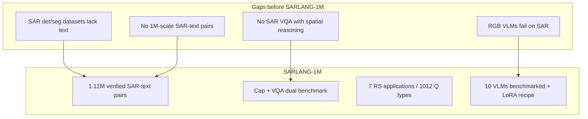
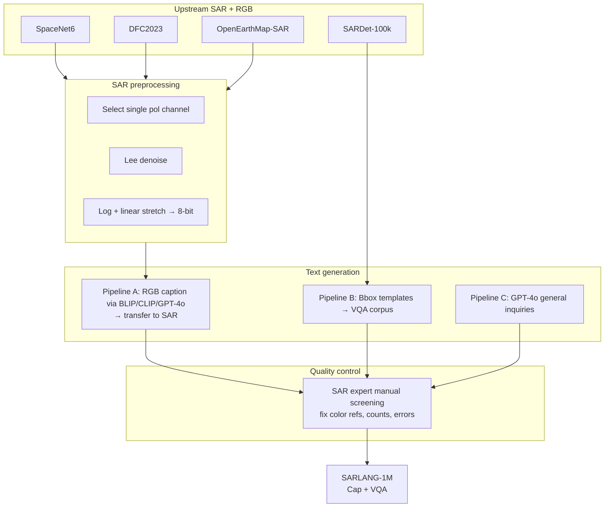
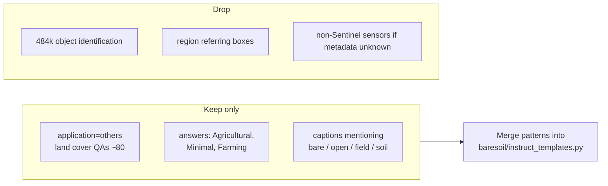
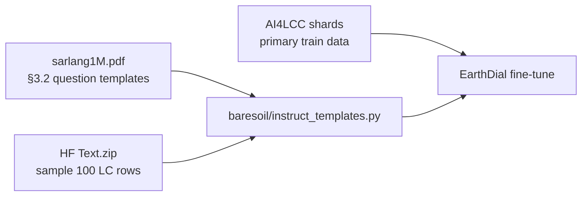

# SARLANG-1M — Complete Dataset Analysis

> **Source paper (your PDF):** Wei, Y., Xiao, A., Ren, Y., Zhu, Y., Chen, H., Xia, J., Yokoya, N. (2025/2026).  
> **Title:** SARLANG-1M: A Benchmark for Vision-Language Modeling in SAR Image Understanding  
> **Venue:** arXiv:2504.03254v1 · **IEEE TGRS** (accepted Jan 2026) — [IEEE Xplore](https://ieeexplore.ieee.org/document/11341914)  
> **Local PDF:** `paperRelatedToDataset/sarlang1M.pdf`  
> **Code:** [github.com/Jimmyxichen/SARLANG-1M](https://github.com/Jimmyxichen/SARLANG-1M)  
> **Dataset:** [HuggingFace — YiminJimmy/SARLANG-1M](https://huggingface.co/datasets/YiminJimmy/SARLANG-1M)  
> **Related upstream SAR corpora:** SpaceNet6 · DFC2023 · OpenEarthMap-SAR · SARDet-100K

---

## 1. Executive summary

**SARLANG-1M** is the first **large-scale SAR image–text** benchmark aimed at training and evaluating **Vision-Language Models (VLMs)** on synthetic-aperture radar — not optical RGB and **not Sentinel-1-only**. It aggregates **118,331 SAR images** and **1,126,277 expert-screened text annotations** (captions + VQA) from **59+ cities**, spanning **0.1–25 m** ground sampling distance and **12+ satellite/airborne SAR sensors**.

| Property | Value |
|---|---|
| **SAR images** | **118,331** unique images |
| **Text annotations** | **1,126,277** (human-verified after screening) |
| **Benchmark splits** | **SARLANG-1M-Cap** (captioning) + **SARLANG-1M-VQA** |
| **Captions** | **45,650** (concise + complex) |
| **VQA pairs** | **~1,080,627** (train 955,372 + test 125,255) |
| **Object vocabulary** | **1,696** categories (paper; figure cites 1,706) |
| **Land-cover VQA** | **16** LC types — only **~80** QA pairs total |
| **Resolutions** | **0.1–25 m** GSD |
| **SAR sensors** | Capella, Umbra, Gaofen-2/3, SuperView-1, **Sentinel-1** (via SARDet-100k), TerraSAR-X, RadarSat-2, etc. |
| **Tasks** | Captioning, VQA (7 application types) |
| **Format** | SAR as **PNG/TIF** (preprocessed single-channel); text **JSON/CSV** |

**For BareSoilDial-S1:** SARLANG-1M is **not** a primary training corpus. Your project targets **Copernicus Sentinel-1 VH @ 10 m** with **LULC / bare-soil** labels (AI4LCC, DW+). Use SARLANG-1M to **borrow dialogue templates**, study **SAR-VLM fine-tuning recipes**, and optionally **augment QA diversity** — after **filtering** land-cover / open-field questions and **excluding** non–Sentinel-1 subsets if sensor consistency matters.

---

## 2. Paper objectives

### 2.1 Primary objective

Enable **multimodal SAR understanding** by providing:

1. **~1M** high-quality **SAR + text** pairs where RGB-trained VLMs fail (Figure 1).
2. Two benchmarks — **SARLANG-1M-Cap** and **SARLANG-1M-VQA** — covering **seven** remote-sensing dialogue applications.
3. Evidence that **LoRA fine-tuning** on SARLANG-1M lifts VLM caption/VQA scores toward **SAR-expert human** performance.

### 2.2 Problems the paper solves

| Problem | SARLANG-1M response |
|---|---|
| VLMs trained on RGB **hallucinate** on SAR (colors, objects, water) | SAR-specific instruction tuning data at scale |
| SAR annotation is **expensive** | Hybrid **RGB→SAR text transfer** + **bbox template** VQA + expert screening |
| No SAR **captioning + VQA** benchmark at scale | **1.12M** verified text samples |
| Sub-meter SAR seg/det datasets lack **language** | Bridges detection corpora (SARDet-100k) with language |
| Speckle/low contrast hurts VLM inputs | Standardized **denoise + log-stretch** preprocessing pipeline |

### 2.3 What the paper is *not* doing

- **Not** a Sentinel-1-only or Copernicus-focused dataset (mixed sensors).
- **Not** pixel-level LULC segmentation masks (language labels only).
- **Not** a dedicated **bare-soil** benchmark — land-cover QA is **tiny** (80 pairs).
- **Not** multitemporal S1 time series (single images per QA/caption).
- **Not** compatible out-of-the-box with EarthDial’s **`[s1_vh_10]`** 256×256 dB shard schema without heavy reprocessing.
- **Not** human-written captions at full scale — majority is **model-generated + filtered**.

---

## 3. Research gaps addressed



### 3.1 Comparison with prior SAR datasets (paper Table 2)

| Dataset | Samples | GSD (m) | Task | Text? |
|---|---:|---|---|---|
| OpenSARShip | 11,346 | 10 | Classification | ✗ |
| MSAR | 28,449 | ≤1 | Detection | ✗ |
| SARDet-100k | 104,985 | 0.1–25 | Detection | ✗ |
| OpenEarthMap-SAR | 5,033 | 0.15–0.5 | Segmentation | ✗ |
| BRIGHT | 4,246 | 0.3–1 | Change / SSL | ✗ |
| **SARLANG-1M** | **1,126,277** | **0.1–25** | **Caption + VQA** | **✓** |

**First large-scale SAR dataset with high-quality text** for VLM training — unique positioning.

### 3.2 Comparison with RGB RS-VLM datasets (paper Table 3)

| Dataset | Modality | Images | Text sim. (mean/var) |
|---|---|---:|---|
| RSICD | RGB | 10,921 | 0.27 / 0.16 |
| VRSBench | RGB | 29,614 | 0.48 / 0.12 |
| **SARLANG-1M (SAR)** | **SAR** | **118,331** | **0.49 / 0.16** |

SARLANG text diversity is comparable to mainstream RGB caption datasets; image diversity (mean sim **0.25**) is better than SARDet-100k alone (**0.26**).

### 3.3 Comparison with your BareSoilDial-S1 stack

| Dataset | Modality | Labels | Bare-soil signal | EarthDial fit |
|---|---|---|---|---|
| **AI4LCC** | S1 GRD 10 m | 14-class seg | Open Spaces/Mineral | **Primary train** |
| **DW+** | S1+S2 10 m | 9-class seg | Bare ground | **Primary eval** |
| **EarthDial** | MS/S1/RGB | Multi-task instruct | Partial | **Base model** |
| **SARLANG-1M** | **Mixed SAR** | **Caption/VQA text** | **Weak** (80 LC QAs) | **Templates only** |

---

## 4. Data sources and sensor mix

### 4.1 Four upstream SAR corpora (paper Table 1)

| Source | SAR images | GSD (m) | Sensor / platform | Polarization | Role in SARLANG |
|---|---:|---|---|---|---|
| **SpaceNet6** | 3,311 | 0.5 | Capella Space (X-band) | **Quad** HH/HV/VH/VV | Cap + VQA (RGB pairs) |
| **DFC2023** | 5,222 | 0.5–2 | SuperView-1, Gaofen-2, Gaofen-3 | Single-pol | Cap + VQA (RGB pairs) |
| **OpenEarthMap-SAR** | 4,813 | 0.15–0.5 | **Umbra** Spotlight | VV or HH | Cap + VQA (RGB pairs) |
| **SARDet-100k** | 104,985 | 0.1–25 | Gaofen-3, **Sentinel-1**, TerraSAR-X, RadarSat-2, TanDEM-X, HISEA-1, airborne | Single-pol | **VQA only** (bbox templates) |

After cleaning incomplete tiles:

| Benchmark | SAR images |
|---|---:|
| **SARLANG-1M-Cap** | **13,346** (RGB–SAR paired subset) |
| **SARLANG-1M-VQA** | **118,331** (full merged set) |

**Sentinel-1 presence:** only as **part of SARDet-100k** — paper does **not** publish per-sensor counts in the final 118k images. Assume **minority fraction**, mixed with X-band commercial and airborne slices.

### 4.2 Optical companions (caption pipeline only)

| Region | Optical source |
|---|---|
| USA | NAIP aerial RGB |
| France | IGN BD ORTHO |
| Japan | GSI orthophotos |

RGB images used to **generate text**, then transfer to SAR. Optional download: [RGBimages.zip on HuggingFace](https://huggingface.co/datasets/YiminJimmy/SARLANG-1M/blob/main/RGBimages.zip).

### 4.3 Geographic coverage

**59+ cities** across **USA, Japan, France, China, India, Australia, Ethiopia, Brazil, Netherlands, Germany, Denmark**, and more (Figure 3). Includes ports, airports, urban cores, agriculture, forests — **object-centric** scenes dominate VQA volume.

---

## 5. Dataset construction

### 5.1 Construction pipeline overview



### 5.2 SAR preprocessing (Figure 5)

| Source | Preprocessing |
|---|---|
| **SARDet-100k** | Use **as provided** (512×512 patches, already denoised) |
| **SpaceNet6, DFC2023, OEM-SAR** | Pick one pol band → **refined Lee filter** → **log transform + linear stretch** → 8-bit grayscale |

HuggingFace release provides **both raw TIF and preprocessed PNG** — preprocessing optional but improves VLM scores (Tables 10–11).

**EarthDial mismatch:** your pipeline expects **float32 VH dB** GeoTIFF at **10 m**; SARLANG uses **8-bit stretched amplitude** at **0.1–25 m** — different physics and dynamic range.

### 5.3 Text generation strategies

#### Pipeline A — SARLANG-1M-Cap (13,346 RGB–SAR pairs)

| Step | Detail |
|---|---|
| 1 | Pair optical + SAR (manually coregistered upstream) |
| 2 | Generate captions on **RGB** with **BLIP**, **CLIP**, **GPT-4o** |
| 3 | Align text to **SAR** image ID |
| 4 | Experts remove **color words**, fix factual errors (Figure 7) |

**Caption types:**

| Type | Generator | Count (total) |
|---|---|---:|
| **Concise** | BLIP / CLIP | 17,487 train + 7,492 test |
| **Complex** | GPT-4o | 14,481 train + 6,190 test |
| **Total** | Mixed for training | **45,650** |

#### Pipeline B — SARLANG-1M-VQA (bbox-driven)

Template questions from SARDet-100k boxes (Table 5):

| Q type | Template example | Answer type |
|---|---|---|
| Object identification | “Is there a [category] in the image?” | Yes/No |
| Object classification | “What categories are visible?” | ship, tank, aircraft, bridge, car, harbor |
| Instance counting | “How many [category]?” | Integer |
| Object positioning | “Where are most [category]?” | left/right/top/bottom/center |
| Region referring | “What object in area [x,y,w,h]?” | 6 detection classes |

**~995,599** auto-generated VQA + **85,028** manually refined pairs (Figure 6).

#### Pipeline C — “General inquiries” (Others application)

GPT-4o prompts for **shape, direction, land cover, pattern, reasoning** — **18,479** QA pairs total.

### 5.4 Quality control (manual screening)

Experts fix four failure modes (Figure 7):

1. **Unsuitable color information** (RGB bleed-over)  
2. **Quantity errors** (aircraft rows miscounted)  
3. **Prediction errors** (ISS vs harbor scene)  
4. **Vague expressions** (refine question specificity)

**Final verified set:** **118,331** images · **1,126,277** annotations (abstract).

---

## 6. Seven applications and sample distribution

### 6.1 Application breakdown (Table 4 / Figure 4a)

| # | Application | Benchmark | SAR-text samples | % of total |
|---|---|---|---:|---:|
| 1 | **Image description** | Cap | **45,650** | 4.1% |
| 2 | **Object identification** | VQA | **484,620** | 43.0% |
| 3 | **Object classification** | VQA | **132,525** | 11.8% |
| 4 | **Instance counting** | VQA | **117,382** | 10.4% |
| 5 | **Region referring** | VQA | **221,450** | 19.7% |
| 6 | **Object positioning** | VQA | **106,171** | 9.4% |
| 7 | **Others** | VQA | **18,479** | 1.6% |

**VQA is detection-centric** — harbor, ship, tank, aircraft, bridge, car dominate. Not land-cover dialogue.

### 6.2 “Others” sub-types (Figure 4b)

| Sub-type | Examples | Bare-soil relevance |
|---|---|---|
| Object shape | “What shape are swimming pools?” | Low |
| Direction | “What direction is the main road?” | Low |
| **Land cover** | “What is the predominant land cover?” | **Medium** — only **~80** QA |
| Pattern | “How are buildings arranged?” | Low |
| Reasoning | “Are buildings under construction?” | Low |

### 6.3 Sixteen land-cover categories (Figure 4b — LC subset)

```
Residential, Industrial, Urban, Mixed-use, Park, Recreational,
Residential and construction, Forest, Minimal, Parking area,
commercial, Farming, Urban development, Agricultural field,
Energy generation and agriculture, Vegetation
```

| LC answer (examples) | Map to `taxonomy.py` | Bare-positive? |
|---|---|---|
| **Minimal** | `bare_soil` or `sparse_vegetation` | partial |
| **Agricultural field** / **Farming** | `agricultural_fallow` | ✅ |
| **Vegetation** / **Forest** / **Park** | `non_bare` or `sparse_vegetation` | partial |
| **Parking area** / **Urban** | `bare_rock_paved` | partial |
| **Industrial** / **commercial** | `non_bare` | ❌ |

**No explicit “bare soil” or “barren” class** — unlike Dynamic World **Bare ground** or OpenEarthMap-SAR **bareland**.

### 6.4 Top object categories (Figure 4c)

Frequent terms: **Sports Field/Playground**, **Golf Course**, **Harbor**, **Tank**, **Aircraft**, **Bridge**, **Parking lot**, etc. — **1,696** open-vocabulary object types in GPT-transferred captions.

---

## 7. Train / test splits

### 7.1 SARLANG-1M-Cap (Table 6)

| Split | Images | Captions |
|---|---:|---:|
| **Train** | **9,341** | **31,968** (mixed concise+complex) |
| **Test** | **4,005** | **13,682** |
| **Ratio** | 7:3 | 7:3 |

Eval sets: `Caption_test.csv` (complex only) · `Caption_test1.csv` (concise only).

### 7.2 SARLANG-1M-VQA (Table 6)

| Split | Images | QA pairs |
|---|---:|---:|
| **Train** | **103,834** | **955,372** |
| **Test** | **14,497** | **125,255** |

**Split rule:**

- Images shared with **Cap** → same **7:3** image split.  
- **SARDet-100k** images → preserve **original SARDet train/test** partition.

### 7.3 HuggingFace VQA subsets (README)

| Prefix | Source images | Content |
|---|---|---|
| **SARVQA1_** | SARDet-100k | Bbox-accurate VQA; **6 object classes** |
| **SARVQA2_** | SpaceNet6 + DFC2023 + OEM-SAR | HR SAR; richer categories |

For HR-only work, use **SARVQA2** alone. For BareSoilDial-S1, if you filter **Sentinel-1**, you'd subset **SARVQA1** and need **sensor metadata** from SARDet-100k — not bundled in SARLANG text CSV alone.

---

## 8. Dataset structure on disk

### 8.1 HuggingFace layout

Download: [huggingface.co/datasets/YiminJimmy/SARLANG-1M](https://huggingface.co/datasets/YiminJimmy/SARLANG-1M)

```text
SARLANG_1M/
├── SARimages/              # PNG (preprocessed) and/or TIF (raw)
│   ├── France_Alpes-Maritimes_Nice_3.png
│   ├── SV_Darwin_-12.4278_130.8688.png
│   ├── 0009787.jpg         # SARDet-100k naming
│   └── ...
├── Text/                   # Text.zip → JSON + CSV
│   ├── caption/
│   │   ├── Caption-training.csv
│   │   ├── Caption_test.csv      # complex GT
│   │   └── Caption_test1.csv     # concise GT
│   └── VQA/
│       ├── SARVQA1_train/...
│       ├── SARVQA1_test/...
│       ├── SARVQA2_train/...
│       └── SARVQA2_test/...
└── RGBimages.zip           # optional optical pairs
```

**Local path (optional):** `EarthDial-main/data/baresoil_s1/sarlang1m/`

### 8.2 Conversation schema (for EarthDial-style conversion)

Typical Cap row:

```json
{
  "image": "SARimages/France_Alpes-Maritimes_Nice_3.png",
  "conversations": [
    {"from": "human", "value": "Describe the content of this image in one sentence."},
    {"from": "gpt", "value": "Aerial view of a marina with a large building."}
  ]
}
```

Typical VQA row:

```json
{
  "image": "SARimages/0009787.jpg",
  "question": "What is the predominant land cover?",
  "answer": "Urban.",
  "application": "others",
  "answer_type": "land cover"
}
```

EarthDial uses `<image>` tokens and modality tags — map SAR PNG to float tensor or RGB-grayscale triple replication per EarthDial SAR convention.

---

## 9. Experimental results (paper §4)

### 9.1 VLM fine-tuning setup

| Setting | Value |
|---|---|
| Fine-tuned models | BLIP, LLaVA1.5-7B/13B, QWEN2-VL-7B, QWEN2.5-VL-7B |
| Method | **LoRA** rank 8 on all linear layers |
| Epochs | **3** |
| Batch size | **1** |
| Learning rate | **1e-4** (warmup 0.1) |
| GPU | 1× NVIDIA A100 |
| Cap prompt | `"Describe the content of this image in one sentence."` |
| VQA prompt | `"Question: {q}. Answer the question concisely."` |

### 9.2 SAR captioning highlights (Table 7)

| Model | Setting | Best CIDEr (complex) | Best CIDEr (concise) |
|---|---|---:|---:|
| QWEN2-VL-7B | LoRA fine-tuned | **48.36** | 9.56 |
| QWEN2.5-VL-7B | LoRA fine-tuned | 55.64 | **70.05** |
| HCNet (CNN baseline) | Scratch | 33.61 | **239.00** |
| LLaVA1.5-7B | **No** fine-tune | ~0.03 | ~0.02 |

**Fine-tuning gain:** up to **+67.20% CIDEr** (concise) vs zero-shot VLMs.

### 9.3 SAR VQA highlights (Table 8–9)

| Model | Accuracy (full test) | Notes |
|---|---:|---|
| InternVL2.5-4B | **43.95%** | Best zero-shot |
| QWEN2.5-VL-7B | **73.33%** | Best fine-tuned |
| LLaVA1.5-7B | 33.55% → **70.30%** | +36.75% after LoRA |
| SAR experts (30-Q subset) | **57.76%** | Human ceiling |
| Ordinary people | 27.76% | |

**Land-cover example (Figure 8, Application 7):** pre-trained LLaVA answers “open field”; after fine-tune → **“Agricultural”** — shows LC QA is learnable but **dataset has only 80 LC labels**.

### 9.4 Preprocessing ablation (Tables 10–11)

Denoise + stretch on OEM-SAR test subset improves QWEN2.5-VL-3B:

| Task | Δ CIDEr / accuracy |
|---|---|
| Cap (concise) | **+5.39 BLEU_1**, +5.63 ROUGE_L |
| VQA | **+2.81** accuracy points |

---

## 10. Image examples (from paper figures)

Open `sarlang1M.pdf` at:

### Figure 1 — Why SARLANG exists

Side-by-side **RGB vs SAR** captions/VQA from DeepSeek-VL, GPT-4o, LLaVA1.5 — SAR outputs hallucinate **hands, craters, wrong water**.

### Figure 2 — Dataset diversity

Cap examples (Nice, Denmark, Florida) + VQA types (counting tanks, land-cover reasoning, region boxes).

### Figure 6 — Annotation pipeline

RGB→SAR transfer + bbox corpus + manual screening counts.

### Figure 7 — Manual correction cases

Remove **“blue”** from pool caption; fix aircraft row count; replace ISS hallucination.

### Figure 8 — Seven applications after fine-tune

Industrial tanks, ship referring, agricultural land-cover QA.

### Figure 9 — Grad-CAM

Fine-tuned BLIP aligns words **“bridge”, “river”, “buildings”** to correct SAR regions.

---

## 11. Implications for BareSoilDial-S1

### 11.1 Recommended role (from your roadmap)

| Use | Recommendation |
|---|---|
| **Primary S1 LULC train** | ❌ **Do not use** |
| **Primary eval benchmark** | ❌ **Do not use** |
| **QA / instruct templates** | ✅ **Borrow** question patterns (counting, land-cover, yes/no) |
| **SAR-VLM fine-tune recipe** | ✅ Reference LoRA settings for **optional** EarthDial Stage 4 ablation |
| **Scale augmentation** | ⚠️ Only if you accept **mixed-sensor** SAR and **non–bare-soil** bias |
| **Thesis novelty** | ⚠️ Fine-tuning EarthDial on full SARLANG **dilutes** Sentinel-1 bare-soil story |

### 11.2 What to borrow for `instruct_templates.py`

| SARLANG pattern | BareSoilDial adaptation |
|---|---|
| “What is the predominant land cover?” | “What land cover dominates this patch?” |
| “Is there [class] present?” | “Is bare soil or exposed ground visible?” |
| “Describe in one sentence.” | EarthDial Cap template with `[baresoil] [s1_vh_10]` |
| Region referring `[x,y,w,h]` | Skip (no bbox labels in AI4LCC pipeline) |
| Instance counting | Optional for **harbor/tank** — not bare-soil core |

### 11.3 Filtering strategy if used as supplementary QA



**Realistic yield:** <**500** bare-relevant QA pairs without mining captions — **not** a scale dataset for you.

### 11.4 EarthDial integration cautions

| Issue | Detail |
|---|---|
| **Image tensor** | PNG 8-bit vs GeoTIFF **VH dB** |
| **Resolution** | 0.1–25 m vs **10 m** fixed |
| **Sensor token** | No `[s1_vh_10]` semantics for Umbra/Capella |
| **Task mismatch** | SARLANG = **objects**; BareSoil = **LULC / bare soil** |
| **Label lineage** | Text from **RGB VLMs** for Cap subset |

### 11.5 Workflow diagram (template-only path)



---

## 12. Limitations

1. **Mixed SAR sensors** — Capella, Umbra, Gaofen, **Sentinel-1**, etc.; not homogenous Copernicus S1.
2. **RGB-derived captions** — semantic bias from optical VLMs; color leakage manually reduced but not eliminated.
3. **Land-cover QA tiny** — **~80** pairs / **16** classes — useless alone for bare-soil benchmarking.
4. **No explicit bare-soil class** — “Minimal” / “Agricultural” are weak proxies.
5. **Object-heavy VQA** — 43% object-identification questions (harbor, ship, tank).
6. **Template repetition** — bbox VQA from **6** SARDet classes creates linguistic patterns.
7. **Resolution heterogeneity** — 0.1–25 m in one benchmark confounds GSD-specific learning.
8. **8-bit preprocessing** — information loss vs science-grade sigma0 products.
9. **Expert screening not full rewrite** — scalable QC, not pixel-accurate SAR photo-interpretation.
10. **Human expert ceiling ~58%** on small 30-Q set — labels still noisy/hard.
11. **Linux-only official code** — Windows paths need adaptation (your `earth2` env).
12. **EarthDial overlap risk** — if you fine-tune on full SARLANG, reviewers may conflate with generic SAR-VLM work vs **BareSoilDial-S1** contribution.

---

## 13. Key citations

```bibtex
@article{wei2026sarlang,
  title   = {{SARLANG-1M}: A Benchmark for Vision-Language Modeling in {SAR} Image Understanding},
  author  = {Wei, Yimin and Xiao, Aoran and Ren, Yexian and Zhu, Yuting and Chen, Hongruixuan and Xia, Junshi and Yokoya, Naoto},
  journal = {IEEE Transactions on Geoscience and Remote Sensing},
  year    = {2026},
  publisher = {IEEE}
}

@article{wei2025sarlangarxiv,
  title   = {{SARLANG-1M}: A Benchmark for Vision-Language Modeling in {SAR} Image Understanding},
  author  = {Wei, Yimin and Xiao, Aoran and Ren, Yexian and Zhu, Yuting and Chen, Hongruixuan and Xia, Junshi and Yokoya, Naoto},
  journal = {arXiv preprint arXiv:2504.03254},
  year    = {2025}
}
```

**Upstream:**

- Xia et al., OpenEarthMap-SAR, arXiv:2501.10891  
- Li et al., SARDet-100k, NeurIPS 2024  
- Shermeyer et al., SpaceNet 6, CVPRW 2020  

---

## 14. Quick reference card

| Question | Answer |
|---|---|
| What is SARLANG-1M? | **1.12M** verified **SAR + text** pairs for **VLM** captioning & VQA |
| SAR images? | **118,331** unique ( **13,346** in Cap benchmark ) |
| Sentinel-1 only? | **No** — **12+** sensors; S1 only via **SARDet-100k** subset |
| Resolution? | **0.1–25 m** GSD |
| Patch sizes? | **512×512** (SARDet) · up to **1024×1024** (OEM source) |
| Tasks? | **Cap** + **VQA** (7 applications) |
| Land-cover QA? | **16** classes · **~80** pairs only |
| Bare soil class? | **None explicit** — filter LC + caption keywords |
| Download? | [HuggingFace YiminJimmy/SARLANG-1M](https://huggingface.co/datasets/YiminJimmy/SARLANG-1M) |
| Code? | [github.com/Jimmyxichen/SARLANG-1M](https://github.com/Jimmyxichen/SARLANG-1M) |
| Best VQA after LoRA? | QWEN2.5-VL-7B **73.33%** GPT-4-judged accuracy |
| Use for BareSoilDial-S1? | **Templates + methods only** — not primary data |
| Primary train stays? | **AI4LCC MultiSenGE** |
| Primary eval stays? | **DW+** + **MultiSenNA** |
| EarthDial templates? | `EarthDial-main/baresoil/instruct_templates.py` |

---

*Document created for BareSoilDial-S1 / earth2 workspace. Core statistics from `paperRelatedToDataset/sarlang1M.pdf` (Wei et al., arXiv:2504.03254). HuggingFace folder layout and SARVQA1/2 split notes from [SARLANG-1M GitHub README](https://github.com/Jimmyxichen/SARLANG-1M) (TGRS 2026 release).*
