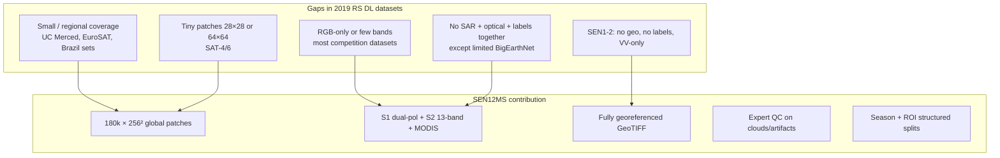
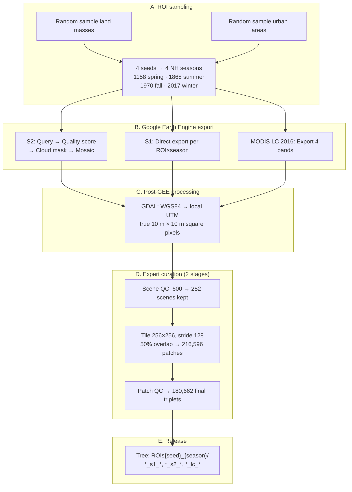
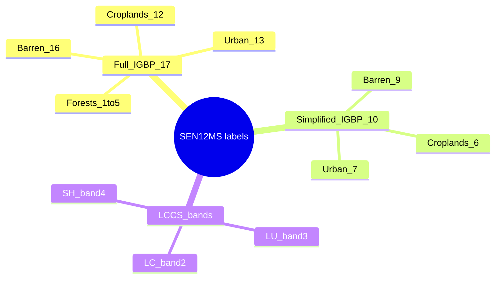
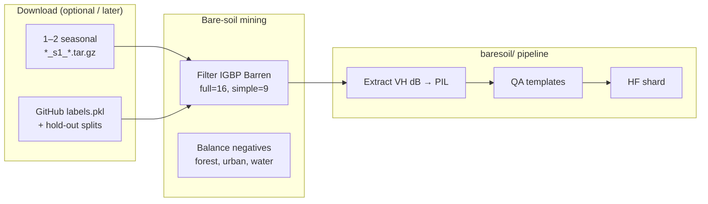

# SEN12MS — Complete Dataset Analysis

> **Source paper:** Schmitt, M., Hughes, L. H., Qiu, C., Zhu, X. X. (2019).  
> **Title:** SEN12MS – A Curated Dataset of Georeferenced Multi-Spectral Sentinel-1/2 Imagery for Deep Learning and Data Fusion  
> **Venue:** ISPRS Annals, Vol. IV-2/W7, pp. 153–160 (PIA19 + MRSS19, Munich)  
> **DOI:** [10.5194/isprs-annals-IV-2-W7-153-2019](https://doi.org/10.5194/isprs-annals-IV-2-W7-153-2019)  
> **Local PDF:** `paperRelatedToDataset/sen12ms.pdf`  
> **Download:** [mediaTUM 1474000](https://mediatum.ub.tum.de/1474000) · [GitHub schmitt-muc/SEN12MS](https://github.com/schmitt-muc/SEN12MS)  
> **License:** CC-BY 4.0  
> **Follow-up:** Schmitt & Wu (2021) — scene classification benchmarks + **simplified 10-class IGBP** labels

---

## 1. Executive summary

**SEN12MS** is a **global**, **seasonally structured** benchmark of **180,662 georeferenced triplets**:

| Modality | Content |
|---|---|
| **Sentinel-1** | Dual-pol GRD — **VV + VH**, σ° in **dB**, 10 m patches |
| **Sentinel-2** | Full **13-band** multispectral cubes, cloud-free mosaics |
| **MODIS LC** | **4** land-cover layers upsampled to 10 m (labels or auxiliary data) |

It is the **2019 follow-on to SEN1-2** (280k RGB/VV-only pairs without geolocation). SEN12MS adds **full geocoding**, **all S2 bands**, **dual-pol SAR**, and **MODIS labels** for scene classification and semantic segmentation.

| Property | Value |
|---|---|
| **Patch size** | **256 × 256** px @ **10 m** GSD (2.56 km × 2.56 km) |
| **Spatial triplets** | **180,662** (after expert QC) |
| **Geographic coverage** | All **inhabited continents**, global ROI sampling |
| **Temporal structure** | 4 **meteorological seasons** (NH definition) |
| **Storage** | **421.3 GiB** (paper); portal lists **~510 GB** today |
| **Label native resolution** | MODIS **500 m** → upsampled to 10 m (important caveat) |
| **Bare-soil class** | IGBP **Barren** (full ID **16** → simplified ID **9**) — **very rare** (~29 test patches) |

---

## 2. Paper objectives

### 2.1 Primary objective

Provide a **large-scale, curated, georeferenced** multi-sensor dataset so deep learning models can learn **data fusion**, **land cover mapping**, and **scene classification** from real Sentinel data — not simplified RGB thumbnails.

### 2.2 Specific goals vs SEN1-2 (2018)

| SEN1-2 (old) | SEN12MS (this paper) |
|---|---|
| ~564k pairs | 180,662 **quality-filtered** triplets |
| VV only, RGB only | **VV + VH** + **13-band S2** |
| No geolocation | Full **GeoTIFF**, UTM-resampled 10 m squares |
| No labels | **MODIS MCD12Q1** land cover (4 schemes) |
| Image translation focus | **Remote sensing** LC / fusion focus |

### 2.3 Secondary objectives

1. **Global diversity:** Random ROIs over land + urban areas worldwide, all NH seasons.
2. **Cloud-free S2:** GEE mosaicking pipeline (Schmitt et al., 2019) for short-term cloud-free composites.
3. **Expert curation:** Two-stage human inspection removes clouds, nodata, mosaicking artifacts.
4. **Baseline demos:** ResNet-110 (Munich) + DenseNet segmentation (Rome) on LCCS labels.
5. **Community splits:** No fixed train/test — users split by season, ROI, or hold-out lists (GitHub).

### 2.4 What the paper is *not* doing

- Not multitemporal SITS per patch (one mosaic per ROI×season, not AI4LCC-style time series).
- Not high-resolution vector labels (MODIS 500 m effective).
- Not a VLM / dialogue dataset.
- Not speckle-filtered SAR (left to end user).

---

## 3. Research gaps addressed



### 3.1 Comparison with key datasets (paper Table 1 + discussion)

| Dataset | Patches | Size | S1+S2 | Labels | Coverage |
|---|---:|---|---|---|---|
| EuroSAT | 27,000 | 64² | S2 only | 10 classes | Europe |
| BigEarthNet | 590,326 | up to 120² | ✅ pair | CORINE 43 | Europe |
| SEN1-2 | 564,768 | 256² | ✅ pair | ❌ none | Global |
| **SEN12MS** | **180,662** | **256²** | **✅ triplet** | **MODIS 4-layer** | **Global, 4 seasons** |
| MultiSenGE (2022) | 8,157 | 256² | ✅ + SITS | OCSGE 14-class @ 10 m | France only |

**SEN12MS strengths:** global scale, large patches, dual-pol SAR, full S2 spectrum.  
**SEN12MS weaknesses vs MultiSenGE:** **coarse MODIS labels**, no urban subclasses, **not multitemporal**.

---

## 4. Data sources

### 4.1 Three-layer stack

| Layer | Source | Product | Processing in SEN12MS |
|---|---|---|---|
| **SAR** | Sentinel-1A/B | GRD **IW** dual-pol | σ° **dB**, VV+VH, SRTM/ASTER DEM orthorectification, **no speckle filter** |
| **Optical** | Sentinel-2A/B | L2A granules via **Google Earth Engine** | Cloud-free **short-term mosaic** per ROI×season |
| **Labels** | MODIS Terra+Aqua | **MCD12Q1 V6** (year **2016**) | 4 bands upsampled **500 m → 10 m** |

### 4.2 Sentinel-1 details (§2.1)

| Property | Value |
|---|---|
| Mode | Interferometric Wide (**IW**) GRD |
| Polarizations | **VV** + **VH** |
| Values | Sigma-nought backscatter in **dB** |
| Native posting | 5 m azimuth × 20 m range (resampled to 10 m grid) |
| Pre-processing | Orbit restitution + **SRTM** (or **ASTER** above 60°N) DEM |
| User responsibility | Speckle filtering, radiometric calibration choices |

### 4.3 Sentinel-2 details (§2.2)

- Full **13 spectral bands** from georeferenced L2A granules.
- Only manipulation: **cloud-free mosaicking** (Section 5.1).
- Native bands at 10 m and 20 m; all exported on common 10 m grid after UTM reprojection.

### 4.4 MODIS land cover (§2.3)

- **MCD12Q1 Collection 6**, year **2016**, native **500 m** GSD.
- Four classification schemes packed into `lc` GeoTIFF (4 bands per patch):

| Band | Scheme | Reported accuracy (paper) |
|---|---|---|
| 1 | **IGBP** (17 classes) | ~67% |
| 2 | LCCS Land Cover | ~74% |
| 3 | LCCS Land Use | ~81% |
| 4 | LCCS Surface Hydrology | ~87% |

**Critical warning (paper §2.3):** Even 100% validation on upsampled MODIS labels cannot exceed **~67% real LCC accuracy** for IGBP — label noise is structural.

---

## 5. Methodology — how the dataset was built

### 5.1 End-to-end production workflow



### 5.2 Cloud-free Sentinel-2 mosaicking (Figure 1 in paper)

Three GEE modules per ROI (detailed in Schmitt et al., 2019):

1. **Query Module** — `ee.ImageCollection()` for all S2 scenes in season window.
2. **Quality Score Module** — per-pixel cloud + shadow likelihood scores.
3. **Image Merging Module** — threshold masks, sort by % poor pixels, merge best scenes → **cloud-free mosaic**.

S1 and MODIS skip mosaicking (not cloud-limited in same way).

### 5.3 Season windows (Northern Hemisphere)

| Seed | Season | Date range |
|---|---|---|
| **1158** | Spring | 1 Mar 2017 – 30 May 2017 |
| **1868** | Summer | 1 Jun 2017 – 31 Aug 2017 |
| **1970** | Fall | 1 Sep 2017 – 30 Nov 2017 |
| **2017** | Winter | 1 Dec 2016 – 28 Feb 2017 |

`seasons.csv` in the release maps each scene to **climatic** season (not just NH calendar) for meaningful geographic splits.

### 5.4 Tiling and overlap

| Parameter | Value |
|---|---|
| Patch size | **256 × 256** px |
| Stride | **128** px |
| Overlap | **50%** between adjacent patches |
| Rationale | Balance patch independence vs sample count |

### 5.5 Quality control funnel

| Stage | Count |
|---|---:|
| Scenes downloaded | 600 |
| After scene-level expert QC | **252** |
| Patches after tiling | 216,596 |
| After patch-level expert QC | **180,662** |

**Removed:** large nodata, undetected clouds, jet-stream artifacts, mosaicking seams (paper Figure 2).

---

## 6. Class taxonomy

### 6.1 Four label schemes in `lc` patches

Each `*_lc_*.tif` has **4 bands** (16-bit GeoTIFF). Band 1 (**IGBP**) is the usual choice for classification.

### 6.2 Full IGBP — 17 classes (paper Table 2)

| IGBP ID | Class name | Bare-soil relevance |
|---:|---|---|
| 1 | Evergreen Needleleaf Forests | ❌ |
| 2 | Evergreen Broadleaf Forests | ❌ |
| 3 | Deciduous Needleleaf Forests | ❌ |
| 4 | Deciduous Broadleaf Forests | ❌ |
| 5 | Mixed Forests | ❌ |
| 6 | Closed Shrublands | sparse veg |
| 7 | Open Shrublands | sparse veg |
| 8 | Woody Savannas | partial |
| 9 | Savannas | partial |
| 10 | Grasslands | sparse veg |
| 11 | Permanent Wetlands | ❌ |
| 12 | Croplands | **fallow / bare period** |
| 13 | Urban and Built-Up Lands | paved |
| 14 | Cropland/Natural Vegetation Mosaics | mixed |
| 15 | Permanent Snow and Ice | ❌ |
| **16** | **Barren** | **✅ primary bare-soil class** |
| 17 | Water Bodies | ❌ |
| 255 | NoData | ignore |

**IGBP Barren (16):** *"Lands with exposed soil, sand, or rocks."*

### 6.3 Simplified IGBP — 10 classes (Schmitt & Wu 2021)

Used for scene classification benchmarks and DFC2020. Merges full IGBP for balance.

| Simplified ID | Name | Merged from (IGBP full) | Color (hex) |
|---:|---|---|---|
| 1 | Forest | 1, 2, 3, 4, 5 | `009900` |
| 2 | Shrubland | 6, 7 | `c6b044` |
| 3 | Savanna | 8, 9 | `fbff13` |
| 4 | Grassland | 10 | `b6ff05` |
| 5 | Wetlands | 11 | `27ff87` |
| 6 | Croplands | 12, 14 | `c24f44` |
| 7 | Urban/Built-up | 13 | `a5a5a5` |
| 8 | Snow/Ice | 15 | `69fff8` |
| **9** | **Barren** | **16** | **`f9ffa4`** |
| 10 | Water | 17 | `1c0dff` |



### 6.4 LCCS layers (bands 2–4 of `lc`)

Paper Table 2 maps IGBP ↔ LCCS values. Example for **Barren**:

| Scheme | Class value | Name |
|---|---:|---|
| IGBP | 16 | Barren |
| LCCS Land Cover | 1 | Barren |
| LCCS Land Use | 1 | Barren |
| LCCS Surface Hydrology | 1 | Barren |

Baseline experiments in §5 of the 2019 paper use **LCCS Land Use** (Munich ResNet, Rome DenseNet).

### 6.5 Bare-soil class statistics (Schmitt & Wu 2021)

| Fact | Implication for BareSoilDial-S1 |
|---|---|
| **Barren extremely rare** in scene labels | Only **~29 patches** with Barren in multi-label **test** set |
| Croplands + Urban dominate | Must **oversample** Barren (IGBP 16 / simplified 9) |
| MODIS 500 m → 10 m | Pixel labels are **blurred**; dominant-class QA safer than per-pixel dialogue |
| SAR helps Barren | Schmitt & Wu: **S1 fusion beats RGB-only** on Barren class |

### 6.6 Mapping to your 7-class bare taxonomy

| SEN12MS (simplified) | `taxonomy.py` unified |
|---|---|
| Barren (9) | `bare_soil` |
| Croplands (6) | `agricultural_fallow` |
| Grassland (4) | `sparse_vegetation` |
| Shrubland (2), Savanna (3) | `sparse_vegetation` |
| Urban (7) | `bare_rock_paved` or `non_bare` |
| Snow (8), Water (10), Wetlands (5), Forest (1) | `non_bare` |

---

## 7. Dataset structure on disk

### 7.1 Tree hierarchy (paper Figure 5)

```text
SEN12MS/
├── ROIs1158_spring/
│   ├── ROIs1158_spring_s1.tar.gz    (or extracted *_s1_* folders)
│   ├── ROIs1158_spring_s2.tar.gz
│   └── ROIs1158_spring_lc.tar.gz
├── ROIs1868_summer/
├── ROIs1970_fall/
├── ROIs2017_winter/
├── seasons.csv
└── (per scene: many patch GeoTIFFs)
```

**Four branches** × multiple ROI scenes × three modalities (`s1`, `s2`, `lc`).

### 7.2 File naming convention

```
ROIs{SSSS}_{SEASON}_{DD}_p{XXX}.tif
```

| Token | Meaning | Example |
|---|---|---|
| `SSSS` | Random seed / season branch | `1158` |
| `SEASON` | `spring`, `summer`, `fall`, `winter` | `spring` |
| `DD` | Data type | `s1`, `s2`, `lc` |
| `XXX` | Patch ID | `p202` |

**Example triplet (same patch):**

```text
ROIs1158_spring_s1_146_p202.tif   # VV+VH SAR
ROIs1158_spring_s2_146_p202.tif   # 13-band S2
ROIs1158_spring_lc_146_p202.tif   # 4-band MODIS LC
```

### 7.3 GeoTIFF channel layout

| File | Channels | Dtype | Notes |
|---|---|---:|---|
| `*_s1_*` | **2** — VV, VH | 16-bit | dB backscatter |
| `*_s2_*` | **13** — B1…B12 | 16-bit | Full MS cube |
| `*_lc_*` | **4** — IGBP, LCCS LC, LCCS LU, LCCS SH | 16-bit | Upsampled MODIS |

### 7.4 GitHub auxiliary files ([schmitt-muc/SEN12MS](https://github.com/schmitt-muc/SEN12MS))

| Path | Purpose |
|---|---|
| `labels/IGBP_probability_labels.pkl` | Per-patch class probability vectors |
| `labels/single-label_IGBPsimple_ClsNum` | Scene labels — simplified 10-class |
| `labels/single-label_IGBPfull_ClsNum` | Scene labels — full 17-class |
| `splits/train_list`, `test_list` | Suggested classification splits |
| `splits/SEN12MS_holdOutScenes.txt` | ~10% spatial hold-out scenes |
| `classification/` | ResNet / DenseNet training scripts |

### 7.5 Download

| Method | Details |
|---|---|
| **Portal** | https://mediatum.ub.tum.de/1474000 |
| **DOI** | https://doi.org/10.14459/2019mp1474000 |
| **Size** | ~**510 GB** (~542k files) |
| **rsync** | `rsync -avzP rsync://m1474000@dataserv.ub.tum.de/m1474000/` (password: `m1474000`) |
| **Partial** | Download only `ROIs{season}_s1.tar.gz` per branch (~tens of GB each, not full 510 GB) |

---

## 8. Image examples (from paper figures)

Open `sen12ms.pdf` at these figures:

### Figure 2 — Rejected patches (QC)

| Row | Modality | Why removed |
|---|---|---|
| Top | SAR | Nodata strips, processing artifacts |
| Bottom | Optical | Clouds, jet stream, mosaic seams |

**Lesson:** SEN12MS is curated — but always verify patches before training.

### Figure 3 — Global ROI distribution

- World map of **252** final scene locations across inhabited land masses.
- Shows **global** diversity (desert, forest, urban, agriculture, etc.).

### Figure 4 — Triplet examples (most important)

Each **column** = one patch triplet. Rows:

| Row | Content |
|---|---|
| 1 | S1 false-color: **R=VV, G=VH, B=VV/VH** |
| 2 | S2 **RGB** |
| 3 | S2 **SWIR** composite |
| 4 | **IGBP** land cover (color map) |
| 5 | **LCCS** land cover |

**Note in caption:** GSD is 10 m for all layers, but **effective resolution** ranges from 10 m (S2) to **500 m** (MODIS labels).

### Figure 6 — Baseline LC mapping (Munich & Rome)

| Panel | Content |
|---|---|
| (a)(e) | Google Earth optical reference |
| (b)(f) | MODIS LCCS @ 500 m |
| (c)(g) | CNN prediction @ 100 m or 10 m |
| (d)(h) | Zoom — urban detail recovered beyond MODIS |

**LCCS class color legend** includes **Barren (LCCS 1)** in yellow-green (`f9ffa4` family).

### How to view S1 for your project

Same rule as AI4LCC: raw SAR `.tif` looks **black** in normal viewers. Use dB percentile stretch or `baresoil/s1_io.py`.

---

## 9. Baseline experiments (paper §5)

### 9.1 ResNet-110 — Munich (scene classification)

| Setting | Value |
|---|---|
| Input | S2 **64×64** crops, **10 bands** |
| Label | Majority **LCCS Land Use** class per crop |
| Training | Summer subset only, from scratch |
| Inference | Sliding window stride 10 → **100 m** output map |
| vs MODIS | OA **65.1%** vs 53.0% (manual reference points) |

### 9.2 DenseNet — Rome (semantic segmentation)

| Setting | Value |
|---|---|
| Input | Full **256×256** S2 10-band patches |
| Output | Per-pixel LCCS LU @ 10 m |
| vs MODIS | OA **63.3%** vs 56.0% |

**Takeaway:** Labels are coarse, but CNNs **super-resolve** detail — similar philosophy to your label-super-resolution / VLM reasoning angle, but with 2019 CNNs not language models.

---

## 10. SEN12MS vs MultiSenGE — when to use which

| Criterion | SEN12MS | MultiSenGE (AI4LCC) |
|---|---|---|
| **Coverage** | **Global** | France (Grand-Est) |
| **Patches** | **180,662** | 8,157 |
| **Label quality** | MODIS **500 m** upsampled | OCSGE **~10 m** vector |
| **Urban classes** | **1** (Urban/Built-up) | **5** urban subclasses |
| **Temporal** | 1 mosaic / season | **Full 2020 SITS** |
| **Storage** | **~510 GB** | ~110 GB (S1 only) |
| **Bare-soil class** | IGBP Barren (rare) | Open Spaces/Mineral + Arable |
| **Your Stage 1** | Optional (disk) | **Primary** |
| **License** | **CC-BY 4.0** | CC-BY-NC 4.0 |

---

## 11. Workflow for BareSoilDial-S1



### 11.1 Recommended strategy (disk-conscious)

1. **Stage 1:** Train on **AI4LCC MultiSenGE** only (~110 GB S1).
2. **Stage 2:** Add SEN12MS **S1-only** seasonal archives for **global Barren** diversity.
3. **Filter** patches using `IGBP_probability_labels.pkl` or `lc` band 1 == 16.
4. **Oversample** Barren — class is **~29** patches in official multi-label test (Schmitt & Wu 2021).
5. Use **`SEN12MS_holdOutScenes.txt`** for spatial zero-shot eval.

### 11.2 Planned local paths (earth2)

```text
EarthDial-main/data/baresoil_s1/sen12ms/
  ROIs1158_spring/   # partial download OK
  labels/            # from GitHub clone
  shards/sen12ms_train/
```

---

## 12. Limitations you must know

1. **Label resolution mismatch:** 500 m MODIS labels on 10 m pixels → **label noise**; document in thesis.
2. **Barren rarity:** Too few Barren-only patches for robust metrics without oversampling.
3. **Northern hemisphere seasons:** Calendar seasons misalign with Southern Hemisphere ecology — use `seasons.csv`.
4. **50% patch overlap:** Not all patches are spatially independent — use **hold-out scenes**, not random patch split.
5. **No speckle filtering on S1:** Match EarthDial norm (`S1_MEAN=-20.26`, `S1_STD=5.91`) but expect speckle in QA.
6. **510 GB full download:** Use **S1-only** partial archives for intern work.
7. **EarthDial overlap:** BigEarthNet RGB/MS used in EarthDial pretrain — SEN12MS S1 + held-out split still adds novelty.
8. **2016 labels vs 2017 imagery:** MODIS year ≠ S2 season year — temporal mismatch.

---

## 13. Related publications

| Paper | DOI | Role |
|---|---|---|
| **SEN12MS (this)** | [10.5194/isprs-annals-IV-2-W7-153-2019](https://doi.org/10.5194/isprs-annals-IV-2-W7-153-2019) | Dataset definition |
| Schmitt et al. 2019 (GEE mosaic) | ISPRS Annals IV-2/W7-145-2019 | S2 cloud-free pipeline |
| **Schmitt & Wu 2021** | [10.5194/isprs-annals-V-2-2021-101-2021](https://doi.org/10.5194/isprs-annals-V-2-2021-101-2021) | Simplified IGBP + CNN baselines |
| DFC 2020 | IEEE GRSS | Contest using SEN12MS + simplified IGBP |
| MultiSenGE 2022 | [10.5194/isprs-annals-V-3-2022-635-2022](https://doi.org/10.5194/isprs-annals-V-3-2022-635-2022) | Regional high-res alternative |

### BibTeX (cite when using SEN12MS)

```bibtex
@inproceedings{Schmitt2019,
  author    = {Michael Schmitt and Lloyd Haydn Hughes and Chunping Qiu and Xiao Xiang Zhu},
  title     = {{SEN12MS} -- A Curated Dataset of Georeferenced Multi-Spectral Sentinel-1/2 Imagery for Deep Learning and Data Fusion},
  booktitle = {ISPRS Annals of the Photogrammetry, Remote Sensing and Spatial Information Sciences},
  volume    = {IV-2/W7},
  pages     = {153--160},
  year      = {2019},
  doi       = {10.5194/isprs-annals-IV-2-W7-153-2019}
}
```

---

## 14. Quick reference card

| Question | Answer |
|---|---|
| What is SEN12MS? | Global S1+S2+MODIS triplets, 256², 10 m, 4 seasons |
| How many patches? | **180,662** |
| S1 format? | **VV+VH**, dB, 2-channel GeoTIFF |
| S2 format? | **13-band** multispectral GeoTIFF |
| Label format? | **4-band** MODIS LC GeoTIFF; use band 1 = IGBP |
| Bare-soil class? | IGBP **Barren** (16) → simplified **9** |
| How rare is Barren? | **~29** patches in multi-label test (2021 paper) |
| Full download size? | **~510 GB** |
| Partial download? | Per-season `ROIs*_s1.tar.gz` only |
| Train/test split? | **Not fixed** — use GitHub `splits/` or hold-out scenes |
| Official link? | https://mediatum.ub.tum.de/1474000 |
| Conversion code? | `EarthDial-main/baresoil/` (same pipeline as AI4LCC) |

---

*Document created for BareSoilDial-S1 / earth2 workspace. Figures 1–6 refer to panels in `paperRelatedToDataset/sen12ms.pdf`. Simplified IGBP table from Schmitt & Wu (2021).*
