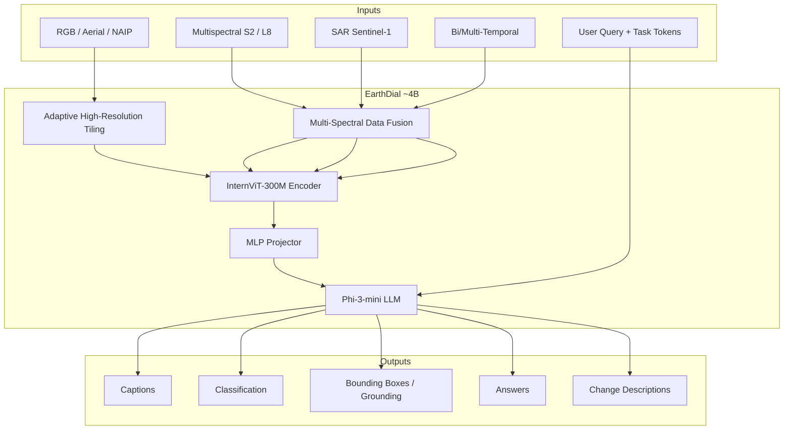
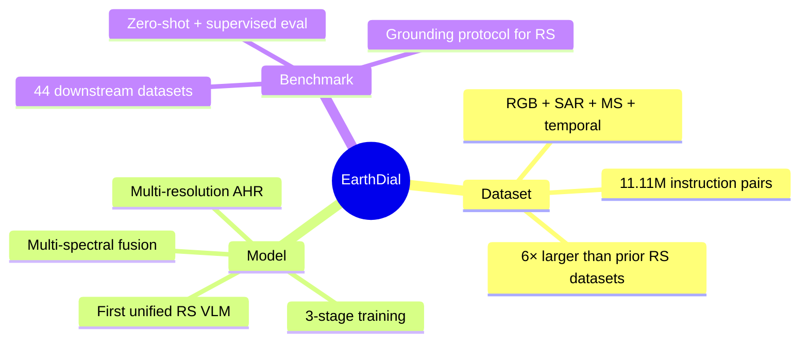
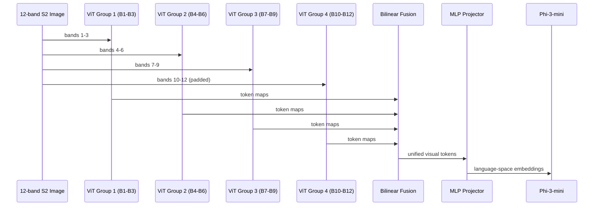
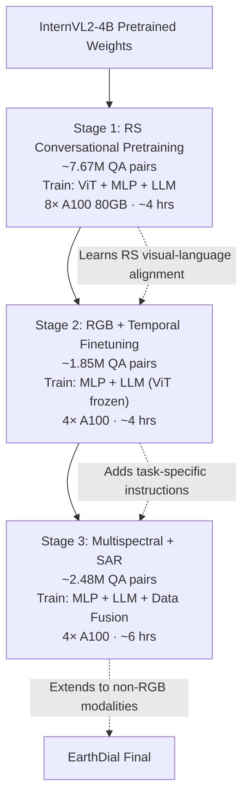
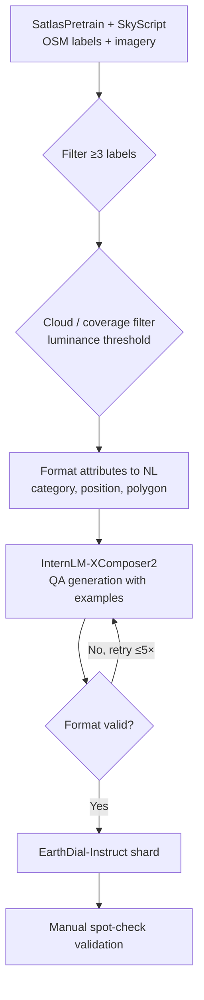
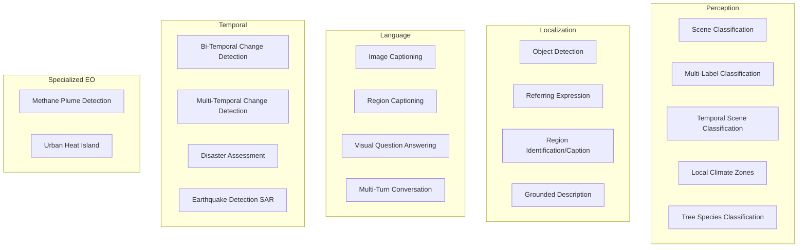
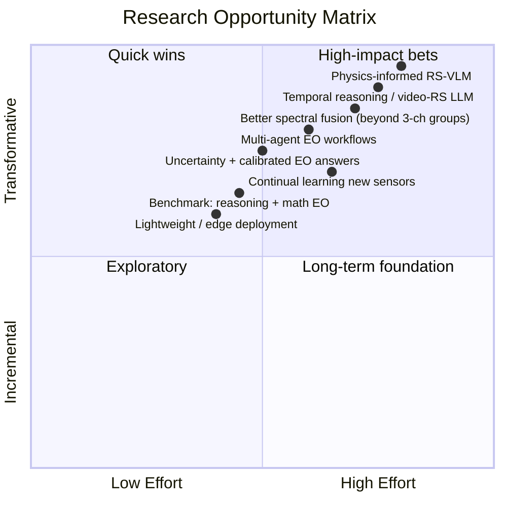

# EarthDial: Complete Research & Codebase Analysis

> **Paper:** *EarthDial: Turning Multi-sensory Earth Observations to Interactive Dialogues* (CVPR 2025)  
> **Authors:** Sagar Soni, Akshay Dudhane, Hiyam Debary, Mustansar Fiaz, et al. (IBM Research + MBZUAI)  
> **arXiv:** [2412.15190](https://arxiv.org/abs/2412.15190)  
> **Code:** `EarthDial-main/` in this workspace  
> **Models & Data:** [Hugging Face Models](https://huggingface.co/akshaydudhane/EarthDial_4B_RGB) · [Hugging Face Dataset](https://huggingface.co/datasets/akshaydudhane/EarthDial-Dataset)

---

## Table of Contents

1. [Executive Summary](#1-executive-summary)
2. [Research Gap & Contributions](#2-research-gap--contributions)
3. [System Architecture (Deep Dive)](#3-system-architecture-deep-dive)
4. [Models Used (Component-by-Component)](#4-models-used-component-by-component)
5. [Three-Stage Training Pipeline](#5-three-stage-training-pipeline)
6. [EarthDial-Instruct Dataset (11.11M QA Pairs)](#6-earthdial-instruct-dataset-1111m-qa-pairs)
7. [Downstream Tasks (All 10 Task Types)](#7-downstream-tasks-all-10-task-types)
8. [44 Evaluation Benchmarks](#8-44-evaluation-benchmarks)
9. [Repository Structure & Code Map](#9-repository-structure--code-map)
10. [Key Results from the Paper](#10-key-results-from-the-paper)
11. [How to Run (Train · Eval · Demo)](#11-how-to-run-train--eval--demo)
12. [Open Research Gaps & Novelty Directions for Your Work](#12-open-research-gaps--novelty-directions-for-your-work)
13. [Glossary](#13-glossary)

---

## 1. Executive Summary

**EarthDial** is the first unified **Vision-Language Model (VLM)** built specifically for **Earth Observation (EO) / Remote Sensing (RS)** that supports:

| Capability | Details |
|---|---|
| **Modalities** | RGB, SAR, Sentinel-2 multispectral, Landsat-8, NAIP high-res aerial, RGB+NIR, hyperspectral (methane) |
| **Temporal** | Bi-temporal & multi-temporal (up to 4 frames) |
| **Resolution** | Multi-resolution via adaptive tiling (0.5 m NAIP → 30 m Landsat) |
| **Tasks** | Classification, detection, grounding, captioning, VQA, change detection, disaster assessment, methane plume, UHI, LCZ, tree species |
| **Scale** | **11.11M** instruction pairs, **44** downstream benchmarks, **~4B** parameters |

At a high level, EarthDial = **InternVL2-4B backbone** (InternViT-300M + Phi-3-mini) + **RS-specific 3-stage fine-tuning** + **largest RS instruction dataset** + **adaptive high-resolution + multi-spectral fusion modules**.



---

## 2. Research Gap & Contributions

### 2.1 Problem Statement

Automating analysis of massive EO archives (Sentinel, Landsat, NAIP, SAR) requires models that understand **geospatial context**, **spectral bands**, **temporal change**, and **high-resolution detail** — while answering in **natural language**.

### 2.2 Existing Limitations (Before EarthDial)

| Approach | Limitation |
|---|---|
| **Generic VLMs** (GPT-4V, InternVL, LLaVA) | Poor RS accuracy; no spectral/temporal understanding |
| **RS-GPT, RemoteCLIP** | Small scale (~2.6K–180K samples); caption/VQA only |
| **GeoChat, SkyEyeGPT, LHRS-Bot** | RGB-only; fixed resolution; no SAR/multispectral |
| **EarthGPT + MMRS-1M** | Optical + SAR + IR but **no multi-temporal**, **no multi-resolution** |
| **RS instruction datasets** | Fragmented; single modality; missing grounding + change detection + specialized EO tasks |

### 2.3 EarthDial's Three Core Contributions



#### Contribution 1 — **EarthDial-Instruct (11.11M pairs)**
- Automated QA generation from SatlasPretrain + SkyScript using **InternLM-XComposer2**
- Covers **10 downstream task types** across **7 spectral modalities** and **2 temporal modalities**
- Quality filters: ≥3 OSM labels, cloud/coverage filtering, format validation (up to 5 retries)

#### Contribution 2 — **EarthDial Model**
- Built on **InternVL2-4B** with RS-specific modules
- **Adaptive High Resolution (AHR):** dynamic 448×448 tiles (1–6 train, up to 40 inference)
- **Data Fusion:** processes >3 or <3 channel inputs via sequential 3-channel ViT passes + bilinear fusion
- **Task/modality tokens:** e.g. `[grounding]`, `[changedet]`, `[s2_ms_10]`, `[s1_vh_10]`

#### Contribution 3 — **Evaluation Suite (44 benchmarks)**
- Standardized protocols for RS conversation grounding, zero-shot detection, temporal disaster assessment
- Outperforms GPT-4o, InternVL-8B, GeoChat on most tasks

### 2.4 Comparison vs Prior RS VLM Datasets

| Dataset | Samples | MS | MT | MR | Tasks Covered |
|---|---:|:-:|:-:|:-:|---|
| RSICap | 2.6K | ✗ | ✗ | ✗ | IC |
| VHM | 180K | ✗ | ✗ | ✗ | IC, RC, VQA, SC, OD, VG |
| GeoChat | 380K | ✗ | ✗ | ✗ | IC, RC, VQA, SC, OD, VG |
| MMRS / EarthGPT | 1.01M | ✓ | ✗ | ✗ | IC, RC, VQA, SC, OD, VG |
| SkyEye-968k | 970K | ✗ | ✗ | ✗ | IC, VQA, SC, OD, VG |
| FIT-RS | 1.8M | ✗ | ✗ | ✗ | IC, RC, VQA, SC, OD, VG |
| **EarthDial-Instruct** | **11.11M** | **✓** | **✓** | **✓** | **All 20 task flags** |

*IC=Image Captioning, RC=Region Captioning, VQA, SC=Scene Classification, OD=Object Detection, VG=Visual Grounding, MS=Multi-Spectral, MT=Multi-Temporal, MR=Multi-Resolution*

---

## 3. System Architecture (Deep Dive)

### 3.1 High-Level Architecture

EarthDial follows the standard **ViT → MLP → LLM** VLM design (InternVL lineage) with two RS-specific additions:

1. **Adaptive High Resolution (AHR)** — for varying spatial resolutions  
2. **Data Fusion Module** — for multi-spectral / multi-temporal / SAR inputs

```mermaid
flowchart LR
    subgraph Vision Path
        IMG[Input Image(s)]
        TILE[Dynamic Tiling<br/>448×448 patches + thumbnail]
        VIT[InternViT-300M<br/>48 layers, 300M params]
        FEAT[Visual Tokens<br/>1024 tokens/patch]
    end

    subgraph Fusion Path
        CH[Channel Groups<br/>3 bands at a time]
        VIT2[ViT per group]
        BILIN[Bilinear Interpolate<br/>& Concatenate]
    end

    subgraph Language Path
        MLP[2-layer MLP Projector<br/>ViT dim → LLM dim]
        TOK[Special Tokens<br/>modality + task]
        PHI[Phi-3-mini LLM<br/>3.8B params]
        OUT[Autoregressive Text<br/>+ bbox coordinates]
    end

    IMG --> TILE --> VIT --> FEAT
    IMG --> CH --> VIT2 --> BILIN --> FEAT
    FEAT --> MLP
    TOK --> PHI
    MLP --> PHI --> OUT
```

### 3.2 Adaptive High Resolution (AHR)

Inspired by **InternVL 1.5**:

| Parameter | Training | Inference |
|---|---|---|
| Base tile size | 448 × 448 px | 448 × 448 px |
| Dynamic patches | 1 – 6 | up to **40** |
| Thumbnail | Yes (global context) | Yes |
| Positional encoding | **Bicubic interpolation** of ViT pos-embed | Same |
| Downsample ratio | 0.5 (token compression) | 0.5 |

**Why it matters:** NAIP imagery is 0.5 m/px; Landsat is 30 m/px. Fixed resize destroys small objects (vehicles, ships, damage). AHR preserves aspect ratio and local detail.

### 3.3 Multi-Spectral / Multi-Temporal Data Fusion

**Paper design:** Process channels in groups of 3 through ViT → aggregate via bilinear interpolation (AnyRes-style).

**Code implementation** (`modeling_internvl_chat.py` → `sequential_vit_features`):

```
For each batch item:
  For channels in steps of 3:
    Pad to 3 channels if needed (duplicate last channel)
    Pass through InternViT → get patch tokens [1, 1024, hidden]
  Fuse all group outputs via bilinear_interpolate_and_concat (default)
Return fused visual embeddings → MLP → LLM
```

Also present but partially used: `datafusion.py` (`DataFusion` class with per-channel PatchEmbed + cross-attention aggregation) — appears experimental; production path uses `sequential_vit_features`.



### 3.4 Special Tokens System

Defined in `src/earthdial/train/constants.py`:

**Modality tokens:**
| Token | Meaning |
|---|---|
| `[s2_rgb_10]` | Sentinel-2 RGB, 10 m |
| `[l8_rgb_30]` | Landsat-8 RGB, 30 m |
| `[hr_rgb_0.5]` | High-res RGB (NAIP), 0.5 m |
| `[hr_rgb_temp_0.5]` | High-res temporal RGB |
| `[s2_ms_10]` | Sentinel-2 multispectral |
| `[s1_vh_10]` / `[s1_vh_1]` | SAR VH polarization |
| `[hr_rgbi_0.5]` | RGB + NIR |
| `[l8_ms_30]` | Landsat-8 multispectral (UHI) |
| `[hyper_rgb_3]` | Hyperspectral methane (RGB + mag1c) |

**Task tokens:**
| Token | Task |
|---|---|
| `[grounding]` | Grounded description with bboxes |
| `[refer]` | Referring expression → bbox |
| `[identify]` | Region captioning (bbox → text) |
| `[classify]` | Scene classification |
| `[caption]` | Image captioning |
| `[changedet]` | Change detection |
| `[treeclassify]` | Tree species ID |
| `[uhi]` | Urban heat island analysis |

**Bounding box format:** `[xmin, ymin, xmax, ymax, θ]` — supports **rotated boxes** (critical for aerial/SAR).

### 3.5 MLP Projector

From `InternVLChatModel.__init__`:

```
LayerNorm(vit_hidden × (1/downsample_ratio)²)
→ Linear → GELU → Linear
```

Maps ViT hidden size → Phi-3 hidden size. Trained in all 3 stages (frozen only partially in Stage 2/3).

---

## 4. Models Used (Component-by-Component)

### 4.1 Base Model: InternVL2-4B

| Component | Model | Params | Role |
|---|---|---:|---|
| **Vision Encoder** | InternViT-300M | ~300M | Patch embedding, 48 transformer layers, QK normalization, Flash Attention |
| **Language Model** | Phi-3-mini-4k-instruct | ~3.8B | Causal decoder; instruction following |
| **Connector** | MLP (2-layer) | ~few M | Vision-language alignment |
| **Total** | EarthDial-4B | **~4B** | End-to-end VLM |

**Initialization checkpoint:** `InternVL2-4B` (from OpenGVLab / Hugging Face)

### 4.2 InternViT-300M Details

| Spec | Value |
|---|---|
| Layers | 48 |
| Hidden size | 3200 |
| Attention heads | 25 |
| Patch size | 14 |
| Default image size | 224 (dynamic up to 448 in EarthDial) |
| Positional encoding | Interpolated bicubic for arbitrary H×W |
| Normalization | RMSNorm (fused via Apex when available) |
| Attention | Flash Attention 2 (optional) |

Distilled from larger InternViT-6B; strong visual encoding at lower compute.

### 4.3 Phi-3-mini LLM Details

| Spec | Value |
|---|---|
| Architecture | Decoder-only transformer |
| Context length | 4096 tokens (EarthDial max_seq_length) |
| Chat template | `phi3-chat` |
| Training | Full fine-tune (LoRA ablation showed ~50% worse detection) |

Supports: multi-turn dialogue, structured output (bbox coordinates), task-conditioned generation via special tokens.

### 4.4 Instruction Generator (Dataset Creation Only)

| Model | Role |
|---|---|
| **InternLM-XComposer2** | Generates QA pairs from OSM labels + satellite metadata |
| Not used at inference | Only in data pipeline |

### 4.5 Published Model Checkpoints

| Checkpoint | HuggingFace ID | Best For |
|---|---|---|
| EarthDial_4B_RGB | `akshaydudhane/EarthDial_4B_RGB` | RGB tasks, temporal, change detection |
| EarthDial_4B_MS | `akshaydudhane/EarthDial_4B_MS` | Multispectral, SAR, LCZ, TreeSatAI |
| EarthDial_4B_Methane_UHI | `akshaydudhane/EarthDial_4B_Methane_UHI` | STARCOP methane + UHI Landsat |

---

## 5. Three-Stage Training Pipeline



### 5.1 Hyperparameters (All Stages)

| Hyperparameter | Value |
|---|---|
| Global batch size | **128** (2 × 64 grad_accum × 8 GPUs) |
| Learning rate | **4e-5** (cosine schedule) |
| Epochs | **1** per stage |
| Max sequence length | **4096** |
| Weight decay | 0.05–0.1 |
| Precision | bf16 |
| Optimizer | AdamW (DeepSpeed ZeRO Stage 1) |
| Warmup ratio | 0.03 |
| Dynamic patches | 1–6 |
| Force image size | 224 (with dynamic tiling to 448) |
| Downsample ratio | 0.5 |

**Config files:**
- Stage 1: `src/shell/data/Stage1_Pretraining.json`
- Stage 2: `src/shell/data/Stage2_RGB_Temporal_Finetunning.json`
- Stage 3: `src/shell/data/Stage3_MS_SAR_finetunning.json`
- Launch script: `src/EarthDial.sh`

### 5.2 What Gets Trained When

| Stage | ViT | MLP | LLM | Data Fusion |
|---|:---:|:---:|:---:|:---:|
| 1 — Pretrain | ✅ Train | ✅ Train | ✅ Train | ✗ Not used |
| 2 — RGB/Temporal | ❄️ Frozen | ✅ Train | ✅ Train | ✅ (temporal only) |
| 3 — MS/SAR | ❄️ Frozen | ✅ Train | ✅ Train | ✅ Full |

---

## 6. EarthDial-Instruct Dataset (11.11M QA Pairs)

### 6.1 Stage-wise Breakdown (from Paper Table 2)

| Stage | Source / Task | QA Pairs | Token Format |
|---:|---|---:|---|
| **1** | NAIP (aerial) | 3,000,113 | `[hr_rgb_0.5]` |
| **1** | Sentinel-2 | 2,749,511 | `[s2_rgb_10]` |
| **1** | Landsat-8 | 1,671,437 | `[l8_rgb_30]` |
| **1** | SkyScript | 249,855 | `[s2_rgb_10]` |
| | **Stage 1 Subtotal** | **~7,670,916** | |
| **2** | Classification | 565,853 | `[hr_rgb_0.5]` |
| **2** | Detection | 22,624 | `[hr_rgb_0.5]` |
| **2** | Visual Grounding | 17,845 | `[hr_rgb_0.5]` |
| **2** | Caption | 202,530 | `[caption][hr_rgb_0.5]` |
| **2** | VQA | 630,768 | `[hr_rgb_0.5]` |
| **2** | Change Detection | 64,631 | `[changedet][hr_rgb_temp_0.5]` |
| **2** | Disaster Assessment | 37,563 | `[hr_rgb_temp_0.5]` |
| **2** | GeoChat | 308,861 | `[hr_rgb_0.5]` |
| | **Stage 2 Subtotal** | **~1,850,675** | |
| **3** | Sentinel-1 (SAR) | 1,668,043 | `[s1_vh_10]` |
| **3** | Local Climate Zones | 765,591 | `[s2_ms_30]` |
| **3** | Tree Species | 38,527 | `[treeclassify][hr_rgbi_0.5]` |
| **3** | Methane Plume | 6,849 | `[hyper_rgb_3]` |
| **3** | Urban Heat Island | 1,296 | `[uhi][l8_ms_30]` |
| | **Stage 3 Subtotal** | **~2,480,306** | |
| | **GRAND TOTAL** | **~11,001,897 ≈ 11.11M** | |

### 6.2 Training Data Sources (from Repo JSON Configs)

#### Stage 1 Datasets
| Key | Source | Listed Length | Bands |
|---|---|---:|---|
| Satlas_S2 | Sentinel-2 (SatlasPretrain) | 539,753 | 3 |
| Satlas_L8 | Landsat (SatlasPretrain) | 380,665 | 3 |
| Naip_Set0–5 | NAIP aerial (6 shards) | — | 3 |
| Skyscript | SkyScript captions | — | 3 |

#### Stage 2 Datasets (Task-Organized)
| Category | Datasets in Config |
|---|---|
| **GeoChat** | GeoChat_Set1–4 |
| **Classification** | BigEarthNet_RGB, PatternNet, RSI-CB256, NWPU-RESISC45, FGSCR |
| **VQA** | MQVQA, Sydney_VQA, UCM_VQA |
| **Grounding** | DIOR-RSVG, RSVG |
| **Captioning** | NWPU, RSICD, Sydney, UCM Captions |
| **Change Detection** | DUBAI-CC, LEVIR-CC, MUDS (4 frames), FMoW (7 parts) |
| **Disaster (xBD)** | detail, localization, refer, region, change (5 shards) |

#### Stage 3 Datasets
| Key | Modality | Bands | Normalization |
|---|---|---:|---|
| BigEarthNet_MS | S2 multispectral | 12 | s2_l2a |
| LCZs_S2 | S2 LCZ | 10 | s2_norm |
| TreeSatAI | RGB+NIR | 4 | tree_norm |
| ship_dataset_v0 / SRSDD | SAR | 1 | s1 |
| Satlas_S1 | Sentinel-1 | 1 | s1 (436,114 listed) |
| STARCOP | RGB + mag1c | 4 | rgbm_norm |
| UHI | Landsat-8 MS | 8 | l8_norm |
| Quakeset | SAR bi-temporal | 1 | s1 |

### 6.3 Data Generation Pipeline



### 6.4 Train / Val / Test Splits

- **Training:** All 11.11M pairs used for instruction tuning (1 epoch each stage)
- **Evaluation benchmarks:** Separate `.arrow` files on HuggingFace — **eval-only, no predefined splits in the released eval pack**
- **Original dataset splits preserved** where they exist (e.g., BigEarthNet train/val/test, FMoW train/val, xBD train/test)
- **Zero-shot eval:** AID, UCM, WHU-19, NWPU-VHR-10, RSVQA-HR, etc. — model never fine-tuned on these specific test sets during EarthDial training (though related train shards may exist in instruction data)

---

## 7. Downstream Tasks (All 10 Task Types)

### 7.1 Task Overview Diagram



### 7.2 Detailed Task Descriptions

| # | Task | Input | Output | Example Prompt |
|---:|---|---|---|---|
| 1 | **Scene Classification** | Single RS image | Class label | "Classify the image. Options: harbor, bridge, …" |
| 2 | **Multi-Label SC** | RS image | Multiple labels | BigEarthNet land-cover tags |
| 3 | **Temporal SC** | 2–4 time steps | Class per sequence | FMoW functional map |
| 4 | **Object Detection** | RS image | Bboxes + labels | "Locate all large buildings" |
| 5 | **Referring Expression** | Image + text ref | Rotated bbox | "Give me location of tennis courts at center" |
| 6 | **Region Captioning** | Image + bbox | Text description | "Describe object at [13,77,15,81,88]" |
| 7 | **Grounded Description** | Image | Text + inline bboxes | "[grounding] Describe the image in detail" |
| 8 | **Image Captioning** | RS image | Free-form caption | "Provide caption for input image" |
| 9 | **VQA** | Image + question | Short answer | "Are there vehicles present?" |
| 10 | **Change Detection** | 2+ temporal images | Change description | "[changedet] Any semantic changes?" |
| 11 | **Disaster Assessment** | Pre/post disaster pair | Damage level, type, bboxes | xBD 8 sub-tasks |
| 12 | **Methane Plume** | RGB+mag1c | Yes/No + location + emission rate | STARCOP conversational QA |
| 13 | **UHI** | Landsat MS bands | Temperature trend + causes | "What is temperature trend?" |
| 14 | **LCZ** | S2 multispectral | LCZ class | "Local climate zones for region" |
| 15 | **Tree Species** | RGB+NIR | Botanical name | "[treeclassify] Species name?" |
| 16 | **SAR Ship Detection** | SAR image | Bboxes for ships | Ship dataset grounding/refer |
| 17 | **Earthquake (SAR)** | Bi-temporal SAR | Yes/No + magnitude | QuakeSet |

---

## 8. 44 Evaluation Benchmarks

The paper evaluates on **44 downstream configurations** across 7 eval pipelines in the repo:

### 8.1 By Eval Module

| Module | # Benchmarks | Datasets |
|---|---:|---|
| `rs_classification` | 9 | AID, UCM, WHU_19, BigEarthNet_RGB, BigEarthNet_S2, LCZs_S2, TreeSatAI, STARCOP_test, UHI_test |
| `rs_detection` | 5 | GeoChat, NWPU_VHR_10, Swimming_pool, urban_tree_crown, ship_dataset_v0 |
| `rs_region_captioning` | 8 | GeoChat, HIT_UAV, NWPU_VHR_10, ship_v0, SRSDD, Swimming_pool, UCAS_AOD, urban_tree |
| `rs_image_caption` | 5 | NWPU_RESISC45, RSICD, RSITMD, Sydney, UCM Captions |
| `rs_grounding_description` | 4 | HIT_UAV, NWPU_VHR_10, Swimming_pool, UCAS_AOD |
| `rs_vqa` | 2 | RSVQA-LR, RSVQA-HR |
| `rs_change_detection` | 4+8 | Dubai_CC, LEVIR_MCI, MUDS, SYSU + 8 xBD sub-tasks |
| **Total** | **~45 configs** | (paper reports 44; some xBD sub-tasks grouped) |

### 8.2 xBD Disaster Sub-Tasks (8 benchmarks)

| Sub-task | Metric |
|---|---|
| Image Captioning (damage description) | ROUGE-1/L, METEOR |
| Region Classification Set-1 (damage level) | Recall |
| Region Classification Set-2 (binary damage) | Recall |
| Image Classification Set-1 (disaster type) | Recall |
| Image Classification Set-2 (binary damage) | Recall |
| Image Classification Set-3 (building count) | Recall |
| Object Detection (large buildings) | mAP@0.5/0.25 |
| Referred Object Detection | mAP@0.5/0.25 |

### 8.3 Evaluation Protocol

- **Decoding:** Greedy (no beam search) — matches interactive demo
- **Zero-shot (ZS):** Model not fine-tuned on that specific benchmark's test split
- **Supervised comparison:** BigEarthNet, xBD Set-1, FMoW — trained on related instruction data
- **Metrics:** Accuracy (classification), mAP@0.5 (detection), ROUGE/METEOR/CIDEr (captioning), answer accuracy (VQA)

---

## 9. Repository Structure & Code Map

```
EarthDial-main/
├── README.md                          # Paper summary, install, train, eval
├── pyproject.toml                     # Dependencies (torch, transformers 4.37.2, deepspeed)
├── demo/                              # Streamlit interactive demo
│   ├── app.py                         # Web UI
│   ├── model_worker.py                # GPU inference worker
│   └── controller.py                  # Multi-worker orchestration
├── images/                            # Architecture diagrams
└── src/
    ├── EarthDial.sh                   # Training launch script (Stage 2 example)
    ├── shell/data/                    # Stage 1/2/3 dataset registry JSON
    ├── earthdial/
    │   ├── model/
    │   │   ├── internvl_chat/         # InternVLChatModel, InternViT, configs
    │   │   ├── phi3/                  # Phi-3 LLM implementation
    │   │   └── internlm2/             # Alternative LLM (not default)
    │   ├── train/
    │   │   ├── pretrain.py            # Stage 1 training
    │   │   ├── finetune.py            # Stage 2/3 training
    │   │   ├── dataloader.py          # ShardDataLoader (multi-modal)
    │   │   ├── datafusion.py          # DataFusion module (experimental)
    │   │   ├── dataset.py             # Preprocessing, dynamic_preprocess
    │   │   └── constants.py           # Special tokens, normalization stats
    │   ├── eval/                      # 7 task-specific eval pipelines
    │   │   ├── eval.sh                # Master eval launcher
    │   │   ├── rs_classification/
    │   │   ├── rs_detection/
    │   │   ├── rs_region_captioning/
    │   │   ├── rs_image_caption/
    │   │   ├── rs_grounding_description/
    │   │   ├── rs_vqa/
    │   │   └── rs_change_detection/
    │   ├── patch/                     # Flash attn, RMSNorm, sampler patches
    │   └── tools/                     # LoRA merge, ViT extract, int8 convert
    └── vela_setup/                    # IBM cluster job templates (optional)
```

### 9.1 Critical Code Paths

| Function | File | Purpose |
|---|---|---|
| `InternVLChatModel.forward` | `modeling_internvl_chat.py` | Main forward pass |
| `sequential_vit_features` | `modeling_internvl_chat.py` | Multi-spectral fusion |
| `ShardDataLoader.multi_modal_get_item` | `dataloader.py` | Single-image loading |
| `ShardDataLoader.multi_modal_multi_image_get_item` | `dataloader.py` | Temporal multi-image |
| `dynamic_preprocess` | `dataset.py` | AHR tile generation |
| `build_datasets` | `finetune.py` / `pretrain.py` | Multi-dataset concat |

---

## 10. Key Results from the Paper

### 10.1 Classification (Table 4)

| Model | AID | UCM | WHU-19 | BigEarthNet | xBD Set-1 | FMoW |
|---|---:|---:|---:|---:|---:|---:|
| GPT-4o | 74.73 | 88.76 | 91.14 | 49.0 | 67.95 | 21.43 |
| InternVL-8B | 60.40 | 58.23 | 79.30 | 19.73 | 51.44 | 21.04 |
| GeoChat | 72.03 | 84.43 | 80.09 | 20.35 | 53.32 | 59.20 |
| **EarthDial** | **88.76** | **92.42** | **96.21** | **68.82** | **96.37** | **70.03** |

### 10.2 Multi-Modal Tasks (Table 5)

| Task | GPT-4o | EarthDial | Δ |
|---|---:|---:|---|
| BigEarthNet (MS) cls | 49.0 | 69.94 | +20.94 |
| LCZ42 cls | 15.53 | 60.72 | +45.19 |
| TreeSatAI (RGBI) | 16.73 | 56.61 | +39.88 |
| SAR ship mAP (multi) | 1.20 | 26.03 | +24.83 |

### 10.3 Captioning (Table 9 — ROUGE-1)

| Dataset | GPT-4o | GeoChat | EarthDial |
|---|---:|---:|---:|
| NWPU Captions | 19.43 | 14.86 | **45.84** |
| RSICD | 20.53 | 13.48 | **33.77** |
| Sydney | 14.52 | 12.00 | **49.39** |

### 10.4 VQA (Table 10 — Average Accuracy)

| Model | RSVQA-LR | RSVQA-HR |
|---|---:|---:|
| GeoChat | 90.70 | 72.30 |
| EarthGPT | 72.06 | — |
| **EarthDial** | **92.70** | **72.45** |

### 10.5 Change Detection (Table 11 — ROUGE-1)

| Dataset | GPT-4o | GeoChat | EarthDial |
|---|---:|---:|---:|
| Dubai CC | 8.81 | 14.21 | **31.94** |
| LEVIR MCI | 10.33 | 17.15 | **33.78** |
| MUDS | 14.18 | 12.35 | **28.16** |

### 10.6 Specialized EO

| Task | GPT-4o | EarthDial |
|---|---:|---:|
| Methane plume detection | 40.93% | **77.09%** |
| UHI temperature trend | 22.68% | **56.77%** |
| QuakeSet earthquake | 55.86% | **57.53%** |

### 10.7 Ablation Highlights (Table 13)

- Multi-stage pretraining → **+5% mAP@0.5** on referred object detection
- Bilinear fusion vs average pooling → **+13.5%** avg classification accuracy
- Full fine-tune vs LoRA (128 rank) → LoRA **significantly worse** on zero-shot detection

---

## 11. How to Run (Train · Eval · Demo)

### 11.1 Installation

```bash
conda create -n earthdial python=3.9 -y
conda activate earthdial
cd EarthDial-main
pip install -e .
pip install flash-attn==2.3.6 --no-build-isolation
```

### 11.2 Download Model

```python
from huggingface_hub import snapshot_download
snapshot_download(repo_id="akshaydudhane/EarthDial_4B_RGB", local_dir="checkpoints/EarthDial_4B_RGB")
```

### 11.3 Training (8× A100 80GB)

```bash
# Edit src/EarthDial.sh for stage & meta_path
bash src/EarthDial.sh
```

### 11.4 Evaluation

```bash
# Classification (RGB)
GPUS=8 ./src/earthdial/eval/eval.sh ./checkpoints/EarthDial_4B_RGB rs_classification --dynamic

# Change detection
GPUS=8 ./src/earthdial/eval/eval.sh rs_change_detection --dynamic
```

### 11.5 Demo (Streamlit)

```bash
cd demo
export CONTROLLER_PORT=40000 WEB_SERVER_PORT=10003
python controller.py --host 0.0.0.0 --port $CONTROLLER_PORT &
CUDA_VISIBLE_DEVICES=0 python model_worker.py --model-path /path/to/checkpoint &
streamlit run app.py --server.port $WEB_SERVER_PORT
```

---

## 12. Open Research Gaps & Novelty Directions for Your Work

EarthDial is strong but leaves **significant room for novel research**. Below are prioritized gaps with concrete project ideas.

### 12.1 Gap Map



### 12.2 Technical Gaps (Model & Architecture)

| Gap | Why It Matters | Novel Direction |
|---|---|---|
| **Naive 3-channel grouping for MS** | Loses cross-band correlations; pads incomplete groups | Learned **spectral token mixer** (hypernetwork, 1×1 conv on band tokens, or SSM over bands) |
| **Frozen ViT after Stage 1** | ViT never sees SAR/MS natively | **Progressive unfreezing** or **spectral adapter layers** in ViT |
| **No true geospatial grounding** | Bboxes are image-normalized, no lat/lon | Bind outputs to **GeoJSON / WGS84** coordinates + map tile indices |
| **4B param limit** | Struggles on complex multi-object crowded scenes (failure cases in supp.) | **Mixture-of-experts** for modality (RGB expert, SAR expert) |
| **Greedy decoding only** | Suboptimal for structured bbox output | **Constrained decoding** / JSON schema for bboxes |
| **DataFusion module unused** | `datafusion.py` has cross-attn aggregation but is bypassed | Complete & ablate proper **channel-attention fusion** |
| **No elevation / InSAR** | 2D-only understanding | Extend to **InSAR, DEM, LiDAR** as additional modalities |
| **LoRA insufficient** | Paper shows 201M LoRA params << full FT | Design **RS-specific adapters** (spectral LoRA, temporal LoRA) |

### 12.3 Data & Benchmark Gaps

| Gap | Novel Direction |
|---|---|
| **Synthetic-heavy instruction data** | Human-verified **RS reasoning benchmark** (counting, comparison, spatial relations) |
| **No pixel-level segmentation** | Extend to **referring segmentation** / mask output for change regions |
| **Limited geographic diversity analysis** | **Geo-fairness** audit — performance by continent, climate, income |
| **11M pairs but quality unknown at scale** | **Data-centric RS-VLM** — filter/noise-robust training, influence functions |
| **Eval lacks IoU for change detection** | Pixel-aligned **RS change segmentation + dialogue** benchmark |
| **No multi-image >4 frames** | Long-sequence temporal (seasonal stacks, full disaster timelines) |
| **Methane/UHI tiny (6K/1.3K samples)** | Expand **climate/emissions VLM** datasets |

### 12.4 Application & System Gaps

| Gap | Novel Direction |
|---|---|
| **No real-time streaming satellite** | **Online VLM** for satellite downlink / edge on UAV |
| **No tool use** | **Agentic EarthDial** — call GIS APIs, run indices (NDVI, NBR), retrieve STAC catalogs |
| **No uncertainty quantification** | Calibrated confidence + **"I don't know"** for cloudy/occluded pixels |
| **Demo is single-GPU batch** | **Multi-user EO copilot** with RAG over metadata |
| **No federated / privacy** | **Federated RS-VLM** for national agencies unwilling to share raw imagery |
| **Carbon / sustainability** | Benchmark **compute vs accuracy** for green EO AI |

### 12.5 Recommended High-Novelty Project Ideas (Ranked)

#### 🥇 Tier 1 — Strong CVPR/ICLR potential

1. **GeoEarth-VLM: Geospatially-Grounded Dialogue**
   - Output lat/lon polygons; integrate OSM + Sentinel catalog retrieval
   - Novelty: first RS-VLM with **map-aligned** grounding, not just pixel bboxes

2. **Spectral-Former Fusion for RS-VLM**
   - Replace 3-channel ViT hack with **learned spectral encoder** (1D conv → band tokens → fusion transformer)
   - Show gains on BigEarthNet MS, LCZ, TreeSatAI beyond EarthDial

3. **TempEarth: Long-Horizon Temporal RS Reasoning**
   - Extend beyond 4 frames; use **temporal position encoding** + memory bank
   - Tasks: crop phenology, deforestation trajectories, urban sprawl forecasting via dialogue

4. **RS-Think: Chain-of-Thought for Remote Sensing**
   - "First identify land cover → then compare bands → then conclude change"
   - Benchmark on complex VQA (VHM-style deceptive questions)

#### 🥈 Tier 2 — Solid contributions

5. **EfficientEarth: Distill EarthDial to 1B for onboard satellite compute**
6. **Uncertainty-Aware EO Assistant** — reject ambiguous queries, quantify spectral confusion
7. **Referring Change Segmentation** — pixel masks + natural language change explanation
8. **Cross-Sensor Transfer** — train on S2, zero-shot on PlanetScope / Maxar without retraining

#### 🥉 Tier 3 — Good for thesis / workshop

9. **InSAR + Optical Multi-modal VLM** (deformation + visual change)
10. **Bare-soil / agriculture extension** (note: `papers/EarthDial-main/baresoil/` exists in related fork — agricultural niche)
11. **RS-VLM Red-teaming** — hallucinated objects, geographic bias analysis
12. **Automatic instruction data quality scorer** — improve beyond InternLM-XComposer2 pipeline

### 12.6 What EarthDial Does NOT Do (Explicit Boundaries)

- ❌ Pixel-level segmentation masks
- ❌ Lat/lon / CRS-aware outputs
- ❌ Hyperspectral beyond STARCOP's 4 channels (no full HSI cube reasoning)
- ❌ Video / streaming time series (>4 frames)
- ❌ 3D point clouds / LiDAR
- ❌ Active learning / human-in-the-loop
- ❌ Theoretical guarantees or uncertainty
- ❌ Multi-language (English only)

---

## 13. Glossary

| Term | Definition |
|---|---|
| **EO** | Earth Observation |
| **RS** | Remote Sensing |
| **VLM** | Vision-Language Model |
| **SAR** | Synthetic Aperture Radar |
| **S2** | Sentinel-2 satellite |
| **NAIP** | National Agriculture Imagery Program (US 0.5–1m aerial) |
| **LCZ** | Local Climate Zones |
| **UHI** | Urban Heat Island |
| **AHR** | Adaptive High Resolution (dynamic tiling) |
| **OSM** | OpenStreetMap (label source for pretraining data) |
| **xBD** | xView2 Building Damage dataset |
| **FMoW** | Functional Map of the World (temporal classification) |
| **STARCOP** | Methane plume hyperspectral dataset |
| **ZS** | Zero-shot evaluation |
| **mAP** | mean Average Precision (detection metric) |
| **mag1c** | Methane spectral band product in STARCOP |

---

## References

```bibtex
@article{soni2024earthdial,
  title={EarthDial: Turning Multi-sensory Earth Observations to Interactive Dialogues},
  author={Soni, Sagar and Dudhane, Akshay and Debary, Hiyam and others},
  journal={CVPR},
  year={2025},
  url={https://arxiv.org/abs/2412.15190}
}
```

**Key Prior Work:** GeoChat (CVPR'24), InternVL (CVPR'24), SkyEyeGPT, EarthGPT, LHRS-Bot, RemoteCLIP, RS-GPT

---

*Report generated from: `EarthDial-main/` codebase scan + arXiv:2412.15190 + CVPR 2025 supplemental material. PDFs referenced in query were synthesized via arXiv content where local copies were not found on disk.*
