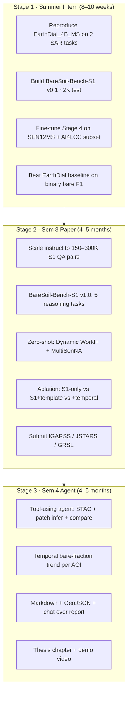
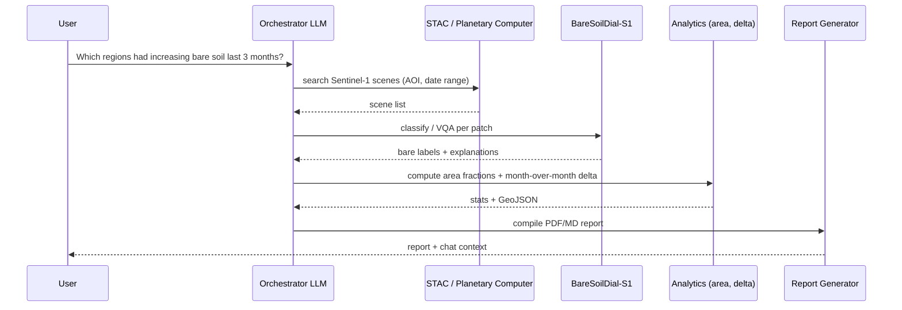

# Senior RE Assessment: Your 3-Stage MTech Plan

The attached plan is **directionally strong** — one thread (EarthDial → bare soil → agent) beats three disconnected projects. As written, it mixes sensors, underestimates dataset work, and leaves Stage 1 too vague. Below is an honest review and a tighter roadmap aligned with EarthDial, your S1 requirement, and what is actually publishable.

---

## Verdict on the Attached Plan

| Aspect | Rating | Comment |
|---|---|---|
| **Single-thread narrative** | ✅ Excellent | Intern → paper → agent is the right MTech structure |
| **“Improve EarthDial, don’t invent a transformer”** | ✅ Correct | Dataset + task + benchmark + eval = real contributions |
| **Option 1 theme (SAR bare soil VLM)** | ✅ Best choice | Clear gap vs EarthDial (ships/quakes, not LULC bare soil) |
| **Stage 3 agentic vision** | ✅ Strong differentiator | Monitoring + explanation + report >> plain classifier |
| **OpenEarthMap-SAR for summer** | ⚠️ Risky | **Umbra SAR, not Sentinel-1** — fine for a quick demo, wrong foundation if thesis is S1-specific |
| **“Nobody evaluates bare-soil reasoning”** | ✅ Mostly true | No standard **S1 bare-soil VLM benchmark** exists — that can be your paper |
| **Stage 1 scope** | ❌ Too vague | “Better encoder / better tuning” without a metric will not satisfy an intern eval |
| **Multi-agent count (4 agents)** | ⚠️ Over-scoped | One orchestrator + tools is enough for Sem 4; don’t over-engineer agents |

**Bottom line:** Keep Option 1 and the 3-stage arc. Replace OpenEarthMap-SAR as the **primary** summer path with **Sentinel-1**. Make Stage 1 a **closed benchmark + baseline**, not open-ended “improvement.”

---

## What I Would Change vs the LLM Plan

### 1. Sensor consistency (critical)

Your thesis thread should be:

**Sentinel-1 GRD → Bare-soil LULC dialogue → Agentic monitoring**

| Dataset | Role |
|---|---|
| **SEN12MS, AI4LCC, Dynamic World+, BigEarthNet-S1** | Train + eval (S1) |
| **OpenEarthMap-SAR** | Optional **cross-sensor** ablation only (Sem 3 appendix) |

Using OpenEarthMap-SAR in summer then pivoting to S1 in Sem 3 = **rework**. Intern on S1 from day one.

### 2. Name the product once

Pick one name and use it everywhere:

**BareSoilDial-S1** (or BareSoilDial)

- Stage 1: baseline + first fine-tune
- Stage 2: **BareSoil-Bench-S1** + reasoning paper
- Stage 3: **BareSoil-Agent** (STAC + VLM + report)

You already have a draft in `papers/EarthDial-main/baresoil/` — extend it for **S1**, not duplicate RGB work.

### 3. Paper novelty (precise wording)

Do **not** claim “first SAR VLM.” Claim:

> **First Sentinel-1 instruction-tuning benchmark and evaluation protocol for interactive bare-soil / barren-land understanding**, built on EarthDial, with a multi-task reasoning suite and an agentic monitoring extension.

That is defensible. “Better reasoning” alone is weak unless you define tasks and metrics.

---

## Revised Roadmap (Better Than the Attached Plan)

Each stage **extends** the previous one; nothing is thrown away.

---

## Stage 1 — Summer Intern (Now)

**Goal (one sentence):**  
*Demonstrate measurable improvement over EarthDial on Sentinel-1 bare-soil classification and binary presence QA.*

### Scope (strict — fits 8–10 weeks)

| Week | Deliverable |
|---|---|
| 1–2 | Environment + run EarthDial_4B_MS inference on ship/SAR sample; document S1 path in codebase |
| 2–3 | **BareSoil-Bench-S1 v0.1**: 500–2K test items from SEN12MS (Barren) + AI4LCC (Arable/fallow) |
| 3–5 | **BareSoil-Instruct-S1 v0.1**: ~30–50K QA (classification + binary VQA) |
| 5–7 | Stage 4 fine-tune from `EarthDial_4B_MS`, freeze ViT |
| 7–8 | Eval: **+5% absolute** on bare binary F1 vs EarthDial (minimum bar) |
| 8–10 | Intern report + demo notebook + checkpoint on HF |

### One improvement only (pick this, not three)

**Recommended:** Instruction tuning + **BareSoil-Bench-S1** (dataset + eval protocol).

Avoid a new SAR encoder in summer — high risk, low intern time.

### Intern success metrics

| Metric | Target |
|---|---|
| Bare vs non-bare **binary F1** | EarthDial + **≥5 pts** |
| 7-class unified **macro-F1** (bare classes) | Beat EarthDial |
| Qualitative | 10 SAR patches with sensible dialogue |

### Intern report title (example)

*“BareSoilDial-S1: Adapting EarthDial for Sentinel-1 Bare Land Classification and Dialogue”*

---

## Stage 2 — Sem 3 + Paper

**Goal:** Novelty + publication — **benchmark + reasoning tasks**, not a new backbone.

### Paper title (working)

**“BareSoil-Bench: Reasoning-Centric Evaluation of Vision-Language Models for Sentinel-1 Bare Land Understanding”**

or

**“Improving Bare Soil Reasoning in SAR Vision-Language Models via Instruction Tuning and Multi-Task Evaluation”**

### Five reasoning tasks (your “nobody evaluates this” — make it concrete)

| Task | Example question | Metric |
|---|---|---|
| **T1 Presence** | Is bare soil present? | Binary F1 |
| **T2 Dominance** | How much bare soil? (none/low/med/high) | Ordinal accuracy |
| **T3 Fine class** | Agricultural fallow vs desert sand vs bare rock? | 7-class macro-F1 |
| **T4 Context** | What land covers surround bare patches? | Set F1 / ROUGE |
| **T5 Temporal** | Did bare area increase since last acquisition? | Binary + caption ROUGE |

Tasks T1–T3 in Sem 3 core; T4–T5 if time (or Sem 4 agent preview).

### Data scale (Sem 3)

| Component | Size |
|---|---|
| BareSoil-Instruct-S1 train | **150–300K** QA |
| BareSoil-Bench-S1 test | **~5–15K** (held-out) |
| Zero-shot eval | **Dynamic World+ (299)** + **AI4LCC MultiSenNA (12K)** |

### Required experiments (reviewers will ask)

1. EarthDial_4B_MS (zero-shot) vs BareSoilDial-S1 (fine-tuned)
2. S1-only vs S1+multi-temporal (AI4LCC)
3. Class imbalance handling (oversampling bare / fallow)
4. Failure analysis: water vs bare, urban roof vs bare, speckle
5. Optional: GPT-4o / GeoChat on same bench (weak baselines on SAR)

### Publication targets (realistic)

| Venue | Fit |
|---|---|
| **IGARSS 2026** | Fast, EO audience (deadline ~Jan) |
| **IEEE GRSL** | Short letter, benchmark + results |
| **JSTARS** | Fuller paper if agent preview included |
| **ISPRS Journal / RS Letters** | If segmentation + dialogue combined |

**Sem 3 milestone:** Submitted manuscript + public benchmark card (HF dataset + eval script).

---

## Stage 3 — Sem 4 Major Project (Agentic AI)

**Goal:** System, not another model — **orchestrated tools** around BareSoilDial-S1.

### Do NOT build “4 separate agents”

Use **one planner** + **tool library** (standard agent pattern):

You already have stubs in `baresoil/agent/` (STAC, spectral, report) — **wire them to S1 + your VLM**, not S2-only.

### Sem 4 deliverables

| Deliverable | Description |
|---|---|
| **BareSoil-Agent v1** | CLI or Streamlit: AOI + date range → report |
| **Monitoring mode** | Batch over grid tiles, trend chart |
| **Chat-over-report** | RAG on generated report + patch summaries |
| **Thesis** | 4 chapters: Background → Bench+Model → Agent → Conclusion |
| **Demo video** | 3 min: query → download → analyze → explain |

### Agent success metrics

| Metric | Target |
|---|---|
| End-to-end latency | < 5 min for medium AOI |
| Trend detection vs pixel baseline | ≥80% agreement on synthetic AOIs |
| User study (optional) | 5 domain experts prefer agent report vs raw VLM |

---

## Comparison: Attached Plan vs My Plan

| Topic | LLM plan | My adjustment |
|---|---|---|
| Summer dataset | OpenEarthMap-SAR | **SEN12MS + AI4LCC (S1)** |
| Summer goal | “Improve something” | **+5 F1 + v0.1 benchmark** |
| Paper | “Better reasoning” | **BareSoil-Bench-S1 + 5 tasks + zero-shot** |
| Agent | 4 agents | **1 orchestrator + tools** |
| Option 2–4 | Listed | **Drop** — stay on Option 1 |
| Architecture | “Better encoder” optional | **Defer to PhD** — instruct + bench only |

---

## What I Would NOT Do (agree + add)

| Avoid | Why |
|---|---|
| New transformer / SAR encoder | Fails in intern timeline; hard to publish without huge compute |
| RGB bare soil as main thread | `baresoil/` draft exists but **not your S1 story** |
| OpenEarthMap-SAR as primary train set | Wrong sensor for Sentinel-1 thesis |
| Agriculture-only (Option 4) | Crowded; less novel |
| Illegal mining (Option 2) | Dataset + labeling pain; regulatory noise |
| Three unrelated milestones | You already fixed this — keep one thread |

---

## 12-Month Calendar (MTech-shaped)

| Period | Focus | Exit criterion |
|---|---|---|
| **May–Jul (Intern)** | Bench v0.1 + fine-tune v0.1 | Intern report + baseline beat |
| **Aug–Oct (Sem 3 start)** | Scale data + Bench v1.0 + experiments | All tables for paper draft |
| **Nov–Jan** | Write + submit IGARSS/GRSL | **Submission** |
| **Feb–Apr (Sem 4)** | Agent v1 + thesis Ch 1–3 | Working demo |
| **May–Jul (Sem 4)** | Agent polish + thesis + defense | **Thesis submission** |

---

## Coherent Elevator Pitch (for guide + company)

> *We adapt EarthDial into **BareSoilDial-S1**, the first instruction-tuned VLM for **Sentinel-1 bare-land dialogue**, with **BareSoil-Bench-S1** for reasoning-centric evaluation. In the final stage, **BareSoil-Agent** autonomously retrieves SAR scenes, estimates bare-soil trends, explains changes in natural language, and supports interactive monitoring — turning a chat model into an **operational EO assistant**.*

---

## Immediate Next Steps (this week)

1. Copy/adapt `papers/EarthDial-main/baresoil/` into `EarthDial-main/baresoil/` and add **`[s1_vh_10]`** templates.
2. Register for **AI4LCC** + start **SEN12MS** download.
3. Define **BareSoil-Bench v0.1** schema (500 samples) before any training.
4. Set intern success = **EarthDial vs BareSoilDial-S1 on that bench**.
5. Defer OpenEarthMap-SAR to Sem 3 **cross-sensor** ablation only.

---

## Final recommendation

**Follow Option 1** from the attached plan, but execute it as:

1. **Summer:** S1 fine-tune + **measurable** bench beat (not Umbra-first).
2. **Sem 3:** **BareSoil-Bench-S1 + reasoning tasks + paper** (novelty = benchmark + tasks + zero-shot on Dynamic World+ / MultiSenNA).
3. **Sem 4:** **Tool-based agent** on the same model (not a new VLM).

That gives one thesis story, one codebase, and three milestones that reviewers and industry both understand.

---

## Related documents in this repo

- [`EarthDial_Complete_Analysis.md`](EarthDial_Complete_Analysis.md) — EarthDial codebase & paper deep dive
- [`BareSoil_S1_VLM_Dataset_Guide.md`](BareSoil_S1_VLM_Dataset_Guide.md) — S1 datasets, conversion pipeline, eval strategy
