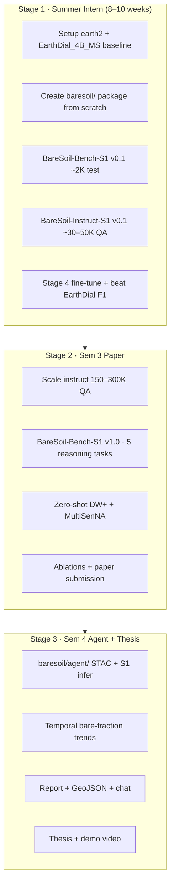
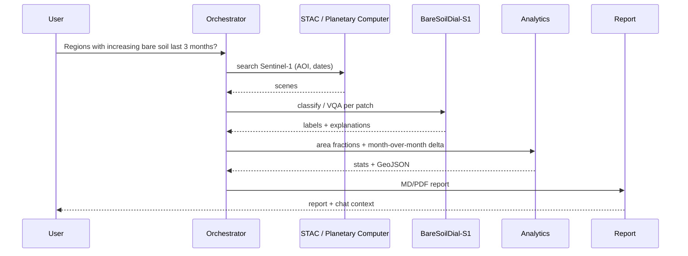

# BareSoil-S1 MTech: 3-Stage Roadmap

> **Workspace:** `e:\MTP\earth2\` only — starting from scratch.  
> **Base:** `EarthDial-main/` (upstream EarthDial)  
> **Extension to build:** `EarthDial-main/baresoil/` (does not exist yet)  
> **Companion doc:** [`BareSoil_S1_VLM_Dataset_Guide.md`](BareSoil_S1_VLM_Dataset_Guide.md)

---

## Earth2 Project Scope

Everything for this thesis lives under:

```
e:\MTP\earth2\
├── BareSoil_S1_MTech_3Stage_Roadmap.md     ← this file
├── BareSoil_S1_VLM_Dataset_Guide.md
├── EarthDial_Complete_Analysis.md
└── EarthDial-main\
    ├── src\earthdial\          ← EarthDial core (train, eval, model)
    ├── baresoil\               ← YOUR CODE (create in Stage 1)
    └── data\baresoil_s1\       ← YOUR DATA (download in Stage 1)
```

**Not used:** any folder outside `earth2`. No copying from other local clones — build fresh here.

---

## Verdict on the Original LLM Plan

| Aspect | Rating | Comment |
|---|---|---|
| Single-thread narrative (intern → paper → agent) | ✅ Excellent | Right MTech structure |
| Improve EarthDial, don't invent a transformer | ✅ Correct | Dataset + bench + eval = publishable |
| SAR bare soil VLM theme | ✅ Best choice | EarthDial S1 = ships/quakes, not LULC bare soil |
| OpenEarthMap-SAR for summer | ⚠️ Risky | Umbra SAR, not Sentinel-1 — appendix only |
| Stage 1 "improve something" without metrics | ❌ Too vague | Need BareSoil-Bench-S1 v0.1 + +5 F1 target |
| Four separate agents in Sem 4 | ⚠️ Over-scoped | One orchestrator + tools is enough |

**Bottom line:** Keep Option 1 (SAR bare soil VLM). Execute entirely inside `earth2`. Start on **Sentinel-1** from day one.

---

## Product Names (use consistently)

| Name | What it is | Location in earth2 |
|---|---|---|
| **BareSoilDial-S1** | Fine-tuned VLM checkpoint | `EarthDial-main/checkpoints/BareSoilDial_S1/` |
| **BareSoil-Instruct-S1** | Training instruction dataset | `EarthDial-main/baresoil/data/instruct/` |
| **BareSoil-Bench-S1** | Evaluation benchmark | `EarthDial-main/baresoil/data/bench/` |
| **BareSoil-Agent** | Sem 4 agentic system | `EarthDial-main/baresoil/agent/` (build in Stage 3) |

---

## Revised 3-Stage Roadmap



Each stage **extends** the previous — no restart, no sensor switch.

---

## Stage 1 — Summer Intern

**Goal:** Measurable improvement over EarthDial on Sentinel-1 bare-soil binary QA and classification.

### Week-by-week (earth2)

| Week | Task | Output path |
|---|---|---|
| 1–2 | `pip install -e EarthDial-main`; download `EarthDial_4B_MS` | `EarthDial-main/checkpoints/` |
| 2 | Scaffold `baresoil/` package | `EarthDial-main/baresoil/taxonomy.py`, `instruct_templates.py` |
| 2–3 | Download SEN12MS + AI4LCC subset | `EarthDial-main/data/baresoil_s1/` |
| 3 | Build bench v0.1 | `baresoil/data/bench/v0.1/` |
| 3–5 | `build_instruct_s1.py` → 30–50K QA | `baresoil/data/instruct/v0.1/` |
| 5 | Create `Stage4_BareSoil_S1.json` | `src/shell/data/` |
| 5–7 | Stage 4 fine-tune, freeze ViT | `checkpoints/BareSoilDial_S1_v0.1/` |
| 7–8 | `eval_bench.py` vs EarthDial baseline | `baresoil/data/metrics/` |
| 8–10 | Intern report + demo notebook | `earth2/docs/` (optional) |

### One improvement only

**Instruction tuning + BareSoil-Bench-S1** (dataset + eval protocol).  
Do **not** build a new SAR encoder in summer.

### Success metrics

| Metric | Target |
|---|---|
| Bare vs non-bare binary F1 | EarthDial + **≥5 pts** |
| 7-class macro-F1 (bare-related) | Beat EarthDial |
| Qualitative | 10 SAR patches with sensible dialogue |

### Intern report title

*BareSoilDial-S1: Adapting EarthDial for Sentinel-1 Bare Land Classification and Dialogue*

---

## Stage 2 — Sem 3 + Paper

**Goal:** Publication via **benchmark + reasoning tasks**, not a new backbone.

### Paper titles (working)

- *BareSoil-Bench: Reasoning-Centric Evaluation of VLMs for Sentinel-1 Bare Land Understanding*
- *Improving Bare Soil Reasoning in SAR Vision-Language Models via Instruction Tuning*

### Five reasoning tasks (BareSoil-Bench-S1 v1.0)

| Task | Example question | Metric |
|---|---|---|
| **T1 Presence** | Is bare soil present? | Binary F1 |
| **T2 Dominance** | How much bare soil? (none/low/med/high) | Ordinal accuracy |
| **T3 Fine class** | Fallow vs desert sand vs bare rock? | 7-class macro-F1 |
| **T4 Context** | What surrounds bare patches? | Set F1 / ROUGE |
| **T5 Temporal** | Did bare area increase? | Binary + ROUGE |

Implement task generators in `EarthDial-main/baresoil/build_bench.py`.

### Data scale

| Component | Size | Path |
|---|---|---|
| BareSoil-Instruct-S1 train | 150–300K QA | `baresoil/data/instruct/v1.0/` |
| BareSoil-Bench-S1 test | 5–15K | `baresoil/data/bench/v1.0/` |
| Zero-shot eval | DW+ 299 + MultiSenNA 12K | external data in `data/baresoil_s1/` |

### Required experiments

1. EarthDial_4B_MS vs BareSoilDial-S1 (same bench, greedy decode)  
2. S1-only vs S1 + multi-temporal (AI4LCC)  
3. Class imbalance / oversampling ablation  
4. Failure cases: water vs bare, urban roof vs bare, speckle  
5. Optional: GPT-4o / GeoChat on same bench (weak SAR baselines)

### Publication targets

| Venue | Notes |
|---|---|
| IGARSS 2026 | ~Jan deadline |
| IEEE GRSL | Short letter |
| JSTARS | Fuller paper + agent preview |

### Paper novelty (precise claim)

> First Sentinel-1 instruction-tuning **benchmark and evaluation protocol** for interactive bare-soil / barren-land understanding, built on EarthDial in `earth2`, with multi-task reasoning and (later) an agentic monitoring extension.

Do **not** claim "first SAR VLM."

---

## Stage 3 — Sem 4 Agent + Thesis

**Goal:** Tool-using system around BareSoilDial-S1 — not a new model.

### Architecture (one orchestrator + tools)



### Build in earth2 (Sem 4)

| Module | Path |
|---|---|
| Agent entry | `EarthDial-main/baresoil/agent/baresoil_agent.py` |
| STAC search (S1) | `baresoil/agent/tools/stac_search.py` |
| VLM inference | `baresoil/agent/tools/vlm_inference.py` |
| Area / trend analytics | `baresoil/agent/tools/analytics.py` |
| Report generator | `baresoil/agent/tools/report.py` |
| Demo UI (optional) | extend `EarthDial-main/demo/` or Streamlit in `baresoil/` |

**Do not** build four separate agents — one planner calling tools.

### Sem 4 deliverables

| Deliverable | Description |
|---|---|
| BareSoil-Agent v1 | AOI + date range → automated report |
| Monitoring mode | Grid tiles + trend chart |
| Chat-over-report | RAG on generated report |
| MTech thesis | 4 chapters: Background → Bench+Model → Agent → Conclusion |
| Demo video | 3 min end-to-end |

### Agent success metrics

| Metric | Target |
|---|---|
| End-to-end latency | < 5 min medium AOI |
| Trend vs pixel baseline | ≥80% agreement |
| User study (optional) | 5 experts prefer agent report |

---

## 12-Month Calendar

| Period | Focus | Exit criterion |
|---|---|---|
| May–Jul (Intern) | `baresoil/` v0.1 + fine-tune | Intern report; +5 F1 |
| Aug–Oct (Sem 3) | Bench v1.0 + full experiments | Paper draft tables complete |
| Nov–Jan | Write + submit | Manuscript submitted |
| Feb–Apr (Sem 4) | Agent v1 + thesis Ch 1–3 | Working demo |
| May–Jul (Sem 4) | Polish + defense | Thesis submitted |

---

## What NOT to Do

| Avoid | Why |
|---|---|
| Work outside `earth2` | Single source of truth for thesis |
| New transformer / SAR encoder | Intern timeline + compute |
| OpenEarthMap-SAR as primary S1 train | Wrong sensor |
| RGB/S2 bare soil as main thread | Not your S1 thesis story |
| Four disconnected milestones | One narrative only |
| Agriculture-only focus | Crowded field |

---

## Elevator Pitch

> We adapt EarthDial (in `earth2`) into **BareSoilDial-S1** — instruction-tuned for **Sentinel-1 bare-land dialogue** — with **BareSoil-Bench-S1** for reasoning-centric evaluation. **BareSoil-Agent** (Sem 4) retrieves SAR scenes, estimates bare-soil trends, explains changes, and supports interactive monitoring.

---

## Immediate Next Steps (this week, earth2 only)

1. **Create** `EarthDial-main/baresoil/` with `taxonomy.py` and `instruct_templates.py` (see Dataset Guide §5–§7).  
2. **Add** `BARESOIL = "[baresoil]"` to `src/earthdial/train/constants.py` and register in `finetune.py`.  
3. **Create** `EarthDial-main/data/baresoil_s1/` directory structure.  
4. **Register** for AI4LCC; start SEN12MS download.  
5. **Define** BareSoil-Bench-S1 v0.1 schema (500 samples) **before** any training.  
6. **Baseline** EarthDial_4B_MS on that bench — record numbers in `baresoil/data/metrics/earthdial_baseline.json`.

---

## Final Recommendation

1. **Summer:** Scaffold `baresoil/` in earth2 + S1 fine-tune + measurable bench beat.  
2. **Sem 3:** BareSoil-Bench-S1 v1.0 + paper (DW+ / MultiSenNA zero-shot).  
3. **Sem 4:** BareSoil-Agent on the same checkpoint + thesis.

One workspace (`earth2`), one codebase (`EarthDial-main` + `baresoil/`), three milestones.

---

## Related documents (all in earth2)

- [`BareSoil_S1_VLM_Dataset_Guide.md`](BareSoil_S1_VLM_Dataset_Guide.md) — datasets, taxonomy, conversion pipeline  
- [`EarthDial_Complete_Analysis.md`](EarthDial_Complete_Analysis.md) — EarthDial architecture & training reference
