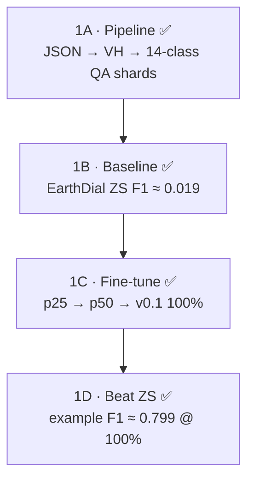

# Stage 1 — Summer Intern Guide (4 substages)

> **Parent roadmap:** [`AI4LCC_S1_VLM_MTech_3Stage_Roadmap.md`](AI4LCC_S1_VLM_MTech_3Stage_Roadmap.md)  
> **Live commands:** [`RUNBOOK.md`](RUNBOOK.md) · history [`log.md`](log.md)  
> **Status (2026-07-13):** **1A–1D DONE** on MultiSenGE (ZS F1 ≈ 0.019 → 100% FT ≈ **0.799**). Dialogue set-match ~0.12 / ~0.37. **E4 MultiSenNA transfer DONE** (F1 ≈ **0.670**). Professor report: **§ Professor deep-dive** → **A (1A data/clip/shards)** · **B (1B ZS)** · **C (1C train)** · **D (1D metrics)** · **E (5 novelties)**.

**Goal (achieved):** Working **LULCDial-S1 v0.1** that beats **EarthDial ZS** on AI4LCC GE validation (example F1).

---

## Quick glossary


| Term                   | Meaning                                                                                                                                                                                                |
| ---------------------- | ------------------------------------------------------------------------------------------------------------------------------------------------------------------------------------------------------ |
| **ZS**                 | **Zero-shot** — use pretrained **EarthDial_4B_MS** **without** training on AI4LCC. Ask it LULC questions on S1 images; record how wrong it is. That number is your **baseline**.                       |
| **LULCDial-S1**        | **Same EarthDial model** (ViT + projector + LLM), **fine-tuned** on your AI4LCC QA shards. **Not a new architecture.** It is a **checkpoint name** for “EarthDial adapted for S1 land-cover dialogue.” |
| **Fine-tune**          | Continue training EarthDial weights on your new question–answer pairs so the model learns OCSGE 14-class SAR dialogue.                                                                                 |
| `[baresoil]` **token** | One new **text token** in the prompt (like `[s1_vh_10]`). Tells the model “this is land-cover / LULC task.” This is **not** a new neural network layer.                                                |


### Is LULCDial-S1 “EarthDial + new layer”?

**No — not a new layer.**

```
EarthDial_4B_MS  =  InternViT (vision)  +  MLP projector  +  Phi-3 LLM (language)
LULCDial-S1      =  SAME stack, weights updated after training on AI4LCC QA data
```

What changes when you fine-tune:


| What changes                                        | What stays the same                        |
| --------------------------------------------------- | ------------------------------------------ |
| Model **weights** (learned from your QA data)       | **Architecture** (no new blocks added)     |
| Optional new prompt token `[baresoil]` in tokenizer | Same input: S1 VH image + text question    |
| Saved as new folder `checkpoints/LULCDial_S1_v0.1/` | Still runs through EarthDial `finetune.py` |


Think of it like: **same student (EarthDial), new textbook chapter (AI4LCC QA)** — not a different person.

---


## Overview — 4 substages




| Substage | One-line goal | Status |
| -------- | ------------- | ------ |
| **1A Pipeline** | Turn raw AI4LCC into EarthDial training data | ✅ Shards + 801 bench |
| **1B Baseline (ZS)** | Measure EarthDial **before** FT | ✅ F1 ≈ 0.019 |
| **1C Fine-tune** | Data scaling 25% / 50% / 100% | ✅ `LULCDial_S1_p25/p50/v0.1` |
| **1D Beat ZS** | Prove fine-tune helped | ✅ F1 ≈ 0.799; set-match secondary |


---


## Substage 1A — Pipeline (JSON → VH → QA shards)

**What:** Build instruction data EarthDial can read.

**Input (on disk):**

```
data/baresoil_s1/ai4lcc/multisenge/
├── labels/         ← 8,157 JSON files  ✅
├── s1/             ← full S1 (build machine / archive)
└── s1_val_bench/   ← ✅ packed 801 val TIFFs on PARAM
```

Shards live under `data/baresoil_s1/shards/` (train / val / p25 / p50) — **built**.

### 1A.1 Classes (what the labels mean)

Official **OCSGE / AI4LCC** taxonomy — **not remapped**. MultiSenGE uses IDs **1–14**; MultiSenNA adds **15** for transfer eval later.

| ID | Class name | Group (for dialogue turn 2) |
| -- | ---------- | --------------------------- |
| 1 | Dense Built-Up | Urban |
| 2 | Sparse Built-Up | Urban |
| 3 | Specialized Built-Up Areas | Urban |
| 4 | Specialized but Vegetative Areas | Urban |
| 5 | Large Scale Networks | Urban |
| 6 | Arable Lands | Natural / agricultural |
| 7 | Vineyards | Natural / agricultural |
| 8 | Orchards | Natural / agricultural |
| 9 | Grasslands | Natural / agricultural |
| 10 | Groves and Hedges | Natural / agricultural |
| 11 | Forests | Natural / agricultural |
| 12 | Open Spaces, Mineral | Natural / agricultural |
| 13 | Wetlands | Natural / agricultural |
| 14 | Water Surfaces | Natural / agricultural |
| 15 | Beaches, Sand (NA only) | Natural / agricultural |

- Labels in JSON are multi-label: e.g. `"6;11"` → present set `{Arable Lands, Forests}`.
- Code: `baresoil/taxonomy.py` (`parse_ai4lcc_label_ids`, `AI4LCC_CLASS_ID_TO_NAME`).

### 1A.2 How a patch is extracted (JSON → one S1 TIFF)

Code: `baresoil/patch_meta.py`.

1. Each label file looks like `31TFN_7196_514.json` → **tile** `31TFN`, **x** `7196`, **y** `514` (2.56 km square on the AI4LCC grid).
2. Read fields: `labels` (class IDs), `corresponding_s1` (many dated TIFF names for 2020).
3. Among S1 files that **exist on disk**, pick the **median date** (`pick_available_s1_file`) — one image per patch (not the full time series for Stage 1).
4. Patch ID = `{tile}_{x}_{y}` (e.g. `31TFN_7196_514`).

### 1A.3 Image clipping / VH processing (important for professor)

Code: `baresoil/s1_vh_io.py`. This is **radiometric clipping of backscatter**, not cropping the map extent (patches are already 256×256).

| Step | Detail |
| ---- | ------ |
| Open GeoTIFF | `rasterio` |
| Band | Prefer **band 2 = VH**; if only 1 band, use band 1 |
| Spatial size | Must be **256 × 256** (AI4LCC patch); reject otherwise |
| Linear → dB | If values look linear (max < 1 and min ≥ 0): `VH_dB = 10·log10(clip(VH, 1e-10))` |
| **Training clip** | `np.clip(VH_dB, −50.0, +10.0)` dB — kills extreme outliers before the model |
| Store in shard | Float32 PIL `mode="F"` (EarthDial S1 convention) — **not** 8-bit RGB |
| Preview only (bench debug PNG) | Separate stretch: clip **[−35, +5]** dB → scale to 0–255 grayscale (human view only; **not** used for train/ZS) |

At train/infer time, EarthDial applies **`normalization: "s1"`** with stats in `constants.py`:

```text
S1_MEAN = (−20.26,)
S1_STD  = (5.91,)
```

→ standardized as `(x − mean) / std` for the single VH channel.  
(`force_image_size 448` later **resizes** 256→448 for the ViT; values stay float SAR, not photo RGB.)

### 1A.4 How shards are made

Code: `baresoil/build_instruct_s1.py`.

```
For each patch (with available S1):
  VH float image ──┬──→ classify QA row   (1 conversation)
                   └──→ dialogue QA row   (2-turn conversation)
```

| Detail | Value |
| ------ | ----- |
| Train/val split | Deterministic MD5 of patch stem; **90% / 10%** (`_split_bucket`) |
| Rows per patch | **2** (classify + dialogue) |
| HF fields | `jpg` = float image · `conversations` = JSON string of EarthDial chat turns |
| Full GE train shard | ~**14 710** rows · ~**7 355** patches |
| Full GE val shard | ~**1 602** rows |
| Format | HuggingFace `Dataset.save_to_disk` (Arrow / `.arrow` files + `manifest.json`) |
| Scaling subsets | Subsample train → `ai4lcc_ge_train_p25` / `_p50` for 1C |

**Not** eight separate corpora — multiple `.arrow` files are one dataset.

### 1A.5 How the eval bench is made (used in 1B/1D)

Code: `baresoil/build_bench.py`.

- Only patches in the **val** bucket with available S1.
- Writes one JSONL row per patch: `patch_id`, `s1_path`, label ids/names, `classify_question` / `classify_answer`, full `dialogue` turns.
- GE held-out bench used in Stage 1: **`ai4lcc_val.jsonl` → 801 rows**.
- Images for PARAM: packed with `pack_bench_s1` → `s1_val_bench/` (only those 801 TIFFs, not full 110 GB).

**Steps (summary):**

| Step | What happens | Code |
| ---- | ------------ | ---- |
| 1 | Parse label JSON → IDs + S1 filename list | `patch_meta.py` |
| 2 | Median available S1 date | `pick_available_s1_file()` |
| 3 | VH band → dB → clip [−50, 10] → float PIL | `s1_vh_io.py` |
| 4 | 2 QA templates with official OCSGE names | `instruct_templates.py` |
| 5 | HF shards + val bench JSONL | `build_instruct_s1.py`, `build_bench.py` |

**Commands:**

```powershell
cd e:\MTP\earth2\LULCDial-s1

python -m baresoil.build_instruct_s1 ^
  --labels-dir data/baresoil_s1/ai4lcc/multisenge/labels ^
  --s1-dir data/baresoil_s1/ai4lcc/multisenge/s1 ^
  --out-dir data/baresoil_s1/shards/ai4lcc_ge_train ^
  --split all

python -m baresoil.build_bench ^
  --labels-dir data/baresoil_s1/ai4lcc/multisenge/labels ^
  --s1-dir data/baresoil_s1/ai4lcc/multisenge/s1 ^
  --out-jsonl data/baresoil_s1/bench/v0.1/ai4lcc_val.jsonl
```

**Outputs:**

| File | Content |
| ---- | ------- |
| `shards/ai4lcc_ge_train_train/` | ~14.7k QA rows |
| `shards/ai4lcc_ge_train_val/` | ~1.6k QA rows |
| `bench/v0.1/ai4lcc_val.jsonl` | 801 held-out eval patches |

**Done when:** `manifest.json` shows `num_samples > 0` and no mass `missing_s1` skips.

**Weeks:** 2–3 (blocked until `s1.tgz` is extracted)

---


## Substage 1B — Baseline: EarthDial ZS

**What:** **ZS = zero-shot.** Run **off-the-shelf EarthDial_4B_MS** on your bench **without any AI4LCC training**.

**Why:** You must show the professor *“before vs after”*. If you only show fine-tuned results, nobody knows if your data helped.

**How:**

1. Download checkpoint: `akshaydudhane/EarthDial_4B_MS` from Hugging Face
2. Load `bench/v0.1/ai4lcc_val.jsonl` (**801** patches)
3. For each sample: load S1 TIFF from `s1_val_bench` with the **same VH → dB → clip** path as 1A (`predict_zero_shot.py` → model preprocess + `normalization: s1`)
4. Ask classify + dialogue with the **same templates** as training
5. Score with `eval_zero_shot.py` → `metrics/v0.1/earthdial_zs_baseline.json`

**Image note for 1B:** We do **not** invent a different clip for ZS. Same **[−50, +10] dB** training clip when reading TIFFs; preview PNGs (if any) use a tighter **[−35, +5]** stretch only for human eyes.

**What you expect:** EarthDial often fails on S1 LULC — pretrained on BigEarthNet **optical/S2**, and S1 mostly for **ships/quakes**, not OCSGE dialogue.

**Metrics to record:**

| Task | Metric | GE ZS result |
| ---- | ------ | ------------ |
| Classification (14-class multi-label) | **example F1** (primary) | **≈ 0.019** |
| Dialogue turn 1 | Exact set-match | **0.0** |
| Dialogue turn 2 (natural/ag subset) | Exact set-match | **0.0** |

**Done when:** Baseline JSON exists for the before/after table.

**Weeks:** 4 (after 1A)

---


## Substage 1C — Fine-tune LULCDial-S1 (data scaling → v0.1)

**What:** Fine-tune EarthDial on your shards; prove **more data helps**.

**Locked plan (see `RUNBOOK.md`):**
1. Finish **1B** full-801 ZS first (strict F1). Keep clean class-list answers — do not redesign mid-1B.
2. Three **separate** fine-tunes from the same base `EarthDial_4B_MS`, same hyperparams, same 801 bench:
   - ~**25%** train patches → eval
   - ~**50%** train patches → eval
   - **100%** → `checkpoints/LULCDial_S1_v0.1/`
3. Scale by patch/sample count (`--max-patches` / subset shards). The 8 `.arrow` files are **one** HF dataset, not eight corpora.
4. Prefer separate short runs (not one continued train) for a clean thesis plot.

**Config:** `Stage4_BareSoil_S1.json` (p25), `_p50.json`, `_v0.1.json` — see `RUNBOOK.md`.

**Training recipe (locked on PARAM):**


| Setting         | Value                                      |
| --------------- | ------------------------------------------ |
| Base checkpoint | `EarthDial_4B_MS` (fresh each run)         |
| Data            | p25 / p50 / full train + val               |
| Image size      | **448** (not 224)                          |
| Bands / norm    | 1 · `s1`                                   |
| Batch / accum   | 1 / 128 · `freeze_backbone` · bf16 · 1 epoch |
| Launch          | `sbatch` (`train_p50.sbatch`, `train_v0.1.sbatch`, …) |


**Output checkpoints (PARAM):**

```
LULCDial-s1/checkpoints/LULCDial_S1_p25/
LULCDial-s1/checkpoints/LULCDial_S1_p50/
LULCDial-s1/checkpoints/LULCDial_S1_v0.1/
```

**Done when:** Scaling curve exists (ZS vs 25/50/100%) — ✅ Jul 2026.

---


## Substage 1D — Beat ZS on classify + dialogue (val)

**What:** Run **same bench** as 1B, but with **LULCDial-S1 v0.1** instead of raw EarthDial.

**Compare:**


| Model            | Trained on AI4LCC? | Role             |
| ---------------- | ------------------ | ---------------- |
| EarthDial_4B_MS  | **No** (ZS)        | Baseline (1B)    |
| LULCDial-S1 v0.1 | **Yes**            | Your result (1D) |


**Success targets (Stage 1 exit) — updated Jul 2026:**


| Metric | Original target | Achieved |
| ------ | --------------- | -------- |
| example F1 (801 val) | Beat ZS strongly | ✅ **0.019 → 0.799** |
| Dialogue turn-1 / turn-2 **exact set-match** | Aspirational ≥70% | ❌ ~**0.12 / 0.37** — secondary only |
| Scaling 25/50/100% | Prove learning | ✅ Weak after 25% |

**Primary metric:** example F1. Do not block Stage 1 on set-match ≥70%.  
**Qualitative:** 10 good SAR explanation examples (write-up).

**Also do:** Short error analysis — when does model confuse Water vs Open Spaces Mineral, urban vs arable?

**Save:** `data/baresoil_s1/metrics/v0.1/lulcdial_v0.1.json`

**Deliverable:** Intern report PDF + demo notebook.

**Weeks:** 6–10

---


## Professor deep-dive — Stage 1A → 1D (full technical report)

> Use this when talking to your supervisor. Covers **1A (data)**, **1B (ZS)**, **1C (train)**, **1D (metrics)** in the same level of detail. Formulas are plain text so they render in any Markdown viewer.

### 0. One-sentence truth

**LULCDial-S1 is not a new neural architecture.** It is **EarthDial_4B_MS** (InternViT + MLP projector + Phi-3) fine-tuned for **1 epoch** on AI4LCC MultiSenGE Sentinel-1 VH instruction data (14-class OCSGE classify + 2-turn dialogue), with **vision backbone frozen**. Core novelty = **benchmark + adaptation + transfer**; scaling is a **supporting ablation**, not a new method.

```
EarthDial_4B_MS     = InternViT (vision) + MLP projector + Phi-3 LLM
LULCDial_S1_v0.1    = SAME stack; LLM + projector updated; ViT frozen
```

---

### A. Stage 1A — classes, clipping, shards, 801-row bench

#### A.1 Classes (OCSGE / AI4LCC — not remapped)

| ID | Name | Dialogue turn-2 group |
| -- | ---- | --------------------- |
| 1–5 | Dense/Sparse/Specialized Built-Up, Spec. Vegetative, Large Scale Networks | Urban |
| 6–14 | Arable, Vineyards, Orchards, Grasslands, Hedges, Forests, Mineral open, Wetlands, Water | Natural / agricultural |
| 15 | Beaches, Sand | Natural / agricultural (MultiSenNA only) |

JSON labels are multi-label strings like `"6;11"` → `{Arable Lands, Forests}`. Code: `baresoil/taxonomy.py`.

#### A.2 Extract one patch → one S1 image

Code: `baresoil/patch_meta.py`.

1. File `31TFN_7196_514.json` → tile / x / y (2.56 km AI4LCC square).
2. Read `labels` + `corresponding_s1` (many 2020 dates).
3. Keep files that exist on disk; pick **median date** (`pick_available_s1_file`).
4. Patch id = `tile_x_y`.

#### A.3 Clipping / VH processing (radiometric — not map crop)

Code: `baresoil/s1_vh_io.py`. Patches are already **256×256**.

| Step | What we do |
| ---- | ---------- |
| Band | Band **2 = VH** (or band 1 if single-band) |
| Linear → dB | If values look linear: `VH_dB = 10 * log10(clip(VH, 1e-10))` |
| **Train / ZS clip** | `clip(VH_dB, -50.0, +10.0)` dB |
| Shard storage | Float32 PIL `mode="F"` (not 8-bit RGB) |
| **Preview PNG only** | `clip(VH_dB, -35.0, +5.0)` then stretch to 0–255 — **eyes only**, never for train/ZS |
| Model norm | `normalization: "s1"` with `S1_MEAN=(-20.26,)`, `S1_STD=(5.91,)` → `(x - mean) / std` |
| Resize later | Train uses `force_image_size 448` (256 → 448); still float SAR |

#### A.4 How shards are built

Code: `baresoil/build_instruct_s1.py`.

```
each patch  →  classify QA row  (1 conversation)
            →  dialogue QA row  (2-turn conversation)
```

| Detail | Value |
| ------ | ----- |
| Split | MD5 of patch stem → **90% train / 10% val** |
| Rows per patch | **2** |
| Train shard | ~**14,710** rows (~7,355 patches) |
| Val shard | ~**1,602** rows |
| Format | HuggingFace Arrow (`save_to_disk`) + `manifest.json` |
| Fields | `jpg` = float image; `conversations` = JSON chat |

Multiple `.arrow` files = **one** dataset (not eight corpora). Subsets `p25` / `p50` for scaling.

#### A.5 How the 801-row bench is made

Code: `baresoil/build_bench.py`.

1. Take only **val-split** patches with available S1.
2. Write one JSONL line per patch: `patch_id`, `s1_path`, labels, `classify_question` / `classify_answer`, full `dialogue`.
3. Result: `bench/v0.1/ai4lcc_val.jsonl` → **801** rows (GE Stage 1 eval set).
4. Pack only those TIFFs → `s1_val_bench/` for PARAM (not full 110 GB `s1/`).

---

### B. Stage 1B — zero-shot baseline (detail)

**Goal:** Measure **EarthDial_4B_MS** on the **same 801-row bench** **before** any AI4LCC fine-tune.

#### B.1 Procedure

1. Checkpoint: `akshaydudhane/EarthDial_4B_MS` (no AI4LCC weights).
2. Images: `s1_val_bench` TIFFs; same VH → dB → **[-50, +10]** as 1A.
3. Prompts: **identical** classify + dialogue templates as training (`instruct_templates.py`).
4. Runner: `baresoil/predict_zero_shot.py` → preds JSONL.
5. Scorer: `baresoil/eval_zero_shot.py` → `metrics/v0.1/earthdial_zs_baseline.json`.

#### B.2 Why ZS is expected to fail

EarthDial S1 pretraining targets **ships / earthquake change**; LULC classification in EarthDial is mostly **optical BigEarthNet**. OCSGE 14-class SAR dialogue is out of distribution.

#### B.3 GE zero-shot numbers (achieved)

| Metric | Value |
| ------ | ----- |
| example F1 (classify) | **0.019** |
| turn1 exact set-match | **0.000** |
| turn2 exact set-match | **0.000** |
| Rows scored | 801 / 801 |

This is the **before** column for every professor table.

#### B.4 Same metrics as 1D

1B and 1D use the **same formulas** (see §D). Only the checkpoint changes (ZS vs `LULCDial_S1_v0.1`).

---

### C. Stage 1C — fine-tune (architecture & recipe)

#### C.1 Layers added?

| Question | Answer |
| -------- | ------ |
| New ViT / LLM / MLP blocks? | **None** |
| New 14-class softmax head? | **None** (answers are generated text) |
| LoRA? | **Not used** |
| Your token | **`[baresoil]`** in `constants.py` (`BARESOIL`); plus EarthDial’s `[s1_vh_10]`, `[classify]` |

**`constants.py` ownership**

| Symbol | Yours? |
| ------ | ------ |
| `BARESOIL = "[baresoil]"` | **Yes** |
| `IMAGENET_*` / `CLIP_*` / `SIGLIP_*` | No (unused for S1) |
| `S1_MEAN` / `S1_STD` | **Yes** (1-band VH) |

#### C.2 Frozen vs trainable

| Module | Setting | Effect |
| ------ | ------- | ------ |
| InternViT | `freeze_backbone True` | Frozen |
| MLP projector | default unfrozen | Trainable |
| Phi-3 LLM | default unfrozen | Trainable |

#### C.3 Hyperparameters (locked on PARAM)

| Setting | Our 1C | EarthDial sample script |
| ------- | ------ | ----------------------- |
| Base | `EarthDial_4B_MS` | InternVL2 / RGB path |
| Epochs | 1 | 1 |
| LR | 4e-5 | 4e-5 |
| Image size | **448** | 224 |
| Batch × accum | 1 × 128 | 2 × 64 (multi-GPU) |
| `max_seq_length` | 1024 | 4096 |
| bf16 / grad checkpoint | Yes | Yes |
| DeepSpeed | **Off** | Often On |
| Bands / norm | 1 / `s1` | RGB/MS |

Launch: `train_p25.sbatch` / `train_p50.sbatch` / `train_v0.1.sbatch`.

#### C.4 Loss (same as EarthDial — not a new LULC loss)

Next-token **Cross-Entropy** on answer tokens:

```text
L = CrossEntropy(shift_logits, shift_labels)
```

No multi-label BCE, Dice, or contrastive loss invented by us.  
Train loss ≈ 0.20 (p25/p50) → ≈ **0.17** (100%).

#### C.5 Optimizations (what each flag means)

These are **training engineering** choices (fit 4B on 1× A100). They are **not** a new model architecture.

| Optimization | What it means | Our 1C |
| ------------ | ------------- | ------ |
| **bf16** | Store/compute many tensors in **bfloat16** instead of float32 | **On** — less VRAM, faster on A100, still numerically stable |
| **Gradient checkpointing** | During forward, discard some mid-layer activations; **recompute** them in backward | **On** — uses more compute, much less memory |
| **accum 128** | `batch=1` but accumulate gradients over 128 steps before one weight update → **effective batch ≈ 128** | **On** |
| **freeze ViT** | No gradients for InternViT; only projector + LLM update | **On** |
| **DeepSpeed** | Extra distributed/ZeRO memory sharding library | **Off** on PARAM (not needed with bf16 + checkpoint + 80GB; toolchain issues) |
| **Flash Attention** | Faster attention kernel if installed | Prefer if present; PARAM logs often said unavailable → **eager** (standard PyTorch attention) |

**Plain sentence for professor:** we did not invent a new optimizer; we used half-precision + memory tricks + gradient accumulation so EarthDial-4B fine-tune fits on one GPU.

#### C.5b Activation functions (unchanged from EarthDial)

We **did not change** any activation. LULCDial-S1 keeps EarthDial / InternVL defaults:

| Module | Activation | Source |
| ------ | ---------- | ------ |
| **InternViT** (vision MLP inside blocks) | **GELU** (`hidden_act='gelu'`) | `configuration_intern_vit.py` |
| **MLP projector** (`mlp1`) | **GELU** (`nn.GELU()`) | `modeling_internvl_chat.py` |
| **Phi-3 LLM** | **SiLU** (`hidden_act='silu'`, a.k.a. swish) | `configuration_phi3.py` |

So: **GELU** in vision + projector, **SiLU** in the language model — stock InternVL2 / Phi-3, not a custom LULC activation.

#### C.6 Scaling results (fresh start from MS each run)

| Run | Data | Checkpoint | GE example F1 |
| --- | ---- | ---------- | ------------- |
| 1B ZS | none | EarthDial_4B_MS | **0.019** |
| 1C-a | ~25% | LULCDial_S1_p25 | **0.782** |
| 1C-b | ~50% | LULCDial_S1_p50 | **0.783** |
| 1C-c | 100% | LULCDial_S1_v0.1 | **0.799** |

Most gain by ~25%; 50%/100% nearly flat under this 1-epoch recipe.

---

### D. Stage 1D — prompts + scoring formulas (readable)

Stage 1D = **same 801 bench as 1B**, but load **`LULCDial_S1_v0.1`**. Scorer: `eval_zero_shot.py`. No separate captioning head — classify and dialogue are **text generation**.

#### D.1 Classify prompt

```text
[baresoil] [s1_vh_10] [classify] <image>
Classify the land cover in this image. Choose all that apply from: <14 OCSGE names>.
```

Answer = comma-separated official names, e.g. `Arable Lands, Forests`.

#### D.2 Dialogue turns

| Turn | Text |
| ---- | ---- |
| Q1 | `[baresoil] [s1_vh_10] <image>` + "What land cover classes do you see in this image?" |
| A1 | Same present-class list as classify |
| Q2 | "Which of these are natural or agricultural areas?" |
| A2 | Subset with IDs in {6…15}; else `None` |

#### D.3 Parse answers to sets

Split on `,` `;` `/` ` and ` / newlines → strip → lowercase → unique → **sets** `P` (pred) and `G` (GT).

#### D.4 Classification — example F1 (primary)

For each sample `i` with predicted set `P_i` and ground-truth set `G_i`:

```text
precision_i = |P_i ∩ G_i| / |P_i|     (0 if P_i empty)
recall_i    = |P_i ∩ G_i| / |G_i|     (0 if G_i empty)

F1_i =
  1.0   if both P_i and G_i are empty
  0.0   if exactly one of P_i, G_i is empty
  2 * precision_i * recall_i / (precision_i + recall_i)
        otherwise (and 0 if precision_i + recall_i == 0)

example_f1 = (1/N) * sum_i F1_i
  with N = 801 on GE val
```

**Achieved GE:** ZS **0.019** → LULCDial-S1 v0.1 **0.799**.

#### D.5 Dialogue — exact set-match (secondary)

```text
turn1_set_match = (1/N) * count of samples where P_i^(turn1) == G_i^(turn1)
turn2_set_match = (1/N) * count of samples where P_i^(turn2) == G_i^(turn2)
```

All-or-nothing: one wrong class → that sample scores 0.  
**Achieved GE v0.1:** turn1 ≈ **0.122**, turn2 ≈ **0.371**.

#### D.6 Result table (1B vs 1C/1D + NA)

| Model | Train on AI4LCC? | example F1 | turn1 | turn2 |
| ----- | ---------------- | ---------- | ----- | ----- |
| EarthDial_4B_MS (1B ZS) | No | 0.019 | 0.000 | 0.000 |
| LULCDial_S1_p25 | Yes (~25%) | 0.782 | ~0.10 | ~0.38 |
| LULCDial_S1_p50 | Yes (~50%) | 0.783 | ~0.12 | ~0.38 |
| **LULCDial_S1_v0.1 (1D)** | Yes (100%) | **0.799** | **0.122** | **0.371** |
| NA transfer (E4) | No NA train | **0.670** | 0.018 | 0.081 |

---

### E. Novelty plan — what is worth claiming **so far**

Be honest with your professor: **strong contributions** vs **supporting findings**. AI4LCC and EarthDial already exist — you did not invent a new backbone.

#### Strong enough to list as main novelty / contribution (done)

| # | Claim | Why it counts |
| - | ----- | ------------- |
| **N1** | **First VLM instruction + eval protocol** on **AI4LCC Sentinel-1 VH** with **official 14-class OCSGE** answers (**classify + 2-turn dialogue**) | Core: new **task + bench + scoring**, not a new transformer |
| **N2** | **Regional transfer** MultiSenGE → **MultiSenNA** **without** training on NA (example F1 ≈ **0.670**) | Core experiment: geographic generalization of LULCDial-S1 |

#### Supporting (mention in paper/report, **not** as architecture novelty)

| # | Claim | How to say it |
| - | ----- | ------------- |
| **S1** | **ZS gap:** EarthDial_4B_MS is near floor on this bench (F1 ≈ **0.019**) | Motivates why FT is needed — empirical gap, not a method |
| **S2** | **Data-efficiency ablation:** under fixed 1-epoch recipe, most GE F1 appears by ~**25%**; headline model is still **100%** (`LULCDial_S1_v0.1`, F1 ≈ **0.799**) | Controlled study / appendix — **not** “we invented scaling” |

#### Planned (not done yet — do not claim as finished novelty)

| # | Claim | Status |
| - | ----- | ------ |
| **N3 (future)** | Multitemporal S1 dialogue on AI4LCC 2020 series | ⏳ Stage 2 |

**Recommended 30-second list for professor (only done work):**

1. AI4LCC-S1 dialogue benchmark + protocol (14-class OCSGE).  
2. LULCDial-S1 adaptation of EarthDial (no new layers) — GE F1 ≈ 0.02 → ≈ 0.80.  
3. Zero-shot transfer to MultiSenNA ≈ 0.67 without NA fine-tune.  
4. *(optional appendix)* data-efficiency curve under fixed recipe.

**Do not claim:** first SAR VLM · new backbone · new loss · new layers · “scaling law” as a method.
---


## Timeline (weeks)


| Week | Substage | Focus                                                         |
| ---- | -------- | ------------------------------------------------------------- |
| 1    | Setup    | Env, EarthDial_4B_MS download, update templates to 14 classes |
| 2–3  | **1A**   | Download `s1.tgz`, build shards + bench                       |
| 4    | **1B**   | EarthDial **ZS** baseline                                     |
| 4–6  | **1C**   | Fine-tune **LULCDial-S1 v0.1**                                |
| 6–7  | **1D**   | Eval + beat ZS                                                |
| 7–10 | **1D**   | Error analysis + intern report                                |


---


## What to tell your professor (30 seconds)

> **ZS** means we test EarthDial **without** training on AI4LCC first — that is our baseline.  
> **LULCDial-S1** is the **same EarthDial architecture**, fine-tuned on AI4LCC question–answer data for Sentinel-1 land-cover dialogue — we are **not** adding a new neural layer, we are **adapting weights** (LLM + projector; ViT frozen) and a task token `[baresoil]`.  
> Stage 1 proves the AI4LCC QA conversion is useful because **LULCDial-S1 beats zero-shot EarthDial** on classification (F1 ≈ 0.02 → ≈ 0.80) and transfers to MultiSenNA (≈ 0.67).  
> Full detail: deep-dive **A=1A, B=1B, C=1C, D=1D, E=novelties** (plain-text F1 formulas).

---


## Related files


| File                                                                                                                 | Purpose                 |
| -------------------------------------------------------------------------------------------------------------------- | ----------------------- |
| `[BenchmarkGuide/AI4LCC/BareSoil_AI4LCC_Workflow_Guide.md](BenchmarkGuide/AI4LCC/BareSoil_AI4LCC_Workflow_Guide.md)` | Detailed pipeline steps |
| `[LULCDial-s1/baresoil/README.md](LULCDial-s1/baresoil/README.md)`                                             | Run commands            |
| [`README.md`](README.md)                                                                                             | What to read first      |


