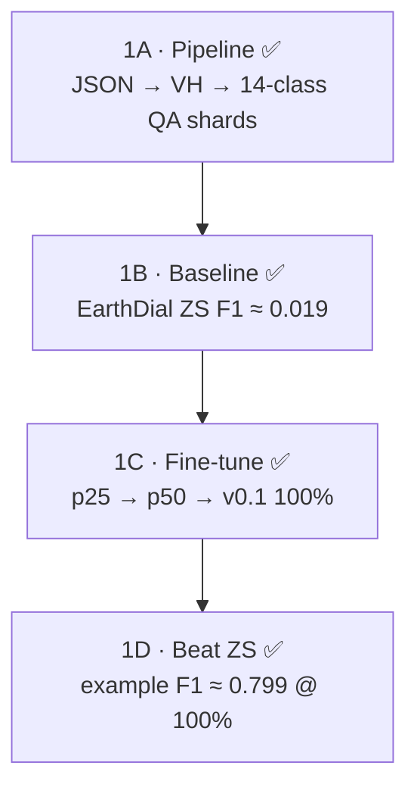

# Stage 1 — Summer Intern Guide (4 substages)

> **Parent roadmap:** [`AI4LCC_S1_VLM_MTech_3Stage_Roadmap.md`](AI4LCC_S1_VLM_MTech_3Stage_Roadmap.md)  
> **Live commands:** [`RUNBOOK.md`](RUNBOOK.md) · history [`log.md`](log.md)  
> **Status (2026-07-12):** **1A–1D DONE** on MultiSenGE (ZS F1 ≈ 0.019 → 100% FT ≈ **0.799**). Dialogue set-match stays ~0.12 / ~0.37. **Next = MultiSenNA transfer.**

**Goal (achieved):** Working **LULCDial-S1 v0.1** that beats **EarthDial ZS** on AI4LCC GE validation (example F1).

---

## Quick glossary


| Term                   | Meaning                                                                                                                                                                                                |
| ---------------------- | ------------------------------------------------------------------------------------------------------------------------------------------------------------------------------------------------------ |
| **ZS**                 | **Zero-shot** — use pretrained **EarthDial_4B_MS** **without** training on AI4LCC. Ask it LULC questions on S1 images; record how wrong it is. That number is your **baseline**.                       |
| **LULCDial-S1**        | **Same EarthDial model** (ViT + projector + LLM), **fine-tuned** on your AI4LCC QA shards. **Not a new architecture.** It is a **checkpoint name** for “EarthDial adapted for S1 land-cover dialogue.” |
| **Fine-tune**          | Continue training EarthDial weights on your new question–answer pairs so the model learns OCSGE 14-class SAR dialogue.                                                                                 |
| `[baresoil]` **token** | One new **text token** in the prompt (like `[s1_vh_10]`). Tells the model “this is land-cover / LULC task.” This is **not** a new neural network layer.                                                |


### Is LULCDial-S1 “EarthDial + new layer”?

**No — not a new layer.**

```
EarthDial_4B_MS  =  InternViT (vision)  +  MLP projector  +  Phi-3 LLM (language)
LULCDial-S1      =  SAME stack, weights updated after training on AI4LCC QA data
```

What changes when you fine-tune:


| What changes                                        | What stays the same                        |
| --------------------------------------------------- | ------------------------------------------ |
| Model **weights** (learned from your QA data)       | **Architecture** (no new blocks added)     |
| Optional new prompt token `[baresoil]` in tokenizer | Same input: S1 VH image + text question    |
| Saved as new folder `checkpoints/LULCDial_S1_v0.1/` | Still runs through EarthDial `finetune.py` |


Think of it like: **same student (EarthDial), new textbook chapter (AI4LCC QA)** — not a different person.

---


## Overview — 4 substages




| Substage | One-line goal | Status |
| -------- | ------------- | ------ |
| **1A Pipeline** | Turn raw AI4LCC into EarthDial training data | ✅ Shards + 801 bench |
| **1B Baseline (ZS)** | Measure EarthDial **before** FT | ✅ F1 ≈ 0.019 |
| **1C Fine-tune** | Data scaling 25% / 50% / 100% | ✅ `LULCDial_S1_p25/p50/v0.1` |
| **1D Beat ZS** | Prove fine-tune helped | ✅ F1 ≈ 0.799; set-match secondary |


---


## Substage 1A — Pipeline (JSON → VH → QA shards)

**What:** Build instruction data EarthDial can read.

**Input (on disk):**

```
data/baresoil_s1/ai4lcc/multisenge/
├── labels/         ← 8,157 JSON files  ✅
├── s1/             ← full S1 (build machine / archive)
└── s1_val_bench/   ← ✅ packed 801 val TIFFs on PARAM
```

Shards live under `data/baresoil_s1/shards/` (train / val / p25 / p50) — **built** (PARAM).

**Steps:**


| Step | What happens                                                                               | Code                                     |
| ---- | ------------------------------------------------------------------------------------------ | ---------------------------------------- |
| 1    | Read each `31TFN_7196_514.json` → tile, x, y, **14-class label IDs**, list of S1 filenames | `baresoil/patch_meta.py`                     |
| 2    | Pick **one S1 date** per patch (median of 2020)                                            | `pick_median_s1_file()`                  |
| 3    | Open `.tif` → take **band 2 (VH)** → 256×256 image                                         | `baresoil/s1_vh_io.py`                      |
| 4    | Build **2 QA pairs** per patch using **official OCSGE names**                              | `baresoil/instruct_templates.py`         |
| 5    | Save HuggingFace shards + val bench JSONL                                                  | `build_instruct_s1.py`, `build_bench.py` |


**Commands:**

```powershell
cd e:\MTP\earth2\LULCDial-s1

python -m baresoil.build_instruct_s1 ^
  --labels-dir data/baresoil_s1/ai4lcc/multisenge/labels ^
  --s1-dir data/baresoil_s1/ai4lcc/multisenge/s1 ^
  --out-dir data/baresoil_s1/shards/ai4lcc_ge_train ^
  --split all

python -m baresoil.build_bench ^
  --labels-dir data/baresoil_s1/ai4lcc/multisenge/labels ^
  --s1-dir data/baresoil_s1/ai4lcc/multisenge/s1 ^
  --out-jsonl data/baresoil_s1/bench/v0.1/ai4lcc_val.jsonl
```

**Outputs:**


| File                            | ~Size              |
| ------------------------------- | ------------------ |
| `shards/ai4lcc_ge_train_train/` | ~14.7k QA rows       |
| `shards/ai4lcc_ge_train_val/`   | ~1.6k QA rows        |
| `bench/v0.1/ai4lcc_val.jsonl`   | held-out eval list |


**Done when:** `manifest.json` inside shard folder shows `num_samples > 0` and no mass `missing_s1` skips.

**Weeks:** 2–3 (blocked until `s1.tgz` is extracted)

---


## Substage 1B — Baseline: EarthDial ZS

**What:** **ZS = zero-shot.** Run **off-the-shelf EarthDial_4B_MS** on your bench **without any AI4LCC training**.

**Why:** You must show the professor *“before vs after”*. If you only show fine-tuned results, nobody knows if your data helped.

**How:**

1. Download checkpoint: `akshaydudhane/EarthDial_4B_MS` from Hugging Face
2. Load `bench/v0.1/ai4lcc_val.jsonl`
3. For each sample: send S1 image + classify or dialogue prompt (same templates as training)
4. Compare model answer vs ground-truth 14-class labels
5. Save metrics → `data/baresoil_s1/metrics/earthdial_zs_baseline.json`

**What you expect:** EarthDial will often **guess wrong** on S1 LULC — it was trained on BigEarthNet **optical/S2**, and S1 for **ships/quakes**, not OCSGE dialogue.

**Metrics to record:**


| Task                                  | Metric                     |
| ------------------------------------- | -------------------------- |
| Classification (14-class multi-label) | Macro-F1, example-F1       |
| Dialogue turn 1                       | Set-match accuracy         |
| Dialogue turn 2 (natural/ag subset)   | Set-match accuracy         |


**Done when:** Baseline JSON file exists with numbers you can put in a table.

**Weeks:** 4 (after 1A)

---


## Substage 1C — Fine-tune LULCDial-S1 (data scaling → v0.1)

**What:** Fine-tune EarthDial on your shards; prove **more data helps**.

**Locked plan (see `RUNBOOK.md`):**
1. Finish **1B** full-801 ZS first (strict F1). Keep clean class-list answers — do not redesign mid-1B.
2. Three **separate** fine-tunes from the same base `EarthDial_4B_MS`, same hyperparams, same 801 bench:
   - ~**25%** train patches → eval
   - ~**50%** train patches → eval
   - **100%** → `checkpoints/LULCDial_S1_v0.1/`
3. Scale by patch/sample count (`--max-patches` / subset shards). The 8 `.arrow` files are **one** HF dataset, not eight corpora.
4. Prefer separate short runs (not one continued train) for a clean thesis plot.

**Config:** `Stage4_BareSoil_S1.json` (p25), `_p50.json`, `_v0.1.json` — see `RUNBOOK.md`.

**Training recipe (locked on PARAM):**


| Setting         | Value                                      |
| --------------- | ------------------------------------------ |
| Base checkpoint | `EarthDial_4B_MS` (fresh each run)         |
| Data            | p25 / p50 / full train + val               |
| Image size      | **448** (not 224)                          |
| Bands / norm    | 1 · `s1`                                   |
| Batch / accum   | 1 / 128 · `freeze_backbone` · bf16 · 1 epoch |
| Launch          | `sbatch` (`train_p50.sbatch`, `train_v0.1.sbatch`, …) |


**Output checkpoints (PARAM):**

```
LULCDial-s1/checkpoints/LULCDial_S1_p25/
LULCDial-s1/checkpoints/LULCDial_S1_p50/
LULCDial-s1/checkpoints/LULCDial_S1_v0.1/
```

**Done when:** Scaling curve exists (ZS vs 25/50/100%) — ✅ Jul 2026.

---


## Substage 1D — Beat ZS on classify + dialogue (val)

**What:** Run **same bench** as 1B, but with **LULCDial-S1 v0.1** instead of raw EarthDial.

**Compare:**


| Model            | Trained on AI4LCC? | Role             |
| ---------------- | ------------------ | ---------------- |
| EarthDial_4B_MS  | **No** (ZS)        | Baseline (1B)    |
| LULCDial-S1 v0.1 | **Yes**            | Your result (1D) |


**Success targets (Stage 1 exit) — updated Jul 2026:**


| Metric | Original target | Achieved |
| ------ | --------------- | -------- |
| example F1 (801 val) | Beat ZS strongly | ✅ **0.019 → 0.799** |
| Dialogue turn-1 / turn-2 **exact set-match** | Aspirational ≥70% | ❌ ~**0.12 / 0.37** — secondary only |
| Scaling 25/50/100% | Prove learning | ✅ Weak after 25% |

**Primary metric:** example F1. Do not block Stage 1 on set-match ≥70%.
| Qualitative             | 10 good SAR explanation examples |


**Also do:** Short error analysis — when does model confuse Water vs Open Spaces Mineral, urban vs arable?

**Save:** `data/baresoil_s1/metrics/lulcdial_v0.1.json`

**Deliverable:** Intern report PDF + demo notebook.

**Weeks:** 6–10

---


## Timeline (weeks)


| Week | Substage | Focus                                                         |
| ---- | -------- | ------------------------------------------------------------- |
| 1    | Setup    | Env, EarthDial_4B_MS download, update templates to 14 classes |
| 2–3  | **1A**   | Download `s1.tgz`, build shards + bench                       |
| 4    | **1B**   | EarthDial **ZS** baseline                                     |
| 4–6  | **1C**   | Fine-tune **LULCDial-S1 v0.1**                                |
| 6–7  | **1D**   | Eval + beat ZS                                                |
| 7–10 | **1D**   | Error analysis + intern report                                |


---


## What to tell your professor (30 seconds)

> **ZS** means we test EarthDial **without** training on AI4LCC first — that is our baseline.  
> **LULCDial-S1** is the **same EarthDial architecture**, fine-tuned on AI4LCC question–answer data for Sentinel-1 land-cover dialogue — we are **not** adding a new neural layer, we are **adapting weights** and a task token.  
> Stage 1 proves the AI4LCC QA conversion is useful because **LULCDial-S1 beats zero-shot EarthDial** on classification and dialogue.

---


## Related files


| File                                                                                                                 | Purpose                 |
| -------------------------------------------------------------------------------------------------------------------- | ----------------------- |
| `[BenchmarkGuide/AI4LCC/BareSoil_AI4LCC_Workflow_Guide.md](BenchmarkGuide/AI4LCC/BareSoil_AI4LCC_Workflow_Guide.md)` | Detailed pipeline steps |
| `[LULCDial-s1/baresoil/README.md](LULCDial-s1/baresoil/README.md)`                                             | Run commands            |
| [`README.md`](README.md)                                                                                             | What to read first      |


